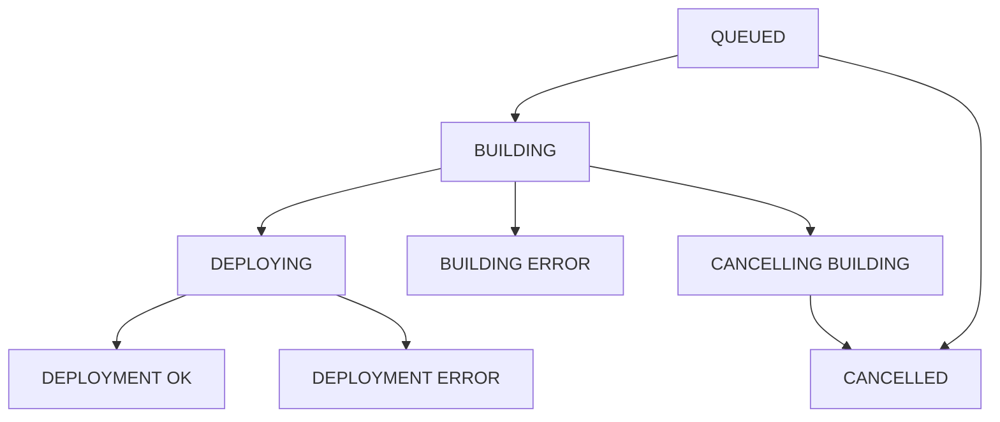

Qovery provides comprehensive status tracking for both running services and deployment operations. Understanding these statuses helps you monitor your applications and troubleshoot issues effectively.


## Running Statuses

Running statuses indicate the current operational state of your services and environments.

### Environment Running Statuses

Environment statuses reflect the aggregate state of all services within that environment:

<Tabs>
  <Tab title="STOPPED">
    **All services are stopped**

    All services in the environment have been stopped. No resources are consuming compute capacity.

    **Common Causes:**
    - Manual stop action
    - Scheduled shutdown (e.g., cost optimization)
    - Environment deactivation

    **Next Steps:**
    - Deploy or start services to resume operations
  </Tab>

  <Tab title="STARTING">
    **At least one service is starting**

    One or more services are in the process of starting up. The environment is transitioning to a running state.

    **What's Happening:**
    - Pods are being scheduled
    - Containers are initializing
    - Health checks are running

    **Expected Duration:** 1-5 minutes typically
  </Tab>

  <Tab title="STOPPING">
    **At least one service is stopping**

    One or more services are in the process of shutting down gracefully.

    **What's Happening:**
    - Pods receive termination signal
    - Graceful shutdown procedures execute
    - Resources are being deallocated

    **Expected Duration:** 30 seconds to 2 minutes
  </Tab>

  <Tab title="RUNNING">
    **All services are running correctly**

    All services in the environment are healthy and operational. This is the desired steady state.

    **Indicators:**
    - All pods are ready
    - Health checks passing
    - Services accepting traffic
  </Tab>

  <Tab title="ERROR">
    **All services are in error status**

    Every service in the environment has encountered an error and is not functioning.

    **Common Causes:**
    - Configuration errors
    - Resource constraints
    - Image pull failures
    - Dependency failures

    **Next Steps:**
    - Check deployment logs
    - Review service configurations
    - Verify resource availability
  </Tab>

  <Tab title="WARNING">
    **At least one service is in error status**

    Some services are experiencing errors while others are running normally.

    **What to Do:**
    - Identify which services are failing
    - Check logs for specific error messages
    - Address issues with failing services
  </Tab>
</Tabs>

### Service Running Statuses

Service statuses indicate the state of individual applications, containers, databases, or jobs:

<CardGroup cols={2}>
  <Card title="STOPPED" icon="stop">
    All instances of the service are stopped. No pods are running.
  </Card>

  <Card title="STARTING" icon="play">
    At least one instance is starting up. Containers are initializing.
  </Card>

  <Card title="RUNNING" icon="circle-check">
    All instances are running correctly and passing health checks.
  </Card>

  <Card title="ERROR" icon="circle-xmark">
    All instances are in an error state and not functioning.
  </Card>

  <Card title="WARNING" icon="triangle-exclamation">
    Some instances are running while others have errors.
  </Card>

  <Card title="COMPLETED" icon="check">
    Job has executed successfully and finished (jobs only).
  </Card>
</CardGroup>

### Job-Specific Status: COMPLETED

For lifecycle jobs and cron jobs, the COMPLETED status indicates successful execution:


**COMPLETED Status Behavior:**
- Job executed without errors
- Exit code was 0 (success)
- All tasks finished as expected
- Job can be run again or scheduled

<Info>
After a job completes, you can clear the status or run it again. Completed jobs don't consume resources until the next execution.
</Info>

## Deployment Statuses

Deployment statuses track the progress of deployment operations from initiation to completion.

### Deployment Status Flow

<Steps>
  <Step title="QUEUED">
    Deployment request is in the queue waiting for execution
  </Step>
  <Step title="BUILDING">
    Code is being built into a container image (Git deployments only)
  </Step>
  <Step title="DEPLOYING">
    Container is being deployed to Kubernetes cluster
  </Step>
  <Step title="DEPLOYMENT OK">
    Deployment completed successfully, service is running
  </Step>
</Steps>

### All Deployment Statuses

<Tabs>
  <Tab title="QUEUED">
    **Waiting in deployment queue**

    The deployment request has been received and is waiting to be processed.

    **Why It's Queued:**
    - Another deployment is currently running
    - Build resources are at capacity
    - Cluster is processing other operations

    **Typical Duration:** Seconds to a few minutes

    <Info>
    Qovery processes one deployment per service at a time. Multiple requests are queued and may be merged for efficiency.
    </Info>
  </Tab>

  <Tab title="BUILDING">
    **Building container image**

    For Git-based deployments, your code is being built into a container image.

    **Build Steps:**
    1. Clone repository
    2. Execute Dockerfile build
    3. Run tests (if configured)
    4. Push image to registry

    **Typical Duration:** 2-10 minutes depending on complexity

    **Monitor Progress:**
    - View real-time build logs
    - Check build output for errors
    - Monitor resource usage
  </Tab>

  <Tab title="BUILDING ERROR">
    **Build process failed**

    The container image build failed due to an error.

    **Common Causes:**
    - Dockerfile syntax errors
    - Compilation failures
    - Test failures
    - Dependency resolution issues
    - Out of memory during build

    **Resolution Steps:**
    1. Check build logs for specific errors
    2. Fix issues in your code or Dockerfile
    3. Commit and push changes
    4. Retry deployment
  </Tab>

  <Tab title="DEPLOYING">
    **Deploying to Kubernetes**

    The container image is being deployed to the Kubernetes cluster.

    **Deployment Steps:**
    1. Create/update Kubernetes resources
    2. Pull container image
    3. Start pods
    4. Wait for health checks
    5. Configure networking

    **Typical Duration:** 1-5 minutes

    **What to Watch:**
    - Pod scheduling
    - Container startup
    - Health check results
    - Service endpoints
  </Tab>

  <Tab title="DEPLOYMENT ERROR">
    **Deployment to Kubernetes failed**

    The deployment to Kubernetes encountered an error.

    **Common Causes:**
    - Image pull failures
    - Insufficient cluster resources
    - Invalid configuration
    - Health check failures
    - Network issues

    **Resolution Steps:**
    1. Check deployment logs
    2. Verify cluster has available resources
    3. Confirm image exists in registry
    4. Review service configuration
    5. Check network and security settings
  </Tab>

  <Tab title="CANCELLING BUILDING">
    **Cancelling build operation**

    A request to cancel the build has been received and is being processed.

    **What Happens:**
    - Build process is interrupted
    - Partial artifacts may remain
    - Resources are cleaned up

    **Next Status:** CANCELLED
  </Tab>

  <Tab title="CANCELLED">
    **Deployment was cancelled**

    The deployment was cancelled before completion.

    **Reasons:**
    - Manual cancellation by user
    - Timeout
    - Superseded by newer deployment

    **Result:**
    - Service remains in previous state
    - No changes were applied
  </Tab>

  <Tab title="DEPLOYMENT OK">
    **Deployment successful**

    The deployment completed successfully and the service is running.

    **Indicators:**
    - All pods are ready
    - Health checks passing
    - Service is accessible
    - No error logs

    **Next Steps:**
    - Monitor service health
    - Verify functionality
    - Check metrics and logs
  </Tab>
</Tabs>

## Status Transitions

Understanding how statuses transition helps you predict and troubleshoot deployment behavior:



### Successful Deployment Flow

```
QUEUED → BUILDING → DEPLOYING → DEPLOYMENT OK → RUNNING
```

### Failed Build Flow

```
QUEUED → BUILDING → BUILDING ERROR → (Previous State)
```

### Failed Deployment Flow

```
QUEUED → BUILDING → DEPLOYING → DEPLOYMENT ERROR → ERROR/WARNING
```

### Cancelled Deployment Flow

```
QUEUED → BUILDING → CANCELLING BUILDING → CANCELLED → (Previous State)
```

## Monitoring Status Changes

### Real-Time Status Updates

Qovery provides real-time status updates through multiple channels:

<CardGroup cols={2}>
  <Card title="Web Console" icon="browser">
    Status badges update in real-time without page refresh
  </Card>

  <Card title="CLI Watch Mode" icon="terminal">
    Use `--watch` flag to monitor status changes
  </Card>

  <Card title="API Webhooks" icon="webhook">
    Receive notifications when status changes
  </Card>

  <Card title="Notifications" icon="bell">
    Email or Slack alerts for status changes
  </Card>
</CardGroup>

### CLI Status Monitoring

```bash
# Watch deployment status
qovery application deploy --watch

# Check current status
qovery application status

# Monitor environment status
qovery environment status

# Stream status updates
qovery status --watch --environment production
```

## Status-Based Automation

Use statuses to trigger automated workflows:

### Example: Auto-Rollback on Error

```bash
# Deploy and monitor status
qovery application deploy

# Wait for deployment to complete
qovery application status --wait

# Check if status is RUNNING
STATUS=$(qovery application status --format json | jq -r '.status')

if [ "$STATUS" != "RUNNING" ]; then
  echo "Deployment failed, rolling back"
  qovery application rollback
fi
```

### Example: Notify on Status Change

```bash
# Monitor for status changes
qovery status --watch --environment production | while read STATUS; do
  if [ "$STATUS" = "ERROR" ]; then
    # Send alert to Slack
    curl -X POST -H 'Content-type: application/json' \
      --data '{"text":"Production environment error!"}' \
      $SLACK_WEBHOOK_URL
  fi
done
```

## Best Practices

<CardGroup cols={2}>
  <Card title="Monitor Actively" icon="eye">
    Watch deployment statuses during critical deployments
  </Card>

  <Card title="Set Up Alerts" icon="bell">
    Configure notifications for ERROR and WARNING statuses
  </Card>

  <Card title="Review Logs" icon="file-lines">
    Always check logs when encountering error statuses
  </Card>

  <Card title="Automate Recovery" icon="robot">
    Implement automatic rollback on deployment failures
  </Card>

  <Card title="Track Patterns" icon="chart-line">
    Monitor status patterns over time to identify trends
  </Card>

  <Card title="Document Issues" icon="book">
    Document recurring status issues and their resolutions
  </Card>
</CardGroup>

## Troubleshooting by Status

<AccordionGroup>
  <Accordion title="Stuck in QUEUED status">
    **Possible Causes:**
    - Another deployment is running
    - Build queue is at capacity
    - Cluster resource constraints

    **Solutions:**
    - Wait for current deployments to complete
    - Cancel stuck deployments
    - Check cluster resource availability
    - Contact support if issue persists
  </Accordion>

  <Accordion title="BUILDING ERROR - Common Issues">
    **Check These First:**
    1. Review build logs for specific error messages
    2. Verify Dockerfile syntax
    3. Ensure all dependencies are accessible
    4. Check for compilation errors
    5. Verify test suite is passing
    6. Confirm adequate build resources

    **Quick Fixes:**
    - Fix syntax errors in Dockerfile
    - Update dependency versions
    - Increase build timeout if needed
  </Accordion>

  <Accordion title="DEPLOYMENT ERROR - Common Issues">
    **Check These First:**
    1. Verify image exists in registry
    2. Check cluster has available resources
    3. Review pod events and logs
    4. Verify environment variables
    5. Check health check configuration
    6. Confirm network connectivity

    **Quick Fixes:**
    - Increase resource limits
    - Fix health check endpoints
    - Update image pull secrets
    - Review security policies
  </Accordion>

  <Accordion title="Service in WARNING state">
    **What WARNING Means:**
    Some replicas are running while others are failing.

    **Investigation Steps:**
    1. Check which pods are failing
    2. Review logs for failed pods
    3. Compare with healthy pods
    4. Check for resource constraints
    5. Verify load balancer health

    **Common Causes:**
    - Resource contention
    - Intermittent network issues
    - Memory leaks causing OOM
    - Health check failures
  </Accordion>

  <Accordion title="Job stuck in RUNNING (never completes)">
    **For Jobs That Should Complete:**

    **Check:**
    1. Job logs for infinite loops
    2. Resource limits causing slowdown
    3. Exit code handling
    4. Job timeout configuration

    **Solutions:**
    - Add job timeout
    - Fix infinite loops
    - Ensure proper exit codes
    - Increase resources if needed
  </Accordion>
</AccordionGroup>

## Next Steps

<CardGroup cols={2}>
  <Card title="Deployment Logs" icon="file-lines" href="/configuration/deployment/logs">
    Access detailed logs for each status transition
  </Card>

  <Card title="Deployment Actions" icon="gears" href="/configuration/deployment/actions">
    Learn how to control deployments
  </Card>

  <Card title="Monitoring" icon="chart-line" href="/configuration/observability/overview">
    Set up comprehensive monitoring
  </Card>

  <Card title="Alerting" icon="bell" href="/configuration/observability/alerting">
    Configure alerts for status changes
  </Card>
</CardGroup>
