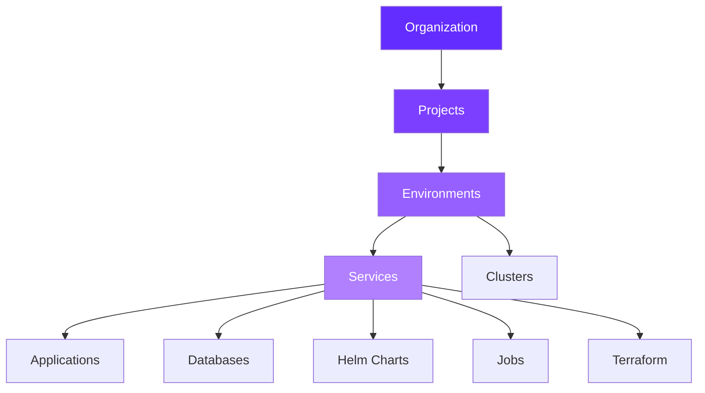

Qovery provides comprehensive configuration options to manage every aspect of your infrastructure, from organization-level settings to individual service configurations. This section covers all configuration capabilities available on the platform.

## Configuration Hierarchy

Qovery uses a hierarchical structure to organize your infrastructure:



## Configuration Sections

<CardGroup cols={2}>
  <Card title="Organization" icon="building" href="/configuration/organization">
    Configure organization-wide settings including team members, API tokens, cloud credentials, and SSO
  </Card>

  <Card title="Resources" icon="layer-group" href="/configuration/project">
    Manage projects, environments, and Kubernetes clusters
  </Card>

  <Card title="Services" icon="box" href="/configuration/application">
    Configure applications, databases, Helm charts, jobs, and Terraform modules
  </Card>

  <Card title="Deployment" icon="rocket" href="/configuration/deployment/overview">
    Control deployment pipelines, auto-deploy, CI/CD integration, and deployment strategies
  </Card>

  <Card title="Settings" icon="gear" href="/configuration/environment-variables">
    Manage environment variables and advanced service settings
  </Card>
</CardGroup>

---

## Organization Configuration

Organization-level settings control access, integrations, and team management across all your projects.

<AccordionGroup>
  <Accordion title="Organization Settings" icon="building">
    Configure your organization's basic information, billing, and general settings.

    [Learn more →](/configuration/organization)
  </Accordion>

  <Accordion title="API Tokens" icon="key">
    Generate and manage API tokens for programmatic access to Qovery resources.

    **Use cases**:
    - CI/CD pipeline integration
    - Infrastructure as Code (Terraform)
    - Custom automation scripts
    - Third-party tool integration

    [Learn more →](/configuration/organization/api-token)
  </Accordion>

  <Accordion title="Cloud Credentials" icon="cloud">
    Connect your AWS, GCP, Azure, or Scaleway accounts to deploy infrastructure.

    **Supported providers**:
    - Amazon Web Services (AWS)
    - Google Cloud Platform (GCP)
    - Microsoft Azure
    - Scaleway

    [Learn more →](/configuration/organization/cloud-credentials)
  </Accordion>

  <Accordion title="Container Registry" icon="box-open">
    Connect private container registries for pulling and pushing images.

    **Supported registries**:
    - Docker Hub
    - AWS ECR
    - Google Artifact Registry
    - Azure ACR
    - GitHub Container Registry
    - GitLab Container Registry
    - Scaleway Container Registry
    - Generic private registries

    [Learn more →](/configuration/organization/container-registry)
  </Accordion>

  <Accordion title="Git Repository Access" icon="code-branch">
    Configure access to private Git repositories for application deployment.

    **Supported providers**:
    - GitHub (public and private)
    - GitHub Enterprise
    - GitLab (public and private)
    - Bitbucket

    [Learn more →](/configuration/organization/git-repository-access)
  </Accordion>

  <Accordion title="Helm Repository" icon="helm">
    Add custom Helm chart repositories for deploying third-party applications.

    [Learn more →](/configuration/organization/helm-repository)
  </Accordion>

  <Accordion title="Labels & Annotations" icon="tag">
    Define organization-wide Kubernetes labels and annotations.

    [Learn more →](/configuration/organization/labels-annotations)
  </Accordion>

  <Accordion title="Members & RBAC" icon="users">
    Manage team members, roles, and permissions with role-based access control.

    **Built-in roles**:
    - Owner: Full access to everything
    - Admin: Manage resources and members
    - Developer: Deploy and manage services
    - Viewer: Read-only access

    [Learn more →](/configuration/organization/members-rbac)
  </Accordion>

  <Accordion title="SSO (SAML/OIDC)" icon="shield-check">
    Configure Single Sign-On authentication with your Identity Provider.

    **Supported protocols**:
    - SAML 2.0
    - OpenID Connect (OIDC)

    [Learn more →](/configuration/organization/sso)
  </Accordion>
</AccordionGroup>

---

## Resources Configuration

Resources form the foundation of your infrastructure hierarchy.

<Tabs>
  <Tab title="Projects">
    **Projects** group related environments together for better organization.

    **Key features**:
    - Logical grouping of environments
    - Team collaboration scope
    - Cost tracking by project
    - Access control at project level

    **Example structure**:
    ```
    Project: E-commerce Platform
    ├── Environment: Production
    ├── Environment: Staging
    └── Environment: Development
    ```

    [Learn more →](/configuration/project)
  </Tab>

  <Tab title="Environments">
    **Environments** contain all services for a specific deployment stage.

    **Common types**:
    - Production
    - Staging
    - Development
    - Preview/Ephemeral

    **Configuration options**:
    - Environment variables
    - Deployment pipeline
    - Auto-deploy settings
    - Resource quotas
    - Network policies

    [Learn more →](/configuration/environment)
  </Tab>

  <Tab title="Clusters">
    **Kubernetes clusters** run your containerized workloads.

    **Cluster types**:
    - Managed by Qovery: Fully automated setup and maintenance
    - Bring Your Own Kubernetes (BYOK): Connect existing clusters

    **Supported platforms**:
    - AWS EKS
    - Google GKE
    - Azure AKS
    - Scaleway Kapsule
    - Self-managed Kubernetes

    [Learn more →](/configuration/clusters)
  </Tab>
</Tabs>

---

## Services Configuration

Services are the applications and infrastructure components running in your environments.

<CardGroup cols={3}>
  <Card title="Applications" icon="window" href="/configuration/application">
    Deploy containerized applications from Git or container registries
  </Card>

  <Card title="Databases" icon="database" href="/configuration/database">
    Managed databases (PostgreSQL, MySQL, MongoDB, Redis, etc.)
  </Card>

  <Card title="Helm Charts" icon="helm" href="/configuration/helm">
    Deploy pre-packaged applications using Helm
  </Card>

  <Card title="Cron Jobs" icon="clock" href="/configuration/cronjob">
    Schedule recurring tasks and batch processes
  </Card>

  <Card title="Lifecycle Jobs" icon="bolt" href="/configuration/lifecycle-job">
    Run one-time or event-triggered jobs
  </Card>

  <Card title="Terraform" icon="code" href="/configuration/terraform">
    Provision infrastructure with Terraform modules
  </Card>
</CardGroup>

### Application Configuration

Applications are your containerized services deployed from Git repositories or container images.

**Configuration options**:
- Build settings (Dockerfile)
- Container registry
- CPU and memory resources
- Auto-scaling rules
- Port configuration
- Health checks
- Storage volumes
- Custom domains

[Learn more →](/configuration/application)

### Database Configuration

Managed database services with automatic backups, scaling, and monitoring.

**Supported databases**:
- PostgreSQL
- MySQL
- MongoDB
- Redis
- Elasticsearch (via containers)

**Configuration options**:
- Version selection
- Instance type and size
- Storage capacity
- Backup schedule
- High availability
- Read replicas

[Learn more →](/configuration/database)

---

## Deployment Configuration

Control how and when your services are deployed to Kubernetes.

<Steps>
  <Step title="Deployment Overview">
    Understand the deployment process and available options.

    [Learn more →](/configuration/deployment/overview)
  </Step>

  <Step title="Auto-Deploy">
    Automatically deploy when code is pushed to Git.

    **Features**:
    - Trigger on Git push
    - Commit filtering (exclude docs, tests, etc.)
    - Branch-specific deployments
    - Pull request environments

    [Learn more →](/configuration/deployment/auto-deploy)
  </Step>

  <Step title="CI/CD Integration">
    Integrate with GitHub Actions, GitLab CI, CircleCI, Jenkins, and more.

    [Learn more →](/configuration/deployment/ci-cd)
  </Step>

  <Step title="Deployment Pipeline">
    Configure staged deployments with dependencies.

    **Pipeline stages**:
    1. Databases
    2. Lifecycle jobs
    3. Containers
    4. Applications

    [Learn more →](/configuration/deployment/pipeline)
  </Step>

  <Step title="Deployment Actions">
    Control deployments with deploy, redeploy, stop, restart, and rollback actions.

    [Learn more →](/configuration/deployment/actions)
  </Step>

  <Step title="Deployment History">
    Review past deployments and rollback when needed.

    [Learn more →](/configuration/deployment/history)
  </Step>

  <Step title="Deployment Statuses">
    Understand deployment and running statuses.

    [Learn more →](/configuration/deployment/statuses)
  </Step>

  <Step title="Deployment Logs">
    Access build, deployment, and runtime logs.

    [Learn more →](/configuration/deployment/logs)
  </Step>

  <Step title="Deployment Strategies">
    Choose between rolling updates and recreate strategies.

    [Learn more →](/configuration/deployment/strategies)
  </Step>

  <Step title="Image Mirroring">
    Improve deployment speed with container image caching.

    [Learn more →](/configuration/deployment/image-mirroring)
  </Step>
</Steps>

---

## Settings

Cross-cutting configuration that applies to services and environments.

<CardGroup cols={2}>
  <Card title="Environment Variables" icon="key" href="/configuration/environment-variables">
    Manage configuration values and secrets

    **Variable types**:
    - Text: Simple string values
    - Secret: Encrypted sensitive data
    - File: Configuration files
    - Alias: Reference other services

    **Scoping**:
    - Service-level variables
    - Environment-level variables
    - Built-in Qovery variables
  </Card>

  <Card title="Advanced Service Settings" icon="sliders" href="/configuration/service-advanced-settings">
    Configure advanced options for fine-tuned control

    **Settings include**:
    - Network configuration
    - Security policies
    - Resource limits
    - Health check tuning
    - Annotations and labels
    - Anti-affinity rules
  </Card>
</CardGroup>

---

## Configuration Best Practices

<CardGroup cols={2}>
  <Card title="Use Environment Variables" icon="key">
    Store configuration in environment variables, not in code. Use secrets for sensitive data.
  </Card>

  <Card title="Follow Naming Conventions" icon="text">
    Use clear, consistent naming for projects, environments, and services to improve organization.
  </Card>

  <Card title="Implement RBAC" icon="shield">
    Assign appropriate roles to team members. Use least-privilege principle.
  </Card>

  <Card title="Configure Auto-Deploy" icon="rotate">
    Enable auto-deploy for development environments. Use manual deploys for production.
  </Card>

  <Card title="Set Resource Limits" icon="gauge">
    Define CPU and memory limits to prevent resource exhaustion and control costs.
  </Card>

  <Card title="Use Deployment Pipelines" icon="diagram-project">
    Configure staged deployments to ensure databases and dependencies are ready first.
  </Card>

  <Card title="Enable Monitoring" icon="chart-line">
    Configure logging and monitoring to track application health and performance.
  </Card>

  <Card title="Tag Resources" icon="tag">
    Use labels and annotations for cost allocation, compliance, and resource management.
  </Card>
</CardGroup>

---

## Configuration Methods

Qovery offers multiple ways to configure your infrastructure:

<Tabs>
  <Tab title="Web Console">
    **Qovery Console** provides a visual interface for all configuration options.

    **Best for**:
    - Getting started
    - Manual configuration changes
    - Visual resource management
    - Quick deployments

    [Access Console →](https://console.qovery.com)
  </Tab>

  <Tab title="CLI">
    **Qovery CLI** enables command-line configuration and automation.

    **Best for**:
    - Local development workflows
    - Scripting and automation
    - CI/CD integration
    - Power users

    ```bash
    # Install Qovery CLI
    curl -s https://get.qovery.com | bash

    # Create an environment
    qovery environment create

    # Deploy an application
    qovery application deploy
    ```

    [Learn more →](/cli/overview)
  </Tab>

  <Tab title="API">
    **Qovery API** provides programmatic access to all platform features.

    **Best for**:
    - Custom integrations
    - Advanced automation
    - Third-party tools
    - Platform extensions

    ```bash
    # Example: Deploy application via API
    curl -X POST \
      "https://api.qovery.com/application/$APP_ID/deploy" \
      -H "Authorization: Token $QOVERY_API_TOKEN"
    ```

    [Learn more →](/api-reference/introduction)
  </Tab>

  <Tab title="Terraform">
    **Qovery Terraform Provider** enables Infrastructure as Code.

    **Best for**:
    - Infrastructure as Code
    - GitOps workflows
    - Reproducible environments
    - Multi-environment management

    ```hcl
    resource "qovery_application" "my_app" {
      name = "my-app"
      environment_id = qovery_environment.prod.id

      git_repository = {
        url = "https://github.com/org/repo"
        branch = "main"
      }

      cpu = 500
      memory = 1024
    }
    ```

    [Learn more →](/terraform/overview)
  </Tab>
</Tabs>

---

## Common Configuration Workflows

<AccordionGroup>
  <Accordion title="Setting Up a New Application" icon="rocket">
    **Step-by-step workflow**:

    1. **Create Project** - Organize related environments
    2. **Create Environment** - Dev, staging, or production
    3. **Connect Git Repository** - Configure repository access
    4. **Create Application** - Configure build and runtime settings
    5. **Set Environment Variables** - Add configuration and secrets
    6. **Configure Deployment** - Set up auto-deploy or CI/CD
    7. **Add Custom Domain** - Configure DNS (optional)
    8. **Deploy** - Launch your application

    [Start deploying →](/guides/qovery-101/deploy)
  </Accordion>

  <Accordion title="Configuring a Production Environment" icon="building">
    **Production checklist**:

    - ✅ Use managed Kubernetes cluster with HA
    - ✅ Configure resource limits and auto-scaling
    - ✅ Set up health checks and readiness probes
    - ✅ Enable monitoring and alerting
    - ✅ Configure backup strategy
    - ✅ Implement RBAC for team access
    - ✅ Use deployment pipeline with stages
    - ✅ Configure custom domain with TLS
    - ✅ Set up CI/CD for automated deployments
    - ✅ Enable deployment history and rollback

    [Production best practices →](/guides/use-cases/production-environment-management)
  </Accordion>

  <Accordion title="Managing Multiple Environments" icon="layer-group">
    **Multi-environment strategy**:

    1. **Development** - Fast iteration, auto-deploy, minimal resources
    2. **Staging** - Production parity, manual deploys, full testing
    3. **Production** - High availability, controlled deploys, monitoring

    **Configuration differences**:
    - Environment variables (API endpoints, feature flags)
    - Resource allocation (CPU, memory)
    - Scaling rules (replicas, auto-scaling)
    - Deployment strategy (auto vs manual)
    - Backup and monitoring settings

    [Multi-environment guide →](/guides/use-cases/multi-kubernetes-clusters-management)
  </Accordion>

  <Accordion title="Migrating Configuration Between Environments" icon="arrows-left-right">
    **Migration methods**:

    1. **Clone Environment** - Copy entire environment configuration
    2. **Export/Import** - Use CLI or API to export and import config
    3. **Terraform** - Define environments as code for consistency
    4. **Blueprint Pattern** - Create templates for new environments

    **What gets migrated**:
    - Service configurations
    - Environment variables
    - Deployment settings
    - Network configuration

    **What doesn't get migrated**:
    - Secrets (must be reconfigured)
    - Cluster selection
    - Custom domains
    - Deployment history

    [Environment cloning →](/configuration/environment)
  </Accordion>
</AccordionGroup>

---

## Next Steps

<CardGroup cols={2}>
  <Card title="Quickstart Tutorial" icon="play" href="/guides/qovery-101/deploy">
    Deploy your first application in minutes
  </Card>

  <Card title="Organization Setup" icon="building" href="/configuration/organization">
    Configure organization-wide settings
  </Card>

  <Card title="CLI Reference" icon="terminal" href="/cli/overview">
    Automate configuration with CLI
  </Card>

  <Card title="API Documentation" icon="code" href="/api-reference/introduction">
    Programmatic access to all features
  </Card>
</CardGroup>
