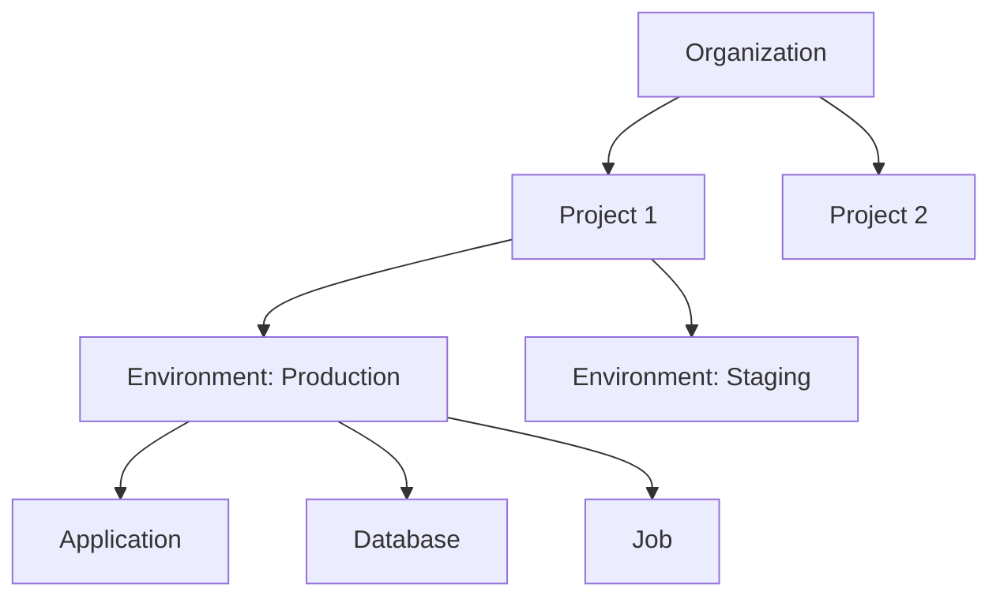

## Introduction

Qovery provides flexible configuration options to customize your infrastructure according to your needs. Configuration can be managed through multiple interfaces, ensuring you can work in the way that suits you best.

## Configuration Methods

<CardGroup cols={2}>
  <Card title="Web Console" icon="browser">
    Visual interface for quick configuration changes
  </Card>
  <Card title="Terraform" icon="code">
    Infrastructure as Code for version-controlled configuration
  </Card>
  <Card title="API" icon="plug">
    Programmatic configuration for automation
  </Card>
  <Card title="CLI" icon="terminal">
    Command-line configuration for scripting
  </Card>
</CardGroup>

## Configuration Hierarchy

Qovery uses a hierarchical structure for organizing your infrastructure:



### Levels

1. **Organization** - Top-level entity containing all resources
2. **Project** - Logical grouping of related environments
3. **Environment** - Isolated deployment environment
4. **Services** - Applications, databases, containers, jobs

## Configuration Scope

### Organization Level

Configure organization-wide settings:

- Cloud provider connections
- Git provider integrations
- Container registries
- User permissions and roles
- Billing and quotas

### Project Level

Project-specific configuration:

- Project name and description
- Environment templates
- Default environment variables
- Team access

### Environment Level

Environment-specific settings:

- Deployment mode (Development, Staging, Production)
- Cluster assignment
- Environment variables
- Deployment rules

### Service Level

Individual service configuration:

- Resource allocation (CPU, memory)
- Scaling parameters
- Health checks
- Port mappings
- Build configuration

## Configuration Categories

<CardGroup cols={2}>
  <Card title="Applications" icon="window" href="/configuration/applications">
    Configure containerized applications
  </Card>
  <Card title="Databases" icon="database" href="/configuration/databases">
    Set up and manage databases
  </Card>
  <Card title="Containers" icon="box" href="/configuration/containers">
    Deploy generic containers
  </Card>
  <Card title="Jobs" icon="clock" href="/configuration/jobs">
    Configure cron and lifecycle jobs
  </Card>
  <Card title="Environment Variables" icon="key" href="/configuration/environment-variables">
    Manage secrets and configuration
  </Card>
  <Card title="Networking" icon="network-wired" href="/configuration/networking">
    Configure networking and ingress
  </Card>
  <Card title="Storage" icon="hard-drive" href="/configuration/storage">
    Persistent storage configuration
  </Card>
  <Card title="Deployment" icon="rocket" href="/configuration/deployment">
    Deployment strategies and rules
  </Card>
  <Card title="Monitoring" icon="chart-line" href="/configuration/monitoring">
    Observability and monitoring setup
  </Card>
</CardGroup>

## Common Configuration Patterns

### Multi-Environment Setup

Configure multiple environments with consistent settings:

```yaml
# Development Environment
environment: development
mode: DEVELOPMENT
auto_deploy: true
instances: 1
resources:
  cpu: 250
  memory: 256

# Production Environment
environment: production
mode: PRODUCTION
auto_deploy: false
instances: 3
resources:
  cpu: 1000
  memory: 2048
```

### Application with Database

Connect application to database:

```yaml
# Database
database:
  name: postgres
  type: POSTGRESQL
  version: "15"

# Application
application:
  name: api
  environment_variables:
    - DATABASE_HOST: ${database.host}
    - DATABASE_PORT: ${database.port}
    - DATABASE_NAME: ${database.name}
  secrets:
    - DATABASE_PASSWORD: ${database.password}
```

### Microservices Architecture

Deploy multiple interconnected services:

```yaml
services:
  - name: frontend
    type: application
    ports:
      - 3000
    environment_variables:
      - API_URL: http://backend:8080

  - name: backend
    type: application
    ports:
      - 8080
    environment_variables:
      - REDIS_URL: redis://cache:6379

  - name: cache
    type: container
    image: redis:7-alpine
    ports:
      - 6379
```

## Configuration Best Practices

<AccordionGroup>
  <Accordion title="Use Environment Variables">
    Store configuration in environment variables rather than hardcoding values. This makes applications portable across environments.
  </Accordion>

  <Accordion title="Separate Secrets from Config">
    Use Qovery's secret management for sensitive data. Secrets are encrypted and never displayed in logs.
  </Accordion>

  <Accordion title="Version Control Your Configuration">
    Use Terraform or store configuration in Git to track changes and enable rollbacks.
  </Accordion>

  <Accordion title="Use Descriptive Names">
    Name resources clearly to make management easier: `api-production`, `postgres-staging`, etc.
  </Accordion>

  <Accordion title="Start Small, Scale Up">
    Begin with minimal resources and scale based on actual usage. Qovery makes it easy to adjust.
  </Accordion>

  <Accordion title="Configure Health Checks">
    Always configure liveness and readiness probes for reliable deployments.
  </Accordion>

  <Accordion title="Use Auto-Deploy Wisely">
    Enable auto-deploy for development/staging. Require manual deployment for production.
  </Accordion>

  <Accordion title="Tag Your Resources">
    Use labels and annotations to organize and track resources.
  </Accordion>
</AccordionGroup>

## Configuration Validation

Qovery validates configuration before applying:

- **Syntax Validation** - Check for valid YAML/JSON/HCL
- **Resource Limits** - Ensure within quota limits
- **Dependency Validation** - Verify service dependencies exist
- **Port Conflicts** - Detect port collisions
- **Name Uniqueness** - Ensure unique resource names

## Configuration Import/Export

### Export Configuration

Export current configuration for backup or migration:

```bash
# Via CLI
qovery environment export --environment prod > prod-config.yaml

# Via API
curl -H "Authorization: Bearer $TOKEN" \
  https://api.qovery.com/api/v1/environment/{id}/export > config.json
```

### Import Configuration

Import configuration to new environment:

```bash
# Via CLI
qovery environment import --file prod-config.yaml

# Via Terraform
terraform import qovery_environment.staging {environment_id}
```

## Configuration Updates

### Rolling Updates

Configuration changes trigger rolling updates:

1. New configuration applied
2. New pods created with updated config
3. Health checks verify new pods
4. Old pods terminated after new pods are healthy

### Zero-Downtime Updates

For production, Qovery ensures zero downtime:

- **Blue/Green Strategy** - Deploy new version alongside old
- **Canary Releases** - Gradually shift traffic to new version
- **Rollback** - Automatic rollback on health check failures

## Troubleshooting Configuration

### Common Issues

<AccordionGroup>
  <Accordion title="Configuration Not Applied">
    **Symptom**: Changes don't take effect

    **Solutions**:
    - Trigger a manual redeploy
    - Check for validation errors
    - Verify environment is running
    - Check deployment logs
  </Accordion>

  <Accordion title="Resource Quota Exceeded">
    **Symptom**: "Insufficient resources" error

    **Solutions**:
    - Reduce resource requests
    - Scale down other services
    - Upgrade cluster node size
    - Add more cluster nodes
  </Accordion>

  <Accordion title="Port Already in Use">
    **Symptom**: "Port conflict" error

    **Solutions**:
    - Choose a different port
    - Check for duplicate port mappings
    - Ensure services don't conflict
  </Accordion>
</AccordionGroup>

### Debugging Configuration

```bash
# View current configuration
qovery application show --application my-app

# Check configuration history
qovery application history --application my-app

# View deployment logs
qovery log --application my-app --follow

# Describe Kubernetes resources
kubectl describe deployment my-app -n env-xyz
```

## Next Steps

<CardGroup cols={3}>
  <Card title="Applications" icon="window" href="/configuration/applications">
    Configure applications
  </Card>
  <Card title="Databases" icon="database" href="/configuration/databases">
    Set up databases
  </Card>
  <Card title="Environment Variables" icon="key" href="/configuration/environment-variables">
    Manage secrets
  </Card>
</CardGroup>
