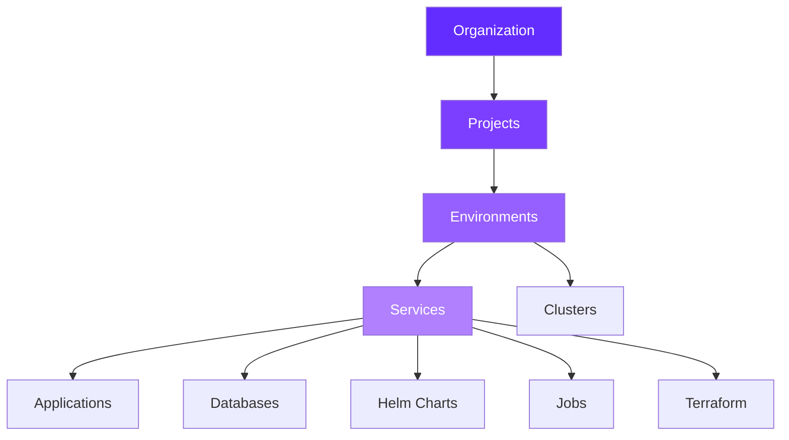

Qovery provides comprehensive configuration options to manage every aspect of your infrastructure, from organization-level settings to individual service configurations.

## Configuration Hierarchy

Qovery uses a hierarchical structure to organize your infrastructure:

## Organization

Configure organization-wide settings, access control, and integrations.

<CardGroup cols={3}>
  <Card title="Organization Settings" icon="building" href="/configuration/organization">
    Basic organization configuration and settings
  </Card>

  <Card title="Members & RBAC" icon="users" href="/configuration/organization/members-rbac">
    Manage team members, roles, and permissions
  </Card>

  <Card title="API Tokens" icon="key" href="/configuration/organization/api-token">
    Generate API tokens for programmatic access
  </Card>

  <Card title="Cloud Credentials" icon="cloud" href="/configuration/organization/cloud-credentials">
    Connect AWS, GCP, Azure, or Scaleway accounts
  </Card>

  <Card title="Git Repository Access" icon="code-branch" href="/configuration/organization/git-repository-access">
    Configure access to GitHub, GitLab, Bitbucket
  </Card>

  <Card title="Container Registry" icon="box-open" href="/configuration/organization/container-registry">
    Connect Docker Hub, ECR, GCR, ACR, and more
  </Card>

  <Card title="Helm Repository" icon="/images/logos/helm-icon-light.svg" href="/configuration/organization/helm-repository">
    Add custom Helm chart repositories
  </Card>

  <Card title="SSO (SAML/OIDC)" icon="shield-check" href="/configuration/organization/sso">
    Configure Single Sign-On authentication
  </Card>

  <Card title="Labels & Annotations" icon="tag" href="/configuration/organization/labels-annotations">
    Define Kubernetes labels and annotations
  </Card>
</CardGroup>

## Clusters

Manage Kubernetes clusters and cloud infrastructure.

<CardGroup cols={2}>
  <Card title="Clusters Configuration" icon="server" href="/configuration/clusters">
    Configure and manage Kubernetes clusters
  </Card>
</CardGroup>

## Projects & Environments

Organize and manage your deployment hierarchy.

<CardGroup cols={2}>
  <Card title="Projects" icon="folder" href="/configuration/project">
    Group related environments together
  </Card>

  <Card title="Environments" icon="layer-group" href="/configuration/environment">
    Configure deployment environments
  </Card>

  <Card title="Environment Variables" icon="key" href="/configuration/environment-variables">
    Manage configuration values and secrets
  </Card>
</CardGroup>

## Services

Deploy and manage your applications and infrastructure components.

<CardGroup cols={3}>
  <Card title="Applications" icon="window" href="/configuration/application">
    Deploy containerized applications
  </Card>

  <Card title="Databases" icon="database" href="/configuration/database">
    Managed PostgreSQL, MySQL, MongoDB, Redis
  </Card>

  <Card title="Helm Charts" icon="/images/logos/helm-icon-light.svg" href="/configuration/helm">
    Deploy pre-packaged applications
  </Card>

  <Card title="Cron Jobs" icon="clock" href="/configuration/cronjob">
    Schedule recurring tasks
  </Card>

  <Card title="Lifecycle Jobs" icon="bolt" href="/configuration/lifecycle-job">
    Run one-time or event-triggered jobs
  </Card>

  <Card title="Terraform" icon="code" href="/configuration/terraform">
    Provision infrastructure with Terraform
  </Card>

  <Card title="Advanced Service Settings" icon="sliders" href="/configuration/service-advanced-settings">
    Fine-tune service configuration
  </Card>
</CardGroup>

## Deployment

Control how and when your services are deployed.

<CardGroup cols={3}>
  <Card title="Deployment Overview" icon="rocket" href="/configuration/deployment/overview">
    Understand the deployment process
  </Card>

  <Card title="Deployment Pipeline" icon="diagram-project" href="/configuration/deployment/pipeline">
    Configure staged deployments
  </Card>

  <Card title="Auto-Deploy" icon="rotate" href="/configuration/deployment/auto-deploy">
    Automatic deployments on Git push
  </Card>

  <Card title="CI/CD Integration" icon="code-branch" href="/configuration/deployment/ci-cd">
    Integrate with GitHub Actions, GitLab CI, etc.
  </Card>

  <Card title="Deployment Actions" icon="play" href="/configuration/deployment/actions">
    Deploy, redeploy, stop, restart, rollback
  </Card>

  <Card title="Deployment Strategies" icon="strategy" href="/configuration/deployment/strategies">
    Rolling updates and recreate strategies
  </Card>

  <Card title="Deployment History" icon="clock-rotate-left" href="/configuration/deployment/history">
    Review and rollback deployments
  </Card>

  <Card title="Deployment Statuses" icon="circle-info" href="/configuration/deployment/statuses">
    Understand deployment states
  </Card>

  <Card title="Deployment Logs" icon="list" href="/configuration/deployment/logs">
    Access build and runtime logs
  </Card>

  <Card title="Image Mirroring" icon="copy" href="/configuration/deployment/image-mirroring">
    Speed up deployments with caching
  </Card>
</CardGroup>

## Integrations

Connect Qovery with your existing tools and cloud services.

### Kubernetes Providers

<CardGroup cols={3}>
  <Card title="AWS EKS" icon="aws" href="/integrations/kubernetes/eks/overview">
    Amazon Elastic Kubernetes Service
  </Card>

  <Card title="Google GKE" icon="google" href="/integrations/kubernetes/gke/overview">
    Google Kubernetes Engine
  </Card>

  <Card title="Azure AKS" icon="microsoft" href="/integrations/kubernetes/aks/overview">
    Azure Kubernetes Service
  </Card>

  <Card title="Scaleway Kapsule" icon="server" href="/integrations/kubernetes/scaleway/overview">
    Scaleway Kubernetes Kapsule
  </Card>

  <Card title="Bring Your Own Kubernetes" icon="dharmachakra" href="/integrations/kubernetes/byok">
    Any Kubernetes cluster
  </Card>

  <Card title="Kubernetes Overview" icon="dharmachakra" href="/integrations/kubernetes/overview">
    Complete Kubernetes documentation
  </Card>
</CardGroup>

### Git Providers

<CardGroup cols={3}>
  <Card title="GitHub" icon="github" href="/integrations/git-providers/overview">
    GitHub and GitHub Enterprise
  </Card>

  <Card title="GitLab" icon="gitlab" href="/integrations/git-providers/gitlab">
    GitLab cloud and self-hosted
  </Card>

  <Card title="Bitbucket" icon="bitbucket" href="/integrations/git-providers/bitbucket">
    Bitbucket Cloud and Data Center
  </Card>
</CardGroup>

### Container Registries

<CardGroup cols={3}>
  <Card title="Docker Hub" icon="docker" href="/integrations/container-registries/docker-hub">
    Docker Hub registry
  </Card>

  <Card title="AWS ECR" icon="aws" href="/integrations/container-registries/aws-ecr">
    Amazon Elastic Container Registry
  </Card>

  <Card title="GCP Artifact Registry" icon="google" href="/integrations/container-registries/gcp-artifact-registry">
    Google Cloud Artifact Registry
  </Card>

  <Card title="Azure ACR" icon="microsoft" href="/integrations/container-registries/azure-acr">
    Azure Container Registry
  </Card>

  <Card title="GitHub Container Registry" icon="github" href="/integrations/container-registries/github-cr">
    GitHub Container Registry
  </Card>

  <Card title="GitLab Container Registry" icon="gitlab" href="/integrations/container-registries/gitlab-cr">
    GitLab Container Registry
  </Card>

  <Card title="Scaleway Container Registry" icon="server" href="/integrations/container-registries/scaleway-cr">
    Scaleway Container Registry
  </Card>

  <Card title="Generic Registry" icon="box" href="/integrations/container-registries/generic">
    Any OCI-compliant registry
  </Card>

  <Card title="Container Registries Overview" icon="box" href="/integrations/container-registries/overview">
    Complete registry documentation
  </Card>
</CardGroup>

### CI/CD Platforms

<CardGroup cols={3}>
  <Card title="Qovery Deploy" icon="rocket" href="/integrations/ci-cd/qovery-deploy">
    Zero-config builds and deployments
  </Card>

  <Card title="GitHub Actions" icon="github" href="/integrations/ci-cd/github-actions">
    GitHub Actions workflows
  </Card>

  <Card title="GitHub Actions Enterprise" icon="github" href="/integrations/ci-cd/github-actions-enterprise">
    GitHub Enterprise self-hosted runners
  </Card>

  <Card title="GitLab CI" icon="gitlab" href="/integrations/ci-cd/gitlab-ci">
    GitLab CI/CD pipelines
  </Card>

  <Card title="CircleCI" icon="circle" href="/integrations/ci-cd/circleci">
    CircleCI workflows
  </Card>

  <Card title="Jenkins" icon="jenkins" href="/integrations/ci-cd/jenkins">
    Jenkins pipelines
  </Card>
</CardGroup>

### Secret Managers

<CardGroup cols={3}>
  <Card title="Doppler" icon="key" href="/integrations/secret-managers/doppler">
    Doppler secrets sync
  </Card>

  <Card title="AWS Secrets Manager" icon="aws" href="/integrations/secret-managers/aws-secrets-manager">
    AWS Secrets Manager
  </Card>
</CardGroup>

### Observability

<CardGroup cols={3}>
  <Card title="Qovery Observe" icon="chart-line" href="/integrations/observability/qovery-observe">
    Built-in observability platform
  </Card>

  <Card title="Datadog" icon="dog" href="/integrations/observability/datadog">
    Datadog monitoring
  </Card>

  <Card title="Kubecost" icon="dollar-sign" href="/integrations/observability/kubecost">
    Kubernetes cost optimization
  </Card>
</CardGroup>

### Notifications & Webhooks

<CardGroup cols={3}>
  <Card title="Slack" icon="slack" href="/integrations/slack">
    Slack notifications
  </Card>

  <Card title="Webhooks" icon="webhook" href="/integrations/webhooks">
    Custom webhooks for events
  </Card>
</CardGroup>

### Other Integrations

<CardGroup cols={3}>
  <Card title="Infrastructure as Code" icon="/images/logos/terraform-icon.svg" href="/integrations/iac/overview">
    Terraform, CloudFormation, and more
  </Card>

  <Card title="Helm Charts" icon="/images/logos/helm-icon-light.svg" href="/integrations/helm/overview">
    Deploy Helm charts
  </Card>

  <Card title="API Gateway (NGINX)" icon="network-wired" href="/integrations/api-gateway-nginx">
    NGINX API Gateway
  </Card>

  <Card title="AWS VPC Peering" icon="diagram-project" href="/integrations/aws/vpc-peering">
    AWS VPC peering configuration
  </Card>
</CardGroup>

---

## Configuration Methods

<CardGroup cols={2}>
  <Card title="Web Console" icon="browser" href="https://console.qovery.com">
    Visual interface for all configurations
  </Card>

  <Card title="Qovery CLI" icon="terminal" href="/cli/overview">
    Command-line configuration and automation
  </Card>

  <Card title="Qovery API" icon="code" href="/api-reference/introduction">
    Programmatic access to all features
  </Card>

  <Card title="Terraform Provider" icon="cube" href="/terraform/overview">
    Infrastructure as Code
  </Card>
</CardGroup>
