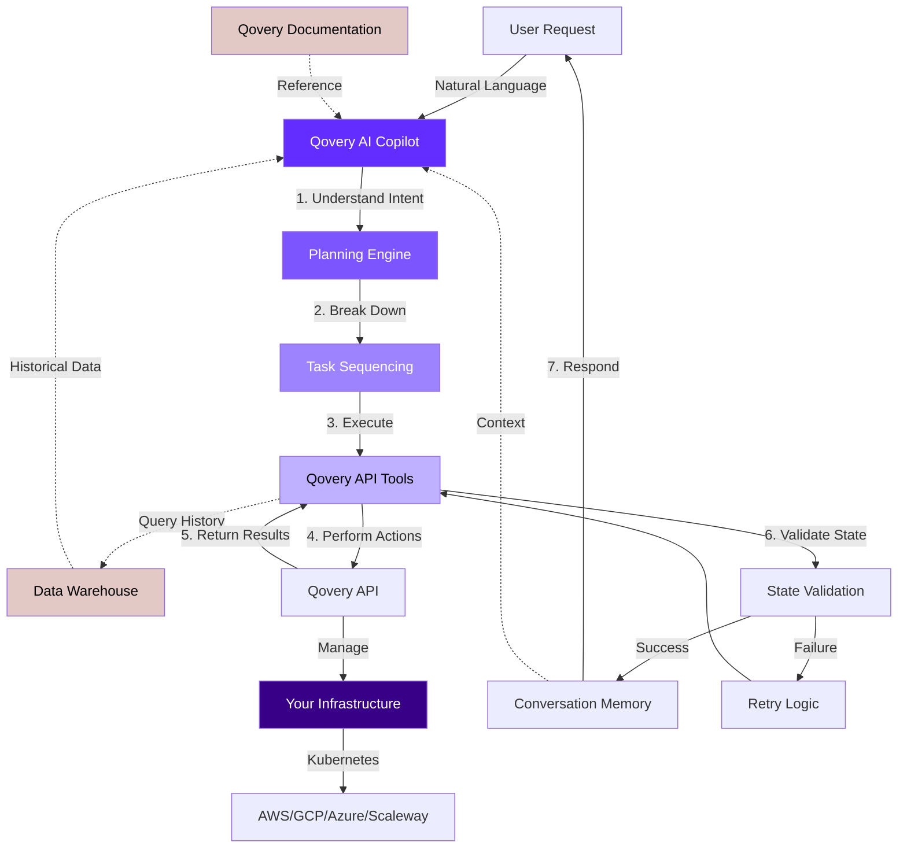

## Overview

Qovery AI Copilot is an **agentic AI system** (not just a chatbot) that automates infrastructure management, deployment optimization, and DevOps workflows. It can dynamically plan and execute multi-step tasks, troubleshoot issues, and interact with your entire Qovery infrastructure through natural language.

<Warning>
**Beta Status**: Qovery AI Copilot is currently in beta. Features and capabilities are actively being developed and improved.
</Warning>

## What Makes It Different?

Unlike traditional chatbots that simply answer questions, Qovery AI Copilot is an **agentic AI** that can:

<CardGroup cols={2}>
  <Card title="Plan" icon="brain">
    Analyzes complex requests and breaks them down into actionable steps
  </Card>

  <Card title="Execute" icon="play">
    Autonomously performs multiple operations to achieve your goals
  </Card>

  <Card title="Reason" icon="lightbulb">
    Understands context, validates states, and makes intelligent decisions
  </Card>

  <Card title="Learn" icon="graduation-cap">
    Adapts to your infrastructure patterns and maintains conversation context
  </Card>
</CardGroup>

## Key Capabilities

### Infrastructure Management

- Create, update, and delete environments
- Manage applications, databases, and services
- Configure networking and security settings
- Deploy and manage Kubernetes clusters
- Clone and migrate environments across clusters

### Deployment Automation

- Deploy applications with specific configurations
- Manage deployment pipelines
- Handle blue/green and canary deployments
- Automate rollbacks and recovery
- Scale services dynamically

### Time-Based Automation

- **One-Time Scheduled Tasks**: Schedule deployments, shutdowns, or any action for a specific time
- **Recurring Schedules**: Set up daily, weekly, or custom recurring automation
- **Maintenance Windows**: Automate routine maintenance during defined time periods
- **Cost Optimization Schedules**: Automatically scale down or stop resources during off-hours
- **Ephemeral Environments**: Auto-delete preview/feature environments after time periods
- **Conditional Time-Based Rules**: Different behaviors based on time of day (e.g., business hours vs. after hours)

### Optimization

- Analyze resource usage and costs
- Optimize Dockerfile configurations
- Recommend performance improvements
- Identify cost-saving opportunities
- Right-size resources based on usage patterns
- Automate cost reduction strategies

### Troubleshooting

- Analyze logs and identify issues
- Debug deployment failures
- Investigate performance problems
- Provide remediation steps
- Root cause analysis for errors
- Health check diagnostics

## How It Works

Qovery AI Copilot uses an agentic architecture that processes natural language requests and autonomously executes infrastructure operations:



### Knowledge Sources

Qovery AI Copilot has access to comprehensive knowledge sources to provide accurate and contextual responses:

<CardGroup cols={2}>
  <Card title="Qovery Documentation" icon="book">
    Complete access to all Qovery documentation for accurate guidance on features, configurations, and best practices
  </Card>

  <Card title="Data Warehouse" icon="database">
    Historical data and operations from your infrastructure for trend analysis, usage patterns, and informed decision-making
  </Card>
</CardGroup>

This knowledge enables the Copilot to:
- Answer questions about Qovery features and capabilities
- Provide best practice recommendations
- Analyze historical trends and patterns
- Make data-driven optimization suggestions
- Understand your infrastructure's evolution over time

### Agentic Architecture Phases

The Copilot evolved through four phases to become a true agentic system:

### 1. Basic Agent Phase
- Understands user intent
- Maps requests to appropriate tools
- Executes single operations

### 2. Agentic Phase
- Dynamically plans sequences of operations
- Uses stateless, composable tools
- Handles complex multi-step workflows

### 3. Resilience Phase
- Validates intermediate states
- Implements retry and recovery mechanisms
- Self-corrects when operations fail

### 4. Conversation Memory Phase
- Maintains context across interactions
- Understands references and continuity
- Enables complex, multi-turn conversations

<Info>
Read the technical deep-dive: [How We Built an Agentic DevOps Copilot](https://www.qovery.com/blog/how-we-built-an-agentic-devops-copilot-to-automate-infrastructure-tasks-and-beyond)
</Info>

## Access Methods

<Note>
**Activation**: Organization administrators can activate Qovery AI Copilot directly from the console settings. See the [Getting Started guide](/copilot/getting-started#activation) for step-by-step instructions.
</Note>

You can interact with Qovery AI Copilot through two interfaces:

<Tabs>
  <Tab title="Web Console (Beta)">
    Use Qovery AI Copilot directly in the Qovery Web Console.

    - Integrated chat interface
    - Natural language interaction
    - Full automation capabilities
    - Maintains conversation context
    - No additional setup required
  </Tab>

  <Tab title="MCP Server (Beta)">
    Use Qovery AI Copilot in Claude Desktop or other MCP-compatible clients.

    - Natural language interaction
    - Full automation capabilities
    - Maintains conversation context
    - Works from any MCP-compatible AI assistant
    - [Setup Guide →](/copilot/mcp-server)
  </Tab>
</Tabs>

## Example Use Cases

### Simple Tasks

```
"Deploy my application to staging"
"Show me the status of production environment"
"Scale up the API service to 5 replicas"
```

### Time-Based Automation

```
"Every weekday at 6 PM, stop all development environments"
"Deploy the hotfix to production tomorrow at 2 AM"
"Automatically scale down non-production services on weekends"
"Run database backups every night at 2 AM"
"Delete all feature environments older than 2 weeks every Monday"
```

### Complex Workflows

```
"Generate usage statistics for the last 30 days and export as CSV"
"Stop all environments that have been inactive for more than 6 hours"
"Create a staging environment that's a clone of production, but with smaller resources"
"Deploy to dev, then staging, then production - only if tests pass at each stage"
```

### Optimization

```
"Analyze my Dockerfile and suggest optimizations"
"Show me which services are using the most resources"
"Find environments where we can reduce costs"
"During business hours, ensure 5 replicas. Outside hours, scale to 2."
```

### Troubleshooting

```
"Why is my application deployment failing?"
"Investigate the error logs from the last hour"
"Debug the connection issue between my app and database"
"Show me all services with failing health checks"
```

## Technical Architecture

### Powered by Claude Sonnet 4.5

Qovery AI Copilot is currently powered by Anthropic's Claude Sonnet 4.5, providing:

- Advanced reasoning capabilities
- Large context windows for understanding complex infrastructure
- Reliable tool use for executing operations
- Safe and aligned behavior

<Info>
**Future Enhancement**: In the future, you'll be able to choose different AI models to power your Copilot, allowing you to select the best model for your specific needs and use cases.
</Info>

### Security & Privacy

- **No Sensitive Data Exposure**: Infrastructure details stay within your Qovery account
- **Secure Authentication**: Uses your Qovery credentials with proper authorization
- **Audit Trail**: All Copilot actions are logged and auditable
- **Role-Based Access**: Respects your Qovery permissions and access controls

<Warning>
Copilot can only perform actions you're authorized to perform. It respects all Qovery RBAC policies.
</Warning>

## Roadmap

We're continuously improving Qovery AI Copilot with:

- **Faster Planning**: Reduced latency for complex workflows
- **Self-Hosted Models**: Option to run models in your infrastructure
- **Long-Term Memory**: Context persistence across sessions
- **Custom Tools**: Extend Copilot with your own automation
- **Enhanced Observability**: Better visibility into Copilot reasoning

## Getting Started

<CardGroup cols={2}>
  <Card title="What is Agentic AI?" icon="brain" href="/copilot/what-is-agentic-ai">
    Understand the technology behind Qovery AI Copilot
  </Card>

  <Card title="Setup MCP Server" icon="rocket" href="/copilot/mcp-server">
    Start using Copilot with Claude Desktop
  </Card>

  <Card title="View Capabilities" icon="list" href="/copilot/capabilities/infrastructure-management">
    Explore what Copilot can do
  </Card>

  <Card title="See Examples" icon="code" href="/copilot/examples/common-tasks">
    Learn from practical examples
  </Card>
</CardGroup>

## Learn More

- [Technical Blog Post](https://www.qovery.com/blog/how-we-built-an-agentic-devops-copilot-to-automate-infrastructure-tasks-and-beyond) - Deep dive into how we built it
- [MCP Protocol](https://modelcontextprotocol.io) - Learn about the Model Context Protocol
- [Anthropic Claude](https://www.anthropic.com/claude) - The AI model powering Copilot
