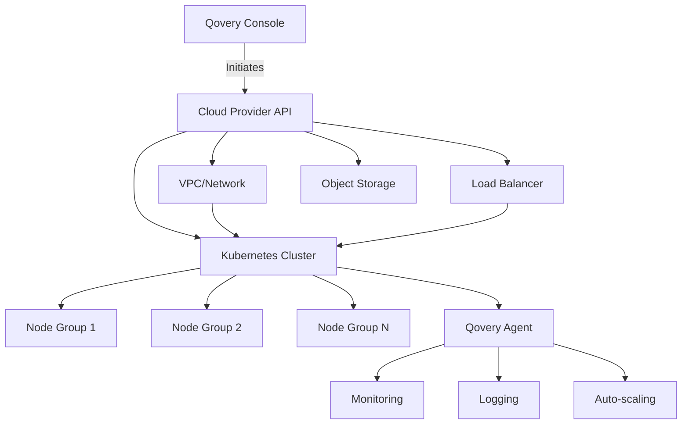

## Overview

Qovery Provision automates the setup and configuration of your cloud infrastructure on AWS, GCP, Azure, or Scaleway. It handles the complexities of cluster provisioning, networking, and infrastructure management, allowing you to focus on deploying applications rather than managing infrastructure.

## What Qovery Provision Does

<CardGroup cols={2}>
  <Card title="Cluster Creation" icon="server">
    Automated Kubernetes cluster provisioning with optimized configurations
  </Card>
  <Card title="Network Setup" icon="network-wired">
    VPC, subnets, load balancers, and DNS configuration
  </Card>
  <Card title="Security Configuration" icon="shield">
    IAM roles, security groups, and encryption by default
  </Card>
  <Card title="Cloud Resources" icon="cloud">
    Object storage, container registries, and monitoring infrastructure
  </Card>
</CardGroup>

## Quick Start

<CardGroup cols={2}>
  <Card title="Install on AWS" icon="aws" href="/getting-started/installation/aws">
    Complete guide to create EKS cluster with Karpenter auto-scaling
  </Card>
  <Card title="Install on GCP" icon="google" href="/getting-started/installation/gcp">
    Complete guide to create GKE cluster with auto-scaling
  </Card>
  <Card title="Install on Azure" icon="microsoft" href="/getting-started/installation/azure">
    Complete guide to create AKS cluster with auto-scaling
  </Card>
  <Card
    title="Install on Scaleway"
    icon="/images/logos/cloud-providers/scaleway-icon-light.svg"
    href="/getting-started/installation/scaleway"
  >
    Complete guide to create Kapsule cluster with auto-scaling
  </Card>
  <Card
    title="Bring Your Own Cluster"
    icon="server"
    href="/configuration/integrations/kubernetes/byok"
  >
    Connect your existing Kubernetes cluster to Qovery
  </Card>
</CardGroup>

---

## Cluster Provisioning Architecture

When you create a cluster, Qovery provisions:

**Components Provisioned**:

1. **VPC/Virtual Network**: Isolated network infrastructure
2. **Kubernetes Control Plane**: Managed Kubernetes API server
3. **Node Groups**: Worker nodes with auto-scaling
4. **Load Balancer**: External traffic routing
5. **Object Storage**: Container images and logs
6. **IAM Roles**: Service accounts and permissions
7. **Qovery Agent**: Cluster management and monitoring

## Cluster Types

### Managed Clusters

Qovery provisions and manages the entire cluster lifecycle.

**Pros**:

- Fully automated setup and maintenance
- Automatic updates and security patches
- Integrated monitoring and logging
- Cost optimization features

**Best For**: Production workloads, teams without dedicated DevOps

### BYOK (Bring Your Own Kubernetes)

Connect your existing Kubernetes cluster to Qovery - perfect for organizations with existing infrastructure or specific compliance requirements.

**What Qovery Manages**:

- ✅ Application deployments and orchestration
- ✅ Developer experience and workflows
- ✅ Application monitoring and logs

**What You Manage**:

- ❌ Kubernetes cluster lifecycle
- ❌ Infrastructure components (ingress, DNS, storage)
- ❌ Cluster upgrades and maintenance

**Best For**: Organizations with Kubernetes expertise and existing clusters (on-premise, edge, any cloud provider)

[Learn more about BYOK →](/integrations/kubernetes/byok)

---

## Use Cases & Benefits

<CardGroup cols={2}>
  <Card title="Multi-Cloud Strategy" icon="globe">
    Deploy across AWS, GCP, Azure, and Scaleway for geographic distribution,
    disaster recovery, or cost optimization
  </Card>
  <Card title="High Availability" icon="shield">
    Multi-AZ deployments with automatic failover and load balancing across
    availability zones
  </Card>
  <Card title="Cost Optimization" icon="piggy-bank">
    Karpenter auto-scaling (AWS), spot instances, and cluster sleep mode to
    reduce infrastructure costs by up to 60%
  </Card>
  <Card title="Infrastructure as Code" icon="code">
    Manage clusters via Terraform provider or API for reproducible,
    version-controlled infrastructure
  </Card>
</CardGroup>

---

## Next Steps

<CardGroup cols={2}>
  <Card title="Deploy Your First App" icon="rocket" href="/getting-started/guides/qovery-101/deploy">
    Learn how to deploy applications on your provisioned cluster
  </Card>

{" "}

<Card
  title="Cluster Advanced Settings"
  icon="sliders"
  href="/configuration/clusters"
>
  Fine-tune cluster configuration for your needs
</Card>

{" "}

<Card
  title="Multi-Cluster Management"
  icon="/images/logos/cloud-providers/scaleway-icon-light.svg"
  href="/configuration/clusters"
>
  Manage multiple clusters across regions
</Card>

  <Card title="Kubernetes Integrations" icon="dharmachakra" href="/configuration/integrations/kubernetes/eks/overview">
    Explore cloud-specific Kubernetes features
  </Card>
</CardGroup>
