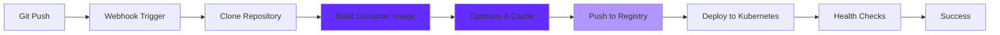

## Overview

Qovery Deploy is Qovery's integrated CI/CD solution that provides optimized container image builds and intelligent deployment automation. Designed specifically for Kubernetes deployments, it offers faster builds, better caching, and actionable build optimization insights.

<Note>
**Build optimization insights coming soon!** Qovery will provide automated recommendations to optimize your Docker builds, reduce image sizes, and speed up deployments.
</Note>

## Features

<CardGroup cols={2}>
  <Card title="Optimized Builds" icon="gauge-high">
    Fast container builds with intelligent caching and parallelization
  </Card>

  <Card title="Git Integration" icon="code-branch">
    Automatic deployments triggered by Git pushes
  </Card>

  <Card title="Build Insights" icon="lightbulb" iconType="duotone">
    Automated recommendations for faster builds (coming soon)
  </Card>

  <Card title="Multi-Registry" icon="warehouse">
    Push to any container registry (ECR, Docker Hub, GCR, etc.)
  </Card>
</CardGroup>

## How It Works



### Build Process

<Steps>
  <Step title="Trigger">
    Push to Git repository triggers automatic build via webhook
  </Step>

  <Step title="Clone">
    Qovery clones your repository at the specified commit
  </Step>

  <Step title="Build">
    Qovery builds your Docker image using BuildKit with optimizations:
    - Layer caching for faster subsequent builds
    - Parallel layer builds
    - Efficient context transfer
    - Build secrets injection
  </Step>

  <Step title="Optimize">
    Build engine analyzes and optimizes:
    - Cache hit rate
    - Layer sizes
    - Build duration per step
    - **Coming soon**: Automated optimization suggestions
  </Step>

  <Step title="Push">
    Image pushed to configured container registry with tags:
    - Commit SHA (e.g., `sha-abc123`)
    - Branch name (e.g., `main`)
    - Custom tags
  </Step>

  <Step title="Deploy">
    New image automatically deployed to Kubernetes cluster
  </Step>

  <Step title="Monitor">
    Track deployment progress with real-time logs and health checks
  </Step>
</Steps>

## Build Optimization

### Current Optimizations

Qovery Deploy automatically applies these optimizations:

<AccordionGroup>
  <Accordion title="Layer Caching" icon="layer-group">
    **How it works**: Qovery caches Docker layers between builds

    **Benefits**:
    - Significantly faster builds (50-90% faster)
    - Only changed layers are rebuilt
    - Shared cache across all builds in the same project

    **Best practice**: Order Dockerfile commands from least to most frequently changing
    ```dockerfile
    # Good: Dependencies (rarely change) first
    COPY package.json package-lock.json ./
    RUN npm ci
    COPY . .

    # Bad: Source code (frequently changes) first
    COPY . .
    RUN npm ci
    ```
  </Accordion>

  <Accordion title="BuildKit" icon="screwdriver-wrench">
    **How it works**: Uses Docker BuildKit for parallel builds

    **Benefits**:
    - Parallel execution of independent build stages
    - Improved caching strategy
    - Build secrets support
    - Better error messages

    **Multi-stage example**:
    ```dockerfile
    # Both stages build in parallel
    FROM node:18 AS frontend
    WORKDIR /app/frontend
    COPY frontend/package*.json ./
    RUN npm ci
    COPY frontend ./
    RUN npm run build

    FROM node:18 AS backend
    WORKDIR /app/backend
    COPY backend/package*.json ./
    RUN npm ci
    COPY backend ./

    FROM node:18-slim
    COPY --from=frontend /app/frontend/dist /app/public
    COPY --from=backend /app/backend /app
    CMD ["node", "index.js"]
    ```
  </Accordion>

  <Accordion title="Efficient Context" icon="folder-tree">
    **How it works**: Only transfers necessary files to build context

    **Benefits**:
    - Faster context transfer
    - Reduced build time
    - Less network usage

    **Best practice**: Use `.dockerignore`
    ```
    # .dockerignore
    node_modules
    npm-debug.log
    .git
    .env
    *.md
    tests
    .github
    ```
  </Accordion>

  <Accordion title="Registry Caching" icon="warehouse">
    **How it works**: Uses registry as remote cache

    **Benefits**:
    - Cache persists across different build runners
    - Faster cold starts
    - Shared cache for team

    **Automatic**: Qovery configures this automatically
  </Accordion>
</AccordionGroup>

### Build Insights (Coming Soon)

Qovery will automatically analyze your builds and provide actionable recommendations:

<Tabs>
  <Tab title="Size Optimization">
    **Recommendations**:
    - 🎯 Use multi-stage builds to reduce final image size
    - 🎯 Switch to Alpine or distroless base images
    - 🎯 Remove unnecessary files and dependencies
    - 🎯 Combine RUN commands to reduce layers

    **Example insight**:
    ```
    💡 Your image is 1.2GB. By using multi-stage builds and Alpine,
       you could reduce it to ~150MB (87% smaller).

    Suggested Dockerfile changes:
    - Replace 'FROM node:18' with 'FROM node:18-alpine'
    - Use multi-stage build to exclude dev dependencies
    - Add .dockerignore to exclude tests/ folder

    Estimated savings: 1.05GB, 45s faster deployment time
    ```
  </Tab>

  <Tab title="Speed Optimization">
    **Recommendations**:
    - ⚡ Reorder Dockerfile commands for better caching
    - ⚡ Parallelize build stages
    - ⚡ Use smaller base images for faster pulls
    - ⚡ Pre-build dependencies in separate stage

    **Example insight**:
    ```
    ⚡ Your builds take 5m 30s. With optimizations, this could be 1m 45s.

    Identified issues:
    1. Dependencies reinstalled on every build (no cache)
       → Move COPY package*.json before COPY . .

    2. Sequential builds could be parallel
       → Use multi-stage builds

    3. Large base image (900MB pull)
       → Consider node:18-alpine (170MB)

    Estimated time savings: 3m 45s (68% faster)
    ```
  </Tab>

  <Tab title="Security Insights">
    **Recommendations**:
    - 🔒 Update base image versions
    - 🔒 Remove sensitive files from image
    - 🔒 Use distroless for minimal attack surface
    - 🔒 Scan for vulnerabilities

    **Example insight**:
    ```
    🔒 Security improvements available:

    1. Base image 'node:18' has 23 vulnerabilities
       → Update to 'node:18.19-alpine' (2 low vulnerabilities)

    2. Found sensitive files in image:
       - .env.example
       - private_key.pem (in .git/)
       → Add to .dockerignore

    3. Running as root user
       → Add USER node to Dockerfile
    ```
  </Tab>

  <Tab title="Cost Optimization">
    **Recommendations**:
    - 💰 Reduce image size to save registry storage
    - 💰 Optimize layers to reduce bandwidth costs
    - 💰 Use build cache effectively
    - 💰 Remove unused dependencies

    **Example insight**:
    ```
    💰 Cost savings available:

    Current monthly costs:
    - Registry storage: $15 (30GB across 50 images)
    - Data transfer: $8 (1,200 deployments)
    - Build time: $22 (110 hours)
    Total: $45/month

    With optimizations:
    - Registry storage: $3 (6GB, 80% reduction)
    - Data transfer: $2 (4x fewer image pulls)
    - Build time: $8 (better caching)
    Estimated total: $13/month

    Savings: $32/month (71% reduction)
    ```
  </Tab>
</Tabs>

## Configuration

### Basic Configuration

In Qovery Console, configure build settings for your application:

<Tabs>
  <Tab title="Build Settings">
    **Dockerfile Path**: Path to Dockerfile (default: `./Dockerfile`)
    ```
    ./Dockerfile
    ./docker/prod.Dockerfile
    ./services/api/Dockerfile
    ```

    **Build Context**: Root directory for build (default: `.`)
    ```
    .
    ./backend
    ./services/api
    ```

    **Build Arguments**: Pass args to Docker build
    ```
    NODE_ENV=production
    API_VERSION=v2
    BUILD_DATE=$QOVERY_BUILD_DATE
    ```
  </Tab>

  <Tab title="Registry Settings">
    **Registry**: Choose container registry
    - ECR (AWS)
    - GCR (Google)
    - ACR (Azure)
    - Docker Hub
    - GitHub Container Registry
    - GitLab Container Registry
    - Generic (any registry)

    **Image Name**: Name for your image
    ```
    my-app
    my-company/my-app
    production/my-app
    ```

    **Tags**: Image tags (automatic)
    - `{commit-sha}`: Git commit SHA
    - `{branch-name}`: Git branch name
    - Custom tags: `v1.0.0`, `latest`
  </Tab>

  <Tab title="Advanced Settings">
    **Build Timeout**: Max build duration (default: 30 minutes)
    ```
    1800  # 30 minutes
    3600  # 60 minutes
    ```

    **Build Platform**: Target architecture
    ```
    linux/amd64  # Intel/AMD (default)
    linux/arm64  # ARM (for AWS Graviton, Apple Silicon)
    ```

    **Build Secrets**: Inject secrets during build
    ```
    NPM_TOKEN=<secret>
    GITHUB_TOKEN=<secret>
    ```

    Access in Dockerfile:
    ```dockerfile
    RUN --mount=type=secret,id=NPM_TOKEN \
        echo "//registry.npmjs.org/:_authToken=$(cat /run/secrets/NPM_TOKEN)" > .npmrc && \
        npm ci
    ```
  </Tab>
</Tabs>

### Dockerfile Best Practices

<CardGroup cols={2}>
  <Card title="Multi-Stage Builds" icon="layer-group">
    ```dockerfile
    # Build stage
    FROM node:18 AS builder
    WORKDIR /app
    COPY package*.json ./
    RUN npm ci
    COPY . .
    RUN npm run build

    # Production stage
    FROM node:18-alpine
    WORKDIR /app
    COPY --from=builder /app/dist ./dist
    COPY --from=builder /app/node_modules ./node_modules
    CMD ["node", "dist/index.js"]
    ```
  </Card>

  <Card title="Layer Optimization" icon="arrow-down">
    ```dockerfile
    # Install dependencies (cached)
    COPY package*.json ./
    RUN npm ci --only=production

    # Copy source (changes frequently)
    COPY . .

    # Don't combine frequently changing commands
    # Each change busts cache for all subsequent layers
    ```
  </Card>

  <Card title="Small Base Images" icon="compress">
    ```dockerfile
    # Large (900MB)
    FROM node:18

    # Medium (350MB)
    FROM node:18-slim

    # Small (170MB)
    FROM node:18-alpine

    # Tiny (10MB + deps) - distroless
    FROM gcr.io/distroless/nodejs18
    ```
  </Card>

  <Card title=".dockerignore" icon="filter">
    ```
    # .dockerignore
    node_modules
    npm-debug.log
    .git
    .gitignore
    .env
    .env.*
    *.md
    tests
    .github
    .vscode
    coverage
    dist  # if rebuilt in container
    ```
  </Card>
</CardGroup>

## Monitoring Builds

### Build Logs

View real-time build logs in Qovery Console:

1. Navigate to your application
2. Click **Deployments** tab
3. Select a deployment
4. View **Build** phase logs

### Build Metrics

Track build performance:

- **Build duration**: Total time to build image
- **Cache hit rate**: Percentage of cached layers
- **Image size**: Final image size
- **Layer count**: Number of layers in image

### Build History

Access historical build information:
- Previous build times
- Image sizes over time
- Cache effectiveness
- Failed builds with logs

## Comparison with Other CI/CD

| Feature | Qovery Deploy | GitHub Actions | GitLab CI | CircleCI |
|---------|---------------|----------------|-----------|----------|
| **Setup** | Zero config | YAML config | YAML config | YAML config |
| **Build Speed** | Optimized (BuildKit) | Standard | Standard | Standard |
| **Caching** | Automatic | Manual config | Manual config | Manual config |
| **Kubernetes Deploy** | Native | Via CLI/tools | Via CLI/tools | Via CLI/tools |
| **Build Insights** | Coming soon | None | None | Third-party |
| **Cost** | Included | Free tier + paid | Free tier + paid | Free tier + paid |
| **Best For** | Kubernetes apps on Qovery | Any GitHub project | Any GitLab project | Any project |

## When to Use Qovery Deploy vs External CI/CD

<Tabs>
  <Tab title="Use Qovery Deploy">
    ✅ **Best for**:
    - New projects starting on Qovery
    - Teams wanting zero-config CI/CD
    - Kubernetes-native deployments
    - Optimized build performance
    - Simple workflows

    **Advantages**:
    - No YAML configuration needed
    - Automatic optimizations
    - Integrated with Qovery deployments
    - Build insights (coming soon)
    - Lower complexity
  </Tab>

  <Tab title="Use External CI/CD">
    ✅ **Best for**:
    - Complex workflows (tests, linting, multiple stages)
    - Multi-platform deployments
    - Advanced matrix builds
    - Custom deployment targets
    - Existing CI/CD pipelines

    **Advantages**:
    - Full workflow control
    - Run tests, linting, security scans
    - Deploy to multiple environments
    - Third-party integrations
    - Reusable workflows

    **Integrate with Qovery**:
    - Build image in CI/CD
    - Push to registry
    - Trigger Qovery deployment via CLI/API
  </Tab>
</Tabs>

## Troubleshooting

<AccordionGroup>
  <Accordion title="Build Timeout">
    **Problem**: Build exceeds timeout limit

    **Solutions**:
    - Increase build timeout in settings
    - Optimize Dockerfile for better caching
    - Use smaller base images (faster pulls)
    - Pre-build dependencies in separate stage
    - Use .dockerignore to reduce context size
  </Accordion>

  <Accordion title="Build Cache Not Working">
    **Problem**: Every build rebuilds all layers

    **Solutions**:
    - Check Dockerfile order (dependencies before source)
    - Avoid commands that change on every build (timestamps, random values)
    - Don't disable cache in build settings
    - Ensure registry has push permissions for cache
  </Accordion>

  <Accordion title="Large Image Size">
    **Problem**: Docker image is very large

    **Solutions**:
    - Use multi-stage builds
    - Switch to Alpine or distroless base images
    - Remove dev dependencies in production
    - Don't include source files if not needed
    - Use .dockerignore
    - Combine RUN commands to reduce layers
  </Accordion>

  <Accordion title="Build Secrets Not Working">
    **Problem**: Cannot access secrets during build

    **Solutions**:
    - Use BuildKit secret mount syntax
    - Ensure secret is defined in Qovery
    - Don't use ARG for secrets (insecure, visible in history)
    - Check secret ID matches mount ID

    Correct syntax:
    ```dockerfile
    RUN --mount=type=secret,id=NPM_TOKEN \
        npm config set //registry.npmjs.org/:_authToken=$(cat /run/secrets/NPM_TOKEN)
    ```
  </Accordion>
</AccordionGroup>

## Roadmap

<CardGroup cols={2}>
  <Card title="Build Insights" icon="lightbulb" iconType="duotone">
    **Coming Q2 2025**
    - Automated Dockerfile optimization suggestions
    - Size reduction recommendations
    - Speed improvement tips
    - Security vulnerability scanning
    - Cost optimization insights
  </Card>

  <Card title="Advanced Caching" icon="database">
    **Coming Q3 2025**
    - Shared cache across projects
    - Cache warming for faster cold starts
    - Predictive cache preloading
    - Cache analytics dashboard
  </Card>

  <Card title="Build Analytics" icon="chart-line">
    **Coming Q3 2025**
    - Build performance trends
    - Cache hit rate over time
    - Image size tracking
    - Build time predictions
    - Cost analysis per build
  </Card>

  <Card title="Custom Build Steps" icon="list-check">
    **Coming Q4 2025**
    - Pre-build hooks (tests, linting)
    - Post-build hooks (security scans)
    - Custom build scripts
    - Matrix builds
  </Card>
</CardGroup>

## Next Steps

<CardGroup cols={2}>
  <Card title="GitHub Actions" icon="github" href="/integrations/ci-cd/github-actions">
    Use GitHub Actions with Qovery
  </Card>

  <Card title="GitLab CI" icon="gitlab" href="/integrations/ci-cd/gitlab-ci">
    Integrate with GitLab CI/CD
  </Card>

  <Card title="Container Registries" icon="warehouse" href="/integrations/container-registries/overview">
    Configure container registries
  </Card>

  <Card title="Deployment Overview" icon="rocket" href="/using-qovery/deployment/overview">
    Learn about deployments
  </Card>
</CardGroup>
