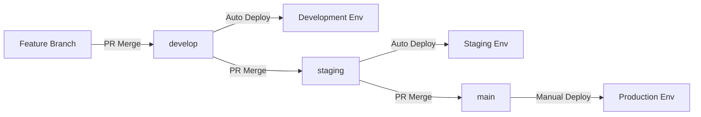

## Overview

Environments in Qovery represent different stages of your application lifecycle. This guide explains how to create and manage multiple environments for development, staging, and production.

## What are Environments?

Environments are isolated deployment contexts where your applications run. Each environment can have:

- Different configurations
- Different resources (CPU, memory)
- Different deployment rules
- Independent lifecycle management

### Environment Types

<CardGroup cols={3}>
  <Card title="Development" icon="code">
    For active development with frequent updates
  </Card>
  <Card title="Staging" icon="flask">
    For testing before production
  </Card>
  <Card title="Production" icon="rocket">
    For live, customer-facing applications
  </Card>
</CardGroup>

## Creating an Environment

<Steps>
  <Step title="Navigate to Project">
    Go to your project in the Qovery Console
  </Step>

  <Step title="Click Create Environment">
    Click the **Create Environment** button
  </Step>

  <Step title="Configure Environment">
    Fill in the details:

    **Basic Settings**:
    - **Name**: e.g., "production", "staging", "dev"
    - **Mode**: PRODUCTION, STAGING, or DEVELOPMENT
    - **Cluster**: Select target cluster

    **Advanced Settings** (optional):
    - **Auto-deploy**: Enable/disable automatic deployments
    - **Auto-stop**: Stop environment after period of inactivity
    - **Deployment Pipeline**: Configure deployment order
  </Step>

  <Step title="Create">
    Click **Create Environment** to finish
  </Step>
</Steps>

## Environment Configuration

### Development Environment

Best for active development:

```yaml
mode: DEVELOPMENT
auto_deploy: true
auto_stop: true  # Stop after 2 hours of inactivity
resources:
  cpu: 250m
  memory: 256Mi
min_instances: 1
max_instances: 1
```

**Characteristics**:
- Auto-deploy on every push
- Lower resource allocation
- Auto-stop to save costs
- Fast iteration cycles

### Staging Environment

Pre-production testing:

```yaml
mode: STAGING
auto_deploy: true
auto_stop: false
resources:
  cpu: 500m
  memory: 512Mi
min_instances: 1
max_instances: 3
```

**Characteristics**:
- Similar to production
- Auto-deploy for testing
- Always running
- Moderate scaling

### Production Environment

Customer-facing environment:

```yaml
mode: PRODUCTION
auto_deploy: false  # Manual approval required
auto_stop: false
resources:
  cpu: 1000m
  memory: 1024Mi
min_instances: 2
max_instances: 10
```

**Characteristics**:
- Manual deployment approval
- High availability (multiple replicas)
- Auto-scaling enabled
- Maximum reliability

## Multi-Environment Setup

Create a complete development workflow:

<Steps>
  <Step title="Create Development Environment">
    ```bash
    Name: development
    Mode: DEVELOPMENT
    Branch: develop
    Auto-deploy: true
    ```
  </Step>

  <Step title="Create Staging Environment">
    ```bash
    Name: staging
    Mode: STAGING
    Branch: staging
    Auto-deploy: true
    ```
  </Step>

  <Step title="Create Production Environment">
    ```bash
    Name: production
    Mode: PRODUCTION
    Branch: main
    Auto-deploy: false
    ```
  </Step>
</Steps>

### Git Workflow



## Environment Variables

Set environment-specific variables:

### Development

```bash
NODE_ENV=development
LOG_LEVEL=debug
FEATURE_FLAGS=all_enabled
DATABASE_HOST=dev-db.internal
```

### Staging

```bash
NODE_ENV=staging
LOG_LEVEL=info
FEATURE_FLAGS=beta_enabled
DATABASE_HOST=staging-db.internal
```

### Production

```bash
NODE_ENV=production
LOG_LEVEL=warn
FEATURE_FLAGS=stable_only
DATABASE_HOST=prod-db.internal
```

## Managing Environments

### Deploy Environment

Deploy all services in an environment:

```bash
# Via Console
1. Select environment
2. Click "Deploy All"
3. Confirm deployment

# Via CLI
qovery environment deploy --environment production
```

### Stop Environment

Temporarily stop all services:

```bash
# Via Console
1. Select environment
2. Click "Stop All"

# Via CLI
qovery environment stop --environment development
```

### Clone Environment

Duplicate an environment with all configurations:

<Steps>
  <Step title="Select Environment">
    Choose the environment to clone
  </Step>

  <Step title="Click Clone">
    Click the **Clone** button
  </Step>

  <Step title="Configure New Environment">
    Adjust settings for the cloned environment:
    - New name
    - Different branch (optional)
    - Modified resources
  </Step>

  <Step title="Create Clone">
    Click **Create** to clone the environment
  </Step>
</Steps>

## Best Practices

<AccordionGroup>
  <Accordion title="Use Consistent Naming">
    Use clear, consistent names: `production`, `staging`, `development` or `prod`, `stg`, `dev`
  </Accordion>

  <Accordion title="Separate Resources">
    Use different cloud resources per environment:
    - Separate databases
    - Separate storage buckets
    - Isolated networks
  </Accordion>

  <Accordion title="Mirror Production">
    Make staging as similar to production as possible for accurate testing
  </Accordion>

  <Accordion title="Auto-Deploy Wisely">
    - **Enable** for dev/staging
    - **Disable** for production (use manual approvals)
  </Accordion>

  <Accordion title="Use Environment Variables">
    Never hardcode environment-specific values. Use environment variables.
  </Accordion>
</AccordionGroup>

## Preview Environments

Create temporary environments for feature branches:

<Steps>
  <Step title="Enable Preview Environments">
    In project settings, enable **Preview Environments**
  </Step>

  <Step title="Configure Trigger">
    Set when to create preview environments:
    - On pull request creation
    - On specific label
    - Manual trigger
  </Step>

  <Step title="Set Lifetime">
    Configure how long previews should live:
    - Delete on PR merge
    - Delete after X days
    - Manual deletion only
  </Step>
</Steps>

See [Preview Environments Guide](/guides/advanced/preview-environments) for details.

## Troubleshooting

<AccordionGroup>
  <Accordion title="Environment Won't Start">
    **Solutions**:
    - Check cluster has sufficient resources
    - Verify all services are configured correctly
    - Check for configuration errors in logs
    - Ensure dependencies (databases) are running
  </Accordion>

  <Accordion title="Services Not Communicating">
    **Solutions**:
    - Verify services are in same environment
    - Check internal DNS names
    - Review network policies
    - Ensure services are running
  </Accordion>

  <Accordion title="Deployment Stuck">
    **Solutions**:
    - Check deployment logs
    - Verify Docker image is valid
    - Check resource quotas
    - Look for failing health checks
  </Accordion>
</AccordionGroup>

## Next Steps

<CardGroup cols={2}>
  <Card title="Deploy Application" icon="rocket" href="/guides/getting-started/deploy-your-first-application">
    Learn how to deploy applications
  </Card>
  <Card title="Connect Database" icon="database" href="/guides/getting-started/connect-database">
    Add a database to your environment
  </Card>
  <Card title="Multi-Environment Setup" icon="layer-group" href="/guides/advanced/multi-environment-setup">
    Advanced multi-environment patterns
  </Card>
  <Card title="CI/CD Integration" icon="rotate" href="/guides/advanced/ci-cd-integration">
    Automate deployments with CI/CD
  </Card>
</CardGroup>
