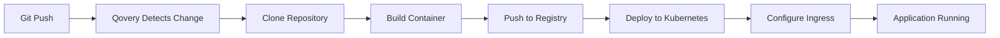

## Overview

This guide walks you through deploying your first application on Qovery, from connecting your Git repository to seeing your app live in production.

## Prerequisites

Before you begin, make sure you have:

- A Qovery account ([sign up here](https://console.qovery.com/signup))
- A Git repository (GitHub, GitLab, or Bitbucket) with your application code
- A Kubernetes cluster set up in Qovery ([Installation Guide](/installation))

## Step 1: Create a Project

Projects help you organize related applications and environments.

<Steps>
  <Step title="Navigate to Projects">
    In the Qovery Console, click on **Projects** in the left sidebar
  </Step>

  <Step title="Create New Project">
    Click **Create Project** and enter:
    - **Name**: e.g., "My First Project"
    - **Description**: Optional description
  </Step>

  <Step title="Select Cluster">
    Choose the cluster where you want to deploy your applications
  </Step>
</Steps>

## Step 2: Create an Environment

Environments represent different stages of your application lifecycle (dev, staging, production).

<Steps>
  <Step title="Open Your Project">
    Click on the project you just created
  </Step>

  <Step title="Create Environment">
    Click **Create Environment** and configure:
    - **Name**: e.g., "production"
    - **Type**: Select PRODUCTION, STAGING, or DEVELOPMENT
    - **Cluster**: Already selected from project
  </Step>

  <Step title="Create">
    Click **Create** to set up your environment
  </Step>
</Steps>

## Step 3: Deploy Your Application

Now let's deploy your first application!

<Steps>
  <Step title="Add Application">
    In your environment, click **Add Application**
  </Step>

  <Step title="Connect Git Repository">
    - Select your Git provider (GitHub, GitLab, or Bitbucket)
    - Choose your repository
    - Select the branch to deploy (e.g., `main`)
  </Step>

  <Step title="Configure Build">
    Qovery will auto-detect your application:
    - **With Dockerfile**: Qovery will use it automatically
    - **Without Dockerfile**: Qovery uses Buildpacks to detect your language/framework

    You can customize:
    - Dockerfile path (if not in root)
    - Build arguments
    - Root application path
  </Step>

  <Step title="Set Resources">
    Configure your application resources:
    ```yaml
    CPU: 500m (0.5 CPU cores)
    Memory: 512 MB
    ```
    You can adjust these later based on your needs.
  </Step>

  <Step title="Configure Port">
    If your application exposes a port:
    - **Internal Port**: The port your app listens on (e.g., 8080, 3000)
    - **External Port**: 443 (HTTPS)
    - **Publicly Accessible**: Enable to expose to the internet
  </Step>

  <Step title="Deploy">
    Click **Deploy** to start your first deployment!
  </Step>
</Steps>

## Step 4: Monitor Deployment

<Steps>
  <Step title="View Logs">
    Click on your application to see real-time deployment logs:
    - **Build logs**: Container image building
    - **Deployment logs**: Kubernetes deployment
    - **Application logs**: Your app's stdout/stderr
  </Step>

  <Step title="Check Status">
    Wait for the status to change to **Running** (usually 2-5 minutes)
  </Step>

  <Step title="Access Your Application">
    Once running, click on the application URL to view your live app!
  </Step>
</Steps>

## Understanding the Deployment

Here's what Qovery did behind the scenes:



1. **Cloned your repository** from Git
2. **Built a container image** using Docker or Buildpacks
3. **Pushed to container registry** in your cloud account
4. **Deployed to Kubernetes** with proper configurations
5. **Configured networking** with automatic HTTPS
6. **Started health checks** to ensure your app is running

## Common Issues

<AccordionGroup>
  <Accordion title="Build Failed">
    **Problem**: Build logs show errors

    **Solutions**:
    - Check if all dependencies are listed in your package manager file
    - Verify Dockerfile syntax if using custom Dockerfile
    - Ensure build commands are correct
    - Check build logs for specific error messages
  </Accordion>

  <Accordion title="Application Crashes">
    **Problem**: App deploys but immediately crashes

    **Solutions**:
    - Check application logs for errors
    - Verify environment variables are set correctly
    - Ensure the port configuration matches your app
    - Check resource limits (CPU/memory might be too low)
  </Accordion>

  <Accordion title="Cannot Access Application">
    **Problem**: Deployment successful but can't access URL

    **Solutions**:
    - Verify "Publicly Accessible" is enabled
    - Check if application is listening on the correct port
    - Ensure health checks are passing
    - Wait a few minutes for DNS propagation
  </Accordion>
</AccordionGroup>

## Example: Deploying a Node.js App

Here's a complete example of a simple Node.js app:

### Application Code

```javascript
// server.js
const express = require('express');
const app = express();
const PORT = process.env.PORT || 3000;

app.get('/', (req, res) => {
  res.json({ message: 'Hello from Qovery!' });
});

app.get('/health', (req, res) => {
  res.json({ status: 'healthy' });
});

app.listen(PORT, () => {
  console.log(`Server running on port ${PORT}`);
});
```

### Package.json

```json
{
  "name": "my-first-app",
  "version": "1.0.0",
  "main": "server.js",
  "scripts": {
    "start": "node server.js"
  },
  "dependencies": {
    "express": "^4.18.0"
  }
}
```

### Qovery Configuration

- **Port**: 3000 (internal), 443 (external)
- **Build**: Automatic (Buildpacks detects Node.js)
- **Health Check**: GET /health
- **Auto Deploy**: Enabled on `main` branch

## Next Steps

Congratulations! You've deployed your first application. Now you can:

<CardGroup cols={2}>
  <Card title="Add a Database" icon="database" href="/guides/getting-started/connect-database">
    Connect a PostgreSQL, MySQL, or other database
  </Card>
  <Card title="Configure Custom Domain" icon="globe" href="/guides/applications/configure-custom-domain">
    Use your own domain name
  </Card>
  <Card title="Manage Environment Variables" icon="key" href="/guides/applications/manage-environment-variables">
    Add secrets and configuration
  </Card>
  <Card title="Create More Environments" icon="layer-group" href="/guides/getting-started/create-environment">
    Set up staging and development environments
  </Card>
</CardGroup>

## Tips for Success

<Tip>
**Start Small**: Begin with minimal resources and scale up based on actual usage. Qovery makes it easy to adjust.
</Tip>

<Tip>
**Use Auto-Deploy**: Enable automatic deployments for development and staging. Keep production manual for control.
</Tip>

<Tip>
**Check Logs**: Always check logs if something isn't working. They contain valuable debugging information.
</Tip>

<Tip>
**Health Checks**: Configure health check endpoints in your application for better reliability.
</Tip>
