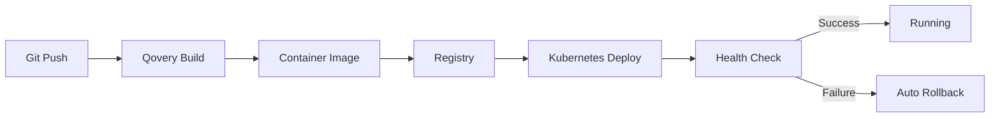

## Overview

Qovery Deploy automates application deployment to Kubernetes with zero-downtime releases, automatic rollbacks, and integrated CI/CD. Deploy from Git repositories, container registries, or Helm charts with a few clicks or API calls.

## What Qovery Deploy Does

<CardGroup cols={2}>
  <Card title="Continuous Deployment" icon="rotate">
    Automatic deployments from Git commits or container image tags
  </Card>
  <Card title="Zero-Downtime" icon="clock">
    Rolling updates with health checks and readiness probes
  </Card>
  <Card title="Automatic Rollback" icon="arrow-rotate-left">
    Instant rollback to previous versions if deployment fails
  </Card>
  <Card title="Multi-Environment" icon="layer-group">
    Deploy to development, staging, and production environments
  </Card>
</CardGroup>

## Deployment Workflow

## Service Types

<AccordionGroup>
  <Accordion title="Applications" icon="rocket">
    **Deploy from Git repositories**

    - **Supported languages**: Node.js, Python, Go, Java, Ruby, PHP, .NET, Rust
    - **Build methods**: Dockerfile, Buildpacks, or framework auto-detection
    - **Sources**: GitHub, GitLab, Bitbucket
    - **Monorepo support**: Deploy multiple apps from one repository

    [Configuration guide →](/configuration/application)
  </Accordion>

  <Accordion title="Containers" icon="docker">
    **Deploy pre-built images**

    - **Registries**: Docker Hub, AWS ECR, GCP GCR, Azure ACR, GitHub CR, GitLab CR
    - **Private registries**: Connect any private registry
    - **Image tags**: Deploy specific tags or auto-update on new tags

    [Configuration guide →](/configuration/application)
  </Accordion>

  <Accordion title="Helm Charts" icon="helm">
    **Deploy packaged applications**

    - **Public repositories**: Prometheus, Grafana, Redis, Elasticsearch
    - **Private repositories**: Connect your Helm repositories
    - **Values override**: Customize deployments with custom values

    [Configuration guide →](/configuration/helm)
  </Accordion>

  <Accordion title="Jobs" icon="clock">
    **Run batch and scheduled tasks**

    - **Cron Jobs**: Scheduled recurring tasks (backups, reports, cleanup)
    - **Lifecycle Jobs**: Run before/after deployments (migrations, seeding)
    - **One-time Jobs**: Ad-hoc task execution

    [Cron Jobs →](/configuration/cronjob) | [Lifecycle Jobs →](/configuration/lifecycle-job)
  </Accordion>
</AccordionGroup>

## Quick Start

<CardGroup cols={2}>
  <Card title="Deploy Your First App" icon="rocket" href="/guides/getting-started/deploy-your-first-application">
    Step-by-step tutorial to deploy your first application on Qovery
  </Card>
  <Card title="Application Configuration" icon="sliders" href="/configuration/application">
    Complete reference for application configuration options
  </Card>
</CardGroup>

---

## Key Features

<CardGroup cols={2}>
  <Card title="GitOps Workflows" icon="code-branch">
    **Auto-deploy on every commit**

    - Automatic deployments on Git push
    - Preview environments for pull requests
    - Multi-environment pipelines (Dev → Staging → Prod)
  </Card>

  <Card title="Zero-Downtime Deployments" icon="arrows-rotate">
    **Rolling updates with health checks**

    - Gradual pod replacement
    - Health check validation
    - Automatic rollback on failure
  </Card>

  <Card title="Preview Environments" icon="git-alt">
    **Test changes before merging**

    - Auto-created per pull request
    - Full-stack with databases
    - Automatic cleanup after merge

    [Learn more →](/guides/use-cases/ephemeral-environment)
  </Card>

  <Card title="Deployment History" icon="clock-rotate-left">
    **Track and rollback deployments**

    - Complete deployment history
    - One-click rollback to any version
    - Deployment logs and status tracking
  </Card>
</CardGroup>

---

## Use Cases

<CardGroup cols={2}>
  <Card title="Web Applications" icon="window">
    Deploy React, Vue, Angular, Next.js frontends with auto-scaling and CDN
  </Card>
  <Card title="APIs & Microservices" icon="server">
    Deploy REST, GraphQL, gRPC backends with load balancing and auto-scaling
  </Card>
  <Card title="Background Workers" icon="gears">
    Run data processing, queue consumers, and async tasks
  </Card>
  <Card title="Scheduled Jobs" icon="calendar">
    Execute cron jobs for backups, reports, cleanup, and automation
  </Card>
</CardGroup>

---

## Next Steps

<CardGroup cols={2}>
  <Card title="Observe Deployments" icon="eye" href="/guides/qovery-101/observe">
    Monitor logs, metrics, and deployment status
  </Card>
  <Card title="Deployment Configuration" icon="sliders" href="/configuration/deployment/overview">
    Learn about deployment pipelines and strategies
  </Card>
  <Card title="CI/CD Integration" icon="pipe" href="/configuration/deployment/ci-cd">
    Integrate with your existing CI/CD pipelines
  </Card>
  <Card title="Environment Variables" icon="key" href="/configuration/environment-variables">
    Configure secrets and environment-specific settings
  </Card>
</CardGroup>
