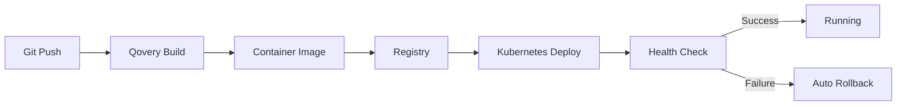

## Overview

Qovery Deploy automates application deployment to Kubernetes with zero-downtime releases, automatic rollbacks, and integrated CI/CD. Deploy from Git repositories, container registries, or Helm charts with a few clicks or API calls.

## What Qovery Deploy Does

<CardGroup cols={2}>
  <Card title="Continuous Deployment" icon="rotate">
    Automatic deployments from Git commits or container image tags
  </Card>
  <Card title="Zero-Downtime" icon="clock">
    Rolling updates with health checks and readiness probes
  </Card>
  <Card title="Automatic Rollback" icon="arrow-rotate-left">
    Instant rollback to previous versions if deployment fails
  </Card>
  <Card title="Multi-Environment" icon="layer-group">
    Deploy to development, staging, and production environments
  </Card>
</CardGroup>

## Deployment Workflow



## Service Types

### Applications

Deploy containerized applications from Git repositories.

**Supported Languages**: Node.js, Python, Go, Java, Ruby, PHP, .NET, Rust, and more

**Deployment Sources**:
- GitHub, GitLab, Bitbucket repositories
- Dockerfile or Buildpacks
- Monorepo support with path-based builds

### Containers

Deploy pre-built container images from registries.

**Supported Registries**:
- Docker Hub
- AWS ECR
- Google Container Registry (GCR)
- Azure Container Registry (ACR)
- GitHub Container Registry
- Private registries

### Helm Charts

Deploy applications using Helm charts.

**Sources**:
- Public Helm repositories
- Private Helm repositories
- Git-based Helm charts
- Custom values override

### Jobs

Deploy batch jobs and scheduled tasks.

**Job Types**:
- **Lifecycle Jobs**: Run before/after deployments
- **Cronjobs**: Scheduled recurring tasks

## Deploying Your First Application

<Steps>
  <Step title="Create Environment">
    Navigate to your project and create an environment:

    ```
    Project: my-project
    └── Environment: production
    ```
  </Step>

  <Step title="Add Application">
    Click **Create Service** → **Application**

    **Configure Application**:
    - **Name**: `my-app`
    - **Git Repository**: Select connected repo
    - **Branch**: `main` or `production`
    - **Build Mode**: Dockerfile or Buildpack
    - **Port**: Application port (e.g., `3000`)
  </Step>

  <Step title="Configure Resources">
    Set CPU and memory allocation:

    ```yaml
    CPU: 1000m (1 vCPU)
    Memory: 512 MB
    Min Instances: 1
    Max Instances: 3
    ```
  </Step>

  <Step title="Add Environment Variables">
    Configure environment-specific variables:

    ```bash
    NODE_ENV=production
    DATABASE_URL=postgresql://...
    API_KEY=secret:MY_API_KEY
    ```
  </Step>

  <Step title="Deploy">
    Click **Deploy** and monitor the deployment progress
  </Step>
</Steps>

## Deployment Modes

### Automatic Deployment

Automatically deploy on every Git commit.

**Configuration**:
```yaml
Auto-Deploy: Enabled
Branch: main
Trigger: On commit push
```

**Use Case**: Development and staging environments

### Manual Deployment

Deploy manually via console or API.

**Configuration**:
```yaml
Auto-Deploy: Disabled
Deployment: Manual trigger required
```

**Use Case**: Production environments with approval workflows

### Preview Environments

Automatically create ephemeral environments for pull requests.

**Configuration**:
```yaml
Preview Environments: Enabled
Trigger: On pull request
Lifecycle: Deleted after PR merge/close
```

**Use Case**: Testing features before merging

## Deployment Strategies

### Rolling Update (Default)

Gradually replace old pods with new ones.

<Tabs>
  <Tab title="Configuration">
    ```yaml
    Strategy: Rolling Update
    Max Surge: 25%
    Max Unavailable: 25%
    ```

    **Process**:
    1. Start new pods (25% of desired count)
    2. Wait for health checks
    3. Terminate old pods (25% of current count)
    4. Repeat until all pods updated
  </Tab>

  <Tab title="Pros & Cons">
    **Pros**:
    - Zero downtime
    - Gradual rollout
    - Easy rollback

    **Cons**:
    - Slower than recreate
    - Both versions run simultaneously
  </Tab>
</Tabs>

### Blue-Green Deployment

Run two identical environments and switch traffic.

<Tabs>
  <Tab title="Implementation">
    Use environment cloning and custom domains:

    ```
    Blue Environment (v1.0) → app.example.com
    Green Environment (v1.1) → staging.example.com

    # Test Green, then switch traffic
    Green Environment (v1.1) → app.example.com
    Blue Environment (v1.0) → [standby]
    ```
  </Tab>

  <Tab title="Benefits">
    - Instant rollback capability
    - Full testing before traffic switch
    - No downtime
    - Clean cutover
  </Tab>
</Tabs>

### Canary Deployment

Gradually roll out to a percentage of users.

<Tabs>
  <Tab title="Implementation">
    Use traffic splitting with service mesh or ingress:

    ```yaml
    Version 1.0: 90% traffic
    Version 1.1: 10% traffic

    # Monitor metrics, then increase
    Version 1.0: 50% traffic
    Version 1.1: 50% traffic

    # Finally
    Version 1.0: 0% traffic
    Version 1.1: 100% traffic
    ```
  </Tab>

  <Tab title="Best Practices">
    - Start with 5-10% traffic
    - Monitor error rates and latency
    - Increase gradually (10% → 25% → 50% → 100%)
    - Set rollback thresholds
  </Tab>
</Tabs>

## Build Configuration

### Dockerfile Deployment

Use custom Dockerfile for build.

```dockerfile
FROM node:18-alpine

WORKDIR /app

COPY package*.json ./
RUN npm ci --production

COPY . .

EXPOSE 3000
CMD ["npm", "start"]
```

**Qovery Configuration**:
- **Build Mode**: Dockerfile
- **Dockerfile Path**: `./Dockerfile` (default)
- **Build Context**: `.` (root directory)

### Buildpack Deployment

Automatic language detection and build.

**Supported Buildpacks**:
- Node.js (npm, yarn, pnpm)
- Python (pip, poetry, pipenv)
- Go (go modules)
- Java (Maven, Gradle)
- Ruby (Bundler)
- PHP (Composer)

**Qovery Configuration**:
- **Build Mode**: Buildpack
- **Language**: Auto-detected
- **Build Command**: Automatic

### Monorepo Support

Deploy multiple applications from single repository.

```yaml
Application 1:
  Repository: my-monorepo
  Root Path: /frontend
  Port: 3000

Application 2:
  Repository: my-monorepo
  Root Path: /backend
  Port: 8080
```

## Environment Management

### Environment Types

<Tabs>
  <Tab title="Development">
    **Purpose**: Feature development and testing

    **Configuration**:
    - Auto-deploy enabled
    - Preview environments enabled
    - Lower resource limits
    - Development database

    ```yaml
    Replicas: 1
    CPU: 500m
    Memory: 256 MB
    ```
  </Tab>

  <Tab title="Staging">
    **Purpose**: Pre-production testing

    **Configuration**:
    - Manual or auto-deploy
    - Production-like resources
    - Staging database
    - Integration testing

    ```yaml
    Replicas: 2
    CPU: 1000m
    Memory: 1 GB
    ```
  </Tab>

  <Tab title="Production">
    **Purpose**: Live user traffic

    **Configuration**:
    - Manual deploy (recommended)
    - High availability (3+ replicas)
    - Auto-scaling enabled
    - Production database

    ```yaml
    Replicas: 3-10
    CPU: 2000m
    Memory: 2 GB
    ```
  </Tab>
</Tabs>

### Environment Variables

<Tabs>
  <Tab title="Environment-Specific">
    Set different values per environment:

    ```bash
    # Development
    DATABASE_URL=postgresql://dev-db/myapp
    LOG_LEVEL=debug

    # Staging
    DATABASE_URL=postgresql://staging-db/myapp
    LOG_LEVEL=info

    # Production
    DATABASE_URL=postgresql://prod-db/myapp
    LOG_LEVEL=warn
    ```
  </Tab>

  <Tab title="Secrets">
    Store sensitive data securely:

    ```bash
    # Using Qovery built-in secrets
    API_KEY=secret:STRIPE_API_KEY
    DB_PASSWORD=secret:DATABASE_PASSWORD

    # Secrets are encrypted and never exposed in logs
    ```
  </Tab>

  <Tab title="Built-in Variables">
    Qovery provides automatic environment variables:

    ```bash
    QOVERY_APPLICATION_ID=app-uuid
    QOVERY_ENVIRONMENT_ID=env-uuid
    QOVERY_PROJECT_ID=project-uuid
    QOVERY_BRANCH_NAME=main
    QOVERY_COMMIT_ID=abc123
    QOVERY_IS_PRODUCTION=true
    ```
  </Tab>
</Tabs>

## Deployment via API

### Deploy Application

```bash
curl -X POST \
  "https://api.qovery.com/application/{application_id}/deploy" \
  -H "Authorization: Token YOUR_API_TOKEN"
```

### Redeploy with Same Version

```bash
curl -X POST \
  "https://api.qovery.com/application/{application_id}/redeploy" \
  -H "Authorization: Token YOUR_API_TOKEN"
```

### Rollback to Previous Version

```bash
curl -X POST \
  "https://api.qovery.com/application/{application_id}/rollback" \
  -H "Authorization: Token YOUR_API_TOKEN" \
  -d '{
    "commit_id": "abc123def456"
  }'
```

### Stop Application

```bash
curl -X POST \
  "https://api.qovery.com/application/{application_id}/stop" \
  -H "Authorization: Token YOUR_API_TOKEN"
```

## Deployment via Terraform

```hcl
resource "qovery_application" "backend_api" {
  name               = "backend-api"
  environment_id     = qovery_environment.production.id
  git_repository = {
    url    = "https://github.com/myorg/backend"
    branch = "main"
  }

  build_mode         = "DOCKER"
  dockerfile_path    = "./Dockerfile"

  cpu                = 1000
  memory             = 1024
  min_running_instances = 2
  max_running_instances = 5

  ports = [
    {
      internal_port        = 8080
      external_port        = 443
      protocol             = "HTTP"
      publicly_accessible  = true
    }
  ]

  environment_variables = [
    {
      key   = "NODE_ENV"
      value = "production"
    }
  ]

  secrets = [
    {
      key   = "DATABASE_URL"
      value = var.database_url
    }
  ]

  auto_deploy = false
}
```

## CI/CD Integration

### GitHub Actions

```yaml
name: Deploy to Qovery

on:
  push:
    branches: [main]

jobs:
  deploy:
    runs-on: ubuntu-latest
    steps:
      - name: Deploy to Qovery
        run: |
          curl -X POST \
            "https://api.qovery.com/application/${{ secrets.QOVERY_APP_ID }}/deploy" \
            -H "Authorization: Token ${{ secrets.QOVERY_API_TOKEN }}"
```

### GitLab CI

```yaml
deploy:
  stage: deploy
  script:
    - |
      curl -X POST \
        "https://api.qovery.com/application/${QOVERY_APP_ID}/deploy" \
        -H "Authorization: Token ${QOVERY_API_TOKEN}"
  only:
    - main
```

### Jenkins

```groovy
pipeline {
  agent any
  stages {
    stage('Deploy') {
      steps {
        sh """
          curl -X POST \
            'https://api.qovery.com/application/${QOVERY_APP_ID}/deploy' \
            -H 'Authorization: Token ${QOVERY_API_TOKEN}'
        """
      }
    }
  }
}
```

## Best Practices

<CardGroup cols={2}>
  <Card title="Use Health Checks" icon="heart-pulse">
    Configure liveness and readiness probes for reliable deployments
  </Card>

  <Card title="Implement Graceful Shutdown" icon="power-off">
    Handle SIGTERM signals to finish in-flight requests
  </Card>

  <Card title="Version Your Deployments" icon="code-branch">
    Use semantic versioning and Git tags
  </Card>

  <Card title="Test Before Production" icon="vial">
    Deploy to staging first and run integration tests
  </Card>

  <Card title="Monitor Deployments" icon="chart-line">
    Watch metrics during and after deployment
  </Card>

  <Card title="Plan Rollback Strategy" icon="rotate-left">
    Know how to quickly revert problematic deployments
  </Card>
</CardGroup>

## Troubleshooting

<AccordionGroup>
  <Accordion title="Deployment Stuck in Progress">
    **Symptoms**: Deployment doesn't complete after 10+ minutes

    **Common Causes**:
    - Health check failures
    - Image pull errors
    - Resource constraints

    **Resolution**:
    1. Check deployment logs in Qovery Console
    2. Verify health check endpoint returns 200
    3. Confirm sufficient cluster resources
    4. Check image exists in registry
  </Accordion>

  <Accordion title="Application Crashes After Deployment">
    **Check**:
    1. Application logs for error messages
    2. Environment variables are set correctly
    3. Database connectivity
    4. Sufficient memory allocation

    **Quick Fix**:
    - Rollback to previous version
    - Fix issue and redeploy
  </Accordion>

  <Accordion title="Build Failures">
    **Common Issues**:
    - Missing dependencies in Dockerfile
    - Build timeout (increase `build.timeout_max_sec`)
    - Insufficient build resources
    - Private dependencies without credentials

    **Debug**:
    - Review build logs in Qovery Console
    - Test Dockerfile locally
    - Verify all build dependencies are available
  </Accordion>
</AccordionGroup>

## Next Steps

<CardGroup cols={2}>
  <Card title="Observe Your Apps" icon="magnifying-glass-chart" href="/guides/qovery-101/observe">
    Learn how to monitor and debug your applications
  </Card>

  <Card title="Service Advanced Settings" icon="sliders" href="/configuration/service-advanced-settings">
    Fine-tune deployment configuration
  </Card>

  <Card title="Environment Variables" icon="key" href="/configuration/environment-variables">
    Manage application configuration and secrets
  </Card>

  <Card title="CI/CD Integration" icon="code-branch" href="/integrations/ci-cd/github-actions">
    Integrate with your CI/CD pipeline
  </Card>
</CardGroup>
