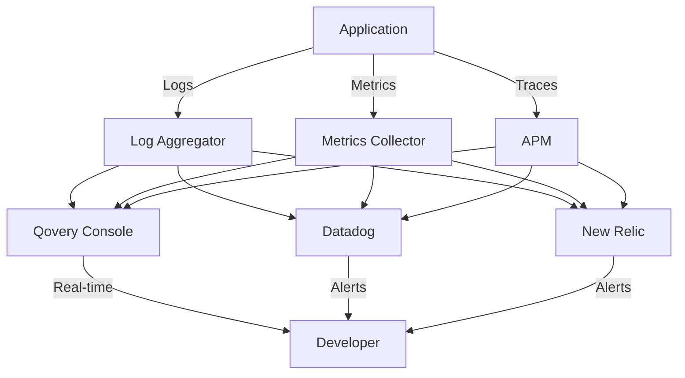

## Overview

Qovery Observe provides comprehensive monitoring and observability for your applications and infrastructure. Access real-time logs, metrics, and performance data to quickly identify and resolve issues. Integrate with leading observability platforms or use Qovery's built-in tools.

## What Qovery Observe Does

<CardGroup cols={2}>
  <Card title="Real-Time Logs" icon="file-lines">
    Stream and search application logs with millisecond latency
  </Card>
  <Card title="Metrics & Monitoring" icon="chart-line">
    Track CPU, memory, network, and custom application metrics
  </Card>
  <Card title="Troubleshooting Tools" icon="bug">
    Debug applications with shell access and port forwarding
  </Card>
  <Card title="Third-Party Integrations" icon="plug">
    Connect to Datadog, New Relic, Prometheus, and more
  </Card>
</CardGroup>

## Observability Architecture



## Getting Started with Observe

### Viewing Application Logs

<Steps>
  <Step title="Navigate to Your Application">
    Go to **Environment** → Select your application
  </Step>

  <Step title="Access Logs Tab">
    Click on the **Logs** tab in the application detail page
  </Step>

  <Step title="View Real-Time Logs">
    Logs stream in real-time as your application generates them:

    ```bash
    2024-01-15 10:30:45.123 INFO  Server started on port 3000
    2024-01-15 10:30:46.456 INFO  Database connection established
    2024-01-15 10:30:50.789 INFO  GET /api/users - 200 OK - 45ms
    2024-01-15 10:30:51.012 WARN  High memory usage: 85%
    2024-01-15 10:30:52.345 ERROR Failed to connect to Redis
    ```
  </Step>

  <Step title="Filter and Search">
    Use search filters to find specific log entries:

    **Search Operators**:
    - `level:ERROR` - Filter by log level
    - `status:500` - Filter by status code
    - `"database connection"` - Search for exact phrase
    - `user:* AND error` - Combine multiple filters
  </Step>
</Steps>

### Using Qovery CLI for Logs

<Tabs>
  <Tab title="Stream Logs">
    ```bash
    # Stream logs from application
    qovery log --follow

    # Stream logs from specific environment
    qovery log --environment production --follow

    # Filter by service
    qovery log --application backend-api --follow
    ```
  </Tab>

  <Tab title="Search Historical Logs">
    ```bash
    # View last 100 log lines
    qovery log --tail 100

    # Search logs with filter
    qovery log --grep "ERROR"

    # View logs from specific time range
    qovery log --since 1h
    qovery log --since "2024-01-15 10:00:00"
    ```
  </Tab>

  <Tab title="Export Logs">
    ```bash
    # Export logs to file
    qovery log --since 24h > application-logs.txt

    # Export with timestamps
    qovery log --tail 1000 --timestamps > logs-$(date +%Y%m%d).txt
    ```
  </Tab>
</Tabs>

## Metrics and Monitoring

### Built-In Metrics

Qovery automatically collects and displays key metrics:

<Tabs>
  <Tab title="Application Metrics">
    **CPU Usage**:
    - Current CPU utilization (%)
    - CPU throttling events
    - CPU limits and requests

    **Memory Usage**:
    - Current memory consumption (MB/GB)
    - Memory limit
    - OOM (Out of Memory) events

    **Network**:
    - Inbound traffic (requests/sec)
    - Outbound traffic (requests/sec)
    - Network errors and retries

    **Instances**:
    - Running replicas
    - Desired replicas
    - Restart count
  </Tab>

  <Tab title="Database Metrics">
    **Performance**:
    - Queries per second
    - Query latency (avg, p95, p99)
    - Connection pool usage

    **Storage**:
    - Disk usage (GB)
    - IOPS (read/write)
    - Storage growth rate

    **Health**:
    - Replication lag
    - Failed queries
    - Connection errors
  </Tab>

  <Tab title="Cluster Metrics">
    **Nodes**:
    - Node count (current/desired)
    - Node CPU/Memory utilization
    - Node status and health

    **Resources**:
    - Total allocatable CPU/Memory
    - Total requested CPU/Memory
    - Cluster capacity percentage

    **Pods**:
    - Running pods
    - Pending pods
    - Failed pods
  </Tab>
</Tabs>

### Accessing Metrics Dashboard

<Steps>
  <Step title="Open Metrics View">
    Navigate to your application → Click **Metrics** tab
  </Step>

  <Step title="Select Time Range">
    Choose time range for metrics:
    - Last 1 hour
    - Last 6 hours
    - Last 24 hours
    - Last 7 days
    - Custom range
  </Step>

  <Step title="Analyze Metrics">
    Review metrics graphs:

    ```yaml
    CPU Usage: 45% (avg) / 85% (peak)
    Memory Usage: 512 MB / 1 GB (50%)
    Request Rate: 1,200 req/min
    Response Time: 85ms (p50), 320ms (p95)
    Error Rate: 0.5%
    ```
  </Step>

  <Step title="Set Up Alerts">
    Configure alerts for anomalies:
    - CPU > 80% for 5 minutes
    - Memory > 90% for 2 minutes
    - Error rate > 5%
    - Response time p95 > 1000ms
  </Step>
</Steps>

## Troubleshooting Tools

### Shell Access

Access running containers for debugging:

<Tabs>
  <Tab title="Console Shell">
    **Via Qovery Console**:
    1. Navigate to application
    2. Click **Actions** → **Open Shell**
    3. Select container instance
    4. Execute commands in browser terminal

    ```bash
    # Check environment variables
    env | grep DATABASE

    # View running processes
    ps aux

    # Check disk usage
    df -h

    # Test network connectivity
    curl -v https://api.example.com
    ```
  </Tab>

  <Tab title="CLI Shell">
    ```bash
    # Open interactive shell
    qovery shell

    # Execute single command
    qovery shell --command "ls -la"

    # Connect to specific instance
    qovery shell --instance 2

    # Use specific shell
    qovery shell --shell /bin/bash
    ```
  </Tab>
</Tabs>

### Port Forwarding

Access services locally for debugging:

```bash
# Forward application port
qovery port-forward --port 3000

# Access at: http://localhost:3000

# Forward database port
qovery port-forward --service postgres-db --port 5432

# Connect with: psql -h localhost -p 5432 -U user -d database

# Forward with custom local port
qovery port-forward --port 8080:3000
```

**Use Cases**:
- Debug API endpoints locally
- Connect to database with local tools
- Test internal services
- Performance profiling

### Status Monitoring

Check service health and status:

<Tabs>
  <Tab title="Console Status">
    **Status Indicators**:
    - 🟢 **Running**: Service healthy and operational
    - 🟡 **Deploying**: Deployment in progress
    - 🟠 **Warning**: Service running with warnings
    - 🔴 **Error**: Service failed or unhealthy
    - ⚪ **Stopped**: Service intentionally stopped

    **Deployment History**:
    - Last 50 deployments
    - Deployment duration
    - Success/failure status
    - Commit hash and message
  </Tab>

  <Tab title="CLI Status">
    ```bash
    # View environment status
    qovery status

    # Output:
    # Environment: production
    # Status: Running
    #
    # Applications:
    #   ✓ backend-api      Running  v1.2.3
    #   ✓ frontend         Running  v2.0.1
    #   ✗ worker-service   Error    v1.1.0
    #
    # Databases:
    #   ✓ postgres-db      Running  14.5
    #   ✓ redis-cache      Running  7.0

    # View specific application status
    qovery status --application backend-api
    ```
  </Tab>

  <Tab title="API Status">
    ```bash
    # Get application status via API
    curl -X GET \
      "https://api.qovery.com/application/{application_id}/status" \
      -H "Authorization: Token YOUR_API_TOKEN"

    # Response:
    {
      "state": "RUNNING",
      "state_message": "Service is healthy",
      "last_deployment_date": "2024-01-15T10:30:00Z",
      "running_instances": 3,
      "desired_instances": 3
    }
    ```
  </Tab>
</Tabs>

## Third-Party Integrations

### Datadog Integration

<Steps>
  <Step title="Enable Datadog Integration">
    Go to **Organization Settings** → **Integrations** → **Datadog**
  </Step>

  <Step title="Configure Datadog">
    Enter your Datadog credentials:

    ```yaml
    API Key: your-datadog-api-key
    Application Key: your-datadog-app-key
    Site: datadoghq.com (or datadoghq.eu)
    ```
  </Step>

  <Step title="Enable for Services">
    Select applications to monitor with Datadog:

    ```yaml
    Metrics: Enabled
    Logs: Enabled
    APM (Traces): Enabled
    Profiling: Optional
    ```
  </Step>

  <Step title="Access Datadog Dashboard">
    Logs and metrics automatically appear in your Datadog account with tags:

    ```yaml
    qovery:organization: my-org
    qovery:project: my-project
    qovery:environment: production
    qovery:application: backend-api
    ```
  </Step>
</Steps>

### New Relic Integration

<Steps>
  <Step title="Install New Relic Agent">
    Add New Relic agent to your application:

    <Tabs>
      <Tab title="Node.js">
        ```javascript
        // Install New Relic
        npm install newrelic

        // Add to application entry point
        require('newrelic');
        ```
      </Tab>

      <Tab title="Python">
        ```python
        # Install New Relic
        pip install newrelic

        # Run with New Relic
        newrelic-admin run-program python app.py
        ```
      </Tab>

      <Tab title="Java">
        ```dockerfile
        # Add to Dockerfile
        RUN curl -O https://download.newrelic.com/newrelic/java-agent/newrelic-agent/current/newrelic-java.zip
        RUN unzip newrelic-java.zip

        # Add to JAVA_OPTS
        ENV JAVA_OPTS="-javaagent:/app/newrelic/newrelic.jar"
        ```
      </Tab>
    </Tabs>
  </Step>

  <Step title="Configure with Environment Variables">
    Add New Relic configuration:

    ```bash
    NEW_RELIC_LICENSE_KEY=secret:NEW_RELIC_KEY
    NEW_RELIC_APP_NAME=backend-api-production
    NEW_RELIC_LOG_LEVEL=info
    ```
  </Step>

  <Step title="Deploy and Verify">
    Deploy application and verify data appears in New Relic dashboard
  </Step>
</Steps>

### Prometheus & Grafana

<Steps>
  <Step title="Expose Metrics Endpoint">
    Add metrics endpoint to your application:

    ```javascript
    // Example: Node.js with prom-client
    const promClient = require('prom-client');
    const register = new promClient.Registry();

    // Default metrics
    promClient.collectDefaultMetrics({ register });

    // Custom metrics
    const httpRequestDuration = new promClient.Histogram({
      name: 'http_request_duration_seconds',
      help: 'Duration of HTTP requests in seconds',
      labelNames: ['method', 'route', 'status_code'],
      registers: [register]
    });

    // Expose metrics
    app.get('/metrics', async (req, res) => {
      res.set('Content-Type', register.contentType);
      res.send(await register.metrics());
    });
    ```
  </Step>

  <Step title="Deploy Prometheus">
    Deploy Prometheus using Helm chart:

    ```bash
    # Add to your cluster via Qovery Helm service
    Repository: https://prometheus-community.github.io/helm-charts
    Chart: kube-prometheus-stack
    ```
  </Step>

  <Step title="Configure Service Monitor">
    Create ServiceMonitor to scrape your application:

    ```yaml
    apiVersion: monitoring.coreos.com/v1
    kind: ServiceMonitor
    metadata:
      name: backend-api-metrics
    spec:
      selector:
        matchLabels:
          app: backend-api
      endpoints:
        - port: http
          path: /metrics
          interval: 30s
    ```
  </Step>

  <Step title="Access Grafana">
    Access Grafana dashboard and create visualizations from Prometheus data
  </Step>
</Steps>

## Log Management Best Practices

<CardGroup cols={2}>
  <Card title="Structured Logging" icon="list-tree">
    Use JSON format for better parsing and filtering
  </Card>

  <Card title="Appropriate Log Levels" icon="layer-group">
    Use DEBUG, INFO, WARN, ERROR, FATAL consistently
  </Card>

  <Card title="Include Context" icon="circle-info">
    Add request IDs, user IDs, and correlation IDs
  </Card>

  <Card title="Avoid Sensitive Data" icon="shield-halved">
    Never log passwords, tokens, or personal information
  </Card>

  <Card title="Log Rotation" icon="rotate">
    Configure log retention to manage storage costs
  </Card>

  <Card title="Performance Impact" icon="gauge-high">
    Use appropriate log levels in production (INFO or WARN)
  </Card>
</CardGroup>

### Structured Logging Example

<Tabs>
  <Tab title="Node.js (Winston)">
    ```javascript
    const winston = require('winston');

    const logger = winston.createLogger({
      level: process.env.LOG_LEVEL || 'info',
      format: winston.format.combine(
        winston.format.timestamp(),
        winston.format.json()
      ),
      defaultMeta: {
        service: 'backend-api',
        environment: process.env.QOVERY_ENVIRONMENT_TYPE
      },
      transports: [
        new winston.transports.Console()
      ]
    });

    // Usage
    logger.info('User login successful', {
      userId: user.id,
      email: user.email,
      ip: req.ip,
      requestId: req.id
    });
    ```
  </Tab>

  <Tab title="Python (structlog)">
    ```python
    import structlog

    logger = structlog.get_logger()

    # Configure
    structlog.configure(
        processors=[
            structlog.stdlib.add_log_level,
            structlog.processors.TimeStamper(fmt="iso"),
            structlog.processors.JSONRenderer()
        ],
        context_class=dict,
        logger_factory=structlog.stdlib.LoggerFactory(),
    )

    # Usage
    logger.info(
        "user_login_successful",
        user_id=user.id,
        email=user.email,
        ip=request.remote_addr
    )
    ```
  </Tab>

  <Tab title="Go (zap)">
    ```go
    package main

    import "go.uber.org/zap"

    func main() {
        logger, _ := zap.NewProduction()
        defer logger.Sync()

        // Usage
        logger.Info("User login successful",
            zap.String("userId", user.ID),
            zap.String("email", user.Email),
            zap.String("ip", req.RemoteAddr),
            zap.String("requestId", requestID),
        )
    }
    ```
  </Tab>
</Tabs>

## Monitoring Best Practices

<CardGroup cols={2}>
  <Card title="Define SLOs" icon="bullseye">
    Set Service Level Objectives for availability and performance
  </Card>

  <Card title="Alert on Symptoms" icon="bell">
    Alert on user-facing issues, not internal metrics
  </Card>

  <Card title="Reduce Alert Fatigue" icon="volume-xmark">
    Only alert on actionable issues requiring immediate attention
  </Card>

  <Card title="Use Dashboards" icon="table-columns">
    Create role-specific dashboards for different teams
  </Card>

  <Card title="Track Trends" icon="chart-line">
    Monitor long-term trends to identify gradual degradation
  </Card>

  <Card title="Automate Responses" icon="wand-magic-sparkles">
    Use auto-scaling and auto-healing for common issues
  </Card>
</CardGroup>

## Common Observability Patterns

### The Four Golden Signals

<Tabs>
  <Tab title="Latency">
    **Track Response Times**:
    ```yaml
    Metrics to Monitor:
      - Average response time
      - P50, P95, P99 percentiles
      - Latency by endpoint
      - Latency by region

    Alert Thresholds:
      - P95 > 500ms (Warning)
      - P99 > 1000ms (Critical)
    ```
  </Tab>

  <Tab title="Traffic">
    **Track Request Volume**:
    ```yaml
    Metrics to Monitor:
      - Requests per second
      - Requests by endpoint
      - Traffic patterns by time
      - Geographic distribution

    Alert Thresholds:
      - Sudden drops > 50% (Critical)
      - Unexpected spikes > 200% (Warning)
    ```
  </Tab>

  <Tab title="Errors">
    **Track Error Rates**:
    ```yaml
    Metrics to Monitor:
      - Error rate (%)
      - 4xx vs 5xx errors
      - Errors by endpoint
      - Failed dependencies

    Alert Thresholds:
      - Error rate > 1% (Warning)
      - Error rate > 5% (Critical)
    ```
  </Tab>

  <Tab title="Saturation">
    **Track Resource Usage**:
    ```yaml
    Metrics to Monitor:
      - CPU utilization
      - Memory usage
      - Disk I/O
      - Network bandwidth

    Alert Thresholds:
      - CPU > 80% (Warning)
      - Memory > 90% (Critical)
    ```
  </Tab>
</Tabs>

### Distributed Tracing

Implement distributed tracing for microservices:

```javascript
// Example: OpenTelemetry with Node.js
const opentelemetry = require('@opentelemetry/api');
const { NodeTracerProvider } = require('@opentelemetry/sdk-trace-node');
const { registerInstrumentations } = require('@opentelemetry/instrumentation');
const { HttpInstrumentation } = require('@opentelemetry/instrumentation-http');

// Configure tracer
const provider = new NodeTracerProvider();
provider.register();

// Auto-instrument HTTP
registerInstrumentations({
  instrumentations: [
    new HttpInstrumentation(),
  ],
});

// Create custom spans
const tracer = opentelemetry.trace.getTracer('backend-api');

app.get('/api/users', async (req, res) => {
  const span = tracer.startSpan('get_users');

  try {
    const users = await database.query('SELECT * FROM users');
    span.setStatus({ code: opentelemetry.SpanStatusCode.OK });
    res.json(users);
  } catch (error) {
    span.setStatus({
      code: opentelemetry.SpanStatusCode.ERROR,
      message: error.message
    });
    throw error;
  } finally {
    span.end();
  }
});
```

## Troubleshooting

<AccordionGroup>
  <Accordion title="No Logs Appearing">
    **Possible Causes**:
    - Application not writing to stdout/stderr
    - Log level too restrictive
    - Application crashed before logging

    **Resolution**:
    1. Verify application writes logs to stdout/stderr (not files)
    2. Check log level configuration (use DEBUG temporarily)
    3. Review deployment logs for startup errors
    4. Test locally with same configuration

    ```bash
    # Check if application is running
    qovery status

    # View deployment logs
    qovery log --deployment
    ```
  </Accordion>

  <Accordion title="High Memory Usage">
    **Investigate**:
    1. Check memory metrics over time
    2. Review application logs for memory warnings
    3. Analyze memory leaks with profiling tools

    **Solutions**:
    - Increase memory limit (temporary)
    - Fix memory leaks in code
    - Optimize data structures and caching
    - Implement proper connection pooling

    ```bash
    # Check current resource usage
    qovery shell --command "top -b -n 1"

    # Generate heap dump (Node.js)
    qovery shell --command "node -e 'require(\"v8\").writeHeapSnapshot()'"
    ```
  </Accordion>

  <Accordion title="Cannot Access Shell">
    **Common Issues**:
    - Container doesn't have shell installed (alpine images)
    - Application crashed or not running
    - Insufficient permissions

    **Solutions**:
    1. Verify application is running: `qovery status`
    2. Use alternative shell: `qovery shell --shell /bin/sh`
    3. For distroless images, use ephemeral debug container
    4. Check RBAC permissions in organization settings
  </Accordion>

  <Accordion title="Metrics Not Showing">
    **Check**:
    1. Application is running and healthy
    2. Metrics collection is enabled for cluster
    3. Time range is appropriate (some metrics delayed 1-2 minutes)

    **If Using Custom Metrics**:
    - Verify metrics endpoint is accessible
    - Check Prometheus scrape configuration
    - Ensure metrics format is correct
    - Review ServiceMonitor labels
  </Accordion>
</AccordionGroup>

## Next Steps

<CardGroup cols={2}>
  <Card title="Optimize Your Apps" icon="gauge-high" href="/guides/qovery-101/optimize">
    Learn how to optimize resources and reduce costs
  </Card>

  <Card title="Secure Your Infrastructure" icon="shield" href="/guides/qovery-101/secure">
    Implement security best practices and compliance
  </Card>

  <Card title="Service Advanced Settings" icon="sliders" href="/configuration/service-advanced-settings">
    Configure health checks and monitoring
  </Card>

  <Card title="Datadog Integration" icon="chart-line" href="/integrations/observability/datadog">
    Set up comprehensive Datadog monitoring
  </Card>
</CardGroup>
