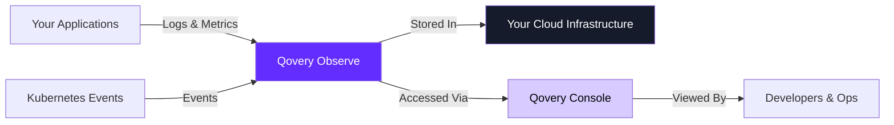

## Overview

Qovery Observe provides built-in observability for your applications and infrastructure, offering a middle ground between expensive SaaS monitoring tools and complex DIY observability stacks. Your data stays in your infrastructure with zero maintenance required, while you get a developer and ops-friendly interface for monitoring service health, performance, and behavior.

<Note>
Qovery Observe is currently available for AWS, GCP, and Scaleway clusters. Azure support is coming soon. Currently supports Applications and Containers, with more service types coming.
</Note>

<Info>
Qovery Observe is not yet self-service. If you're interested in using this feature, please contact Qovery via Slack or email to get access.
</Info>

## What's Included

<CardGroup cols={2}>
  <Card title="Service Health Checks" icon="heart-pulse">
    Monitor the health and availability of your services
  </Card>
  <Card title="Infrastructure Metrics" icon="chart-line">
    CPU usage, memory usage, and network usage metrics
  </Card>
  <Card title="Log Management" icon="file-lines">
    Up to 90 days log retention for troubleshooting
  </Card>
  <Card title="Events Tracking" icon="clock">
    Qovery events and Kubernetes events (deployments, scaling, pod failures)
  </Card>
</CardGroup>

## Key Benefits

<CardGroup cols={3}>
  <Card title="Data Stays in Your Infrastructure" icon="server">
    All observability data remains within your cloud infrastructure
  </Card>
  <Card title="Zero Maintenance" icon="wand-magic-sparkles">
    Automatic setup with no configuration or management required
  </Card>
  <Card title="Correlated Data" icon="link">
    Metrics and logs are automatically correlated for faster troubleshooting
  </Card>
</CardGroup>

## Why Qovery Observe?

Qovery Observe helps you answer critical questions about your infrastructure:

<AccordionGroup>
  <Accordion title="Is my service healthy?" icon="heart-pulse">
    Get real-time visibility into service health and availability status
  </Accordion>

  <Accordion title="Why is my application consuming unexpected resources?" icon="memory">
    Track CPU, memory, and network usage to identify resource anomalies
  </Accordion>

  <Accordion title="What errors occurred during deployment or runtime?" icon="triangle-exclamation">
    Access up to 90 days of logs and Kubernetes events for troubleshooting
  </Accordion>
</AccordionGroup>

## How It Works



## Getting Access

Since Qovery Observe is currently not self-service, follow these steps to get started:

<Steps>
  <Step title="Contact Qovery">
    Reach out to Qovery via Slack or email at support@qovery.com to request access to Qovery Observe
  </Step>

  <Step title="Qovery Enables the Feature">
    The Qovery team will enable observability for your organization and clusters
  </Step>

  <Step title="Start Monitoring">
    Once enabled, access observability features directly from the Qovery Console
  </Step>
</Steps>

## Using Qovery Observe

### Viewing Service Health

<Steps>
  <Step title="Navigate to Your Service">
    Go to **Environment** → Select your application or container
  </Step>

  <Step title="Check Health Status">
    View the health status indicator to see if your service is running properly
  </Step>

  <Step title="Review Health Checks">
    Monitor liveness and readiness probe results
  </Step>
</Steps>

### Viewing Metrics

<Steps>
  <Step title="Access Metrics Dashboard">
    Navigate to your application → Click **Metrics** tab
  </Step>

  <Step title="Monitor Key Metrics">
    View real-time metrics for:
    - **CPU Usage**: Current CPU utilization percentage
    - **Memory Usage**: Current memory consumption and limits
    - **Network Usage**: Inbound and outbound traffic
  </Step>

  <Step title="Analyze Trends">
    Use time range selectors to analyze historical trends and identify patterns
  </Step>
</Steps>

### Accessing Logs

<Steps>
  <Step title="Navigate to Logs">
    Go to your application → Click **Logs** tab
  </Step>

  <Step title="View Real-Time Logs">
    Logs stream in real-time as your application generates them:

    ```bash
    2024-01-15 10:30:45.123 INFO  Server started on port 3000
    2024-01-15 10:30:46.456 INFO  Database connection established
    2024-01-15 10:30:50.789 INFO  GET /api/users - 200 OK - 45ms
    2024-01-15 10:30:51.012 WARN  High memory usage: 85%
    2024-01-15 10:30:52.345 ERROR Failed to connect to Redis
    ```
  </Step>

  <Step title="Search and Filter">
    Use search and filter capabilities to find specific log entries within the 90-day retention period
  </Step>
</Steps>

### Monitoring Events

<Steps>
  <Step title="Access Events View">
    Navigate to your service → Click **Events** tab
  </Step>

  <Step title="Review Qovery Events">
    See Qovery-specific events like deployments, configuration changes, and service actions
  </Step>

  <Step title="Check Kubernetes Events">
    Monitor Kubernetes events including:
    - Pod scheduling and startup
    - Container restarts
    - Scaling events
    - Pod failures and errors
  </Step>
</Steps>

### Using Qovery CLI for Logs

You can also access logs via the [Qovery CLI](/cli/overview):

<Tabs>
  <Tab title="Stream Logs">
    ```bash
    # Stream logs from application
    qovery log --follow

    # Stream logs from specific environment
    qovery log --environment production --follow

    # Filter by service
    qovery log --application backend-api --follow
    ```
  </Tab>

  <Tab title="Search Historical Logs">
    ```bash
    # View last 100 log lines
    qovery log --tail 100

    # Search logs with filter
    qovery log --grep "ERROR"

    # View logs from specific time range
    qovery log --since 1h
    qovery log --since "2024-01-15 10:00:00"
    ```
  </Tab>

  <Tab title="Export Logs">
    ```bash
    # Export logs to file
    qovery log --since 24h > application-logs.txt

    # Export with timestamps
    qovery log --tail 1000 --timestamps > logs-$(date +%Y%m%d).txt
    ```
  </Tab>
</Tabs>

## Available Metrics

Qovery Observe automatically collects and displays key infrastructure metrics:

<CardGroup cols={3}>
  <Card title="CPU Usage" icon="microchip">
    Current CPU utilization percentage and trends over time
  </Card>

  <Card title="Memory Usage" icon="memory">
    Current memory consumption, limits, and usage patterns
  </Card>

  <Card title="Network Usage" icon="network-wired">
    Inbound and outbound network traffic metrics
  </Card>
</CardGroup>

### Understanding Metrics

**CPU Usage**:
- Shows current CPU utilization as a percentage
- Helps identify performance bottlenecks
- Useful for right-sizing resource allocations

**Memory Usage**:
- Displays current memory consumption
- Shows memory limits and available headroom
- Helps prevent OOM (Out of Memory) errors

**Network Usage**:
- Tracks inbound and outbound traffic
- Helps identify network-related issues
- Useful for monitoring data transfer costs

## Troubleshooting with Qovery Observe

### Debugging with Logs

When troubleshooting issues, use logs to:

1. **Identify Error Patterns**: Search for ERROR or WARN level logs
2. **Trace Request Flow**: Follow request IDs through your application
3. **Analyze Performance**: Look for slow queries or high latency operations
4. **Monitor Deployment Issues**: Check logs during and after deployments

### Analyzing Metrics

Use metrics to diagnose issues:

1. **High CPU Usage**: May indicate computational bottlenecks or infinite loops
2. **Memory Leaks**: Gradual memory increase over time without release
3. **Network Issues**: Unusual traffic patterns or connection errors

### Monitoring Events

Check Kubernetes events to understand:

1. **Pod Failures**: Why pods are crashing or failing to start
2. **Scheduling Issues**: Resource constraints preventing pod scheduling
3. **Scaling Events**: When and why auto-scaling triggered

## CLI Tools for Observability

### Shell Access

Access running containers for debugging using the [shell command](/cli/commands/shell):

```bash
# Open interactive shell
qovery shell

# Execute single command
qovery shell --command "ps aux"

# Connect to specific instance
qovery shell --instance 2
```

### Port Forwarding

Access services locally for debugging using [port forwarding](/cli/commands/port-forward):

```bash
# Forward application port
qovery port-forward --port 3000

# Forward database port
qovery port-forward --service postgres-db --port 5432
```

### Status Monitoring

Check service health and status using the [status command](/cli/commands/status):

```bash
# View environment status
qovery status

# View specific application status
qovery status --application backend-api
```

## Best Practices for Observability

<CardGroup cols={2}>
  <Card title="Write to stdout/stderr" icon="terminal">
    Ensure your application logs to stdout/stderr, not files
  </Card>

  <Card title="Use Structured Logging" icon="list-tree">
    Use JSON format for better parsing and filtering
  </Card>

  <Card title="Include Context" icon="circle-info">
    Add request IDs, user IDs, and correlation IDs to logs
  </Card>

  <Card title="Avoid Sensitive Data" icon="shield-halved">
    Never log passwords, tokens, or personal information
  </Card>

  <Card title="Monitor Resource Trends" icon="chart-line">
    Track CPU and memory trends to identify gradual degradation
  </Card>

  <Card title="Review Events Regularly" icon="clock">
    Check Kubernetes events to catch issues early
  </Card>
</CardGroup>

## Need More Advanced Observability?

While Qovery Observe provides built-in monitoring for your applications, you can also integrate with third-party observability platforms for advanced features like APM, distributed tracing, and custom dashboards. Learn more about [monitoring configuration](/configuration/monitoring).

<CardGroup cols={3}>
  <Card title="Datadog" icon="chart-line" href="/integrations/observability/datadog">
    Full-stack monitoring with APM and log management
  </Card>

  <Card title="New Relic" icon="gauge-high" href="/integrations/observability/new-relic">
    Application performance monitoring and analytics
  </Card>

  <Card title="Other Solutions" icon="plug" href="/integrations/observability/other-solutions">
    Prometheus, Grafana, and custom integrations
  </Card>
</CardGroup>

## Next Steps

<CardGroup cols={2}>
  <Card title="Optimize Your Infrastructure" icon="gauge-high" href="/guides/qovery-101/optimize">
    Learn how to optimize resources and reduce costs
  </Card>

  <Card title="Secure Your Applications" icon="shield" href="/guides/qovery-101/secure">
    Implement security best practices and compliance
  </Card>

  <Card title="Advanced Service Settings" icon="sliders" href="/configuration/service-advanced-settings">
    Configure health checks, probes, and resource limits
  </Card>

  <Card title="Observability Integrations" icon="chart-line" href="/integrations/observability/overview">
    Explore third-party monitoring integrations
  </Card>
</CardGroup>
