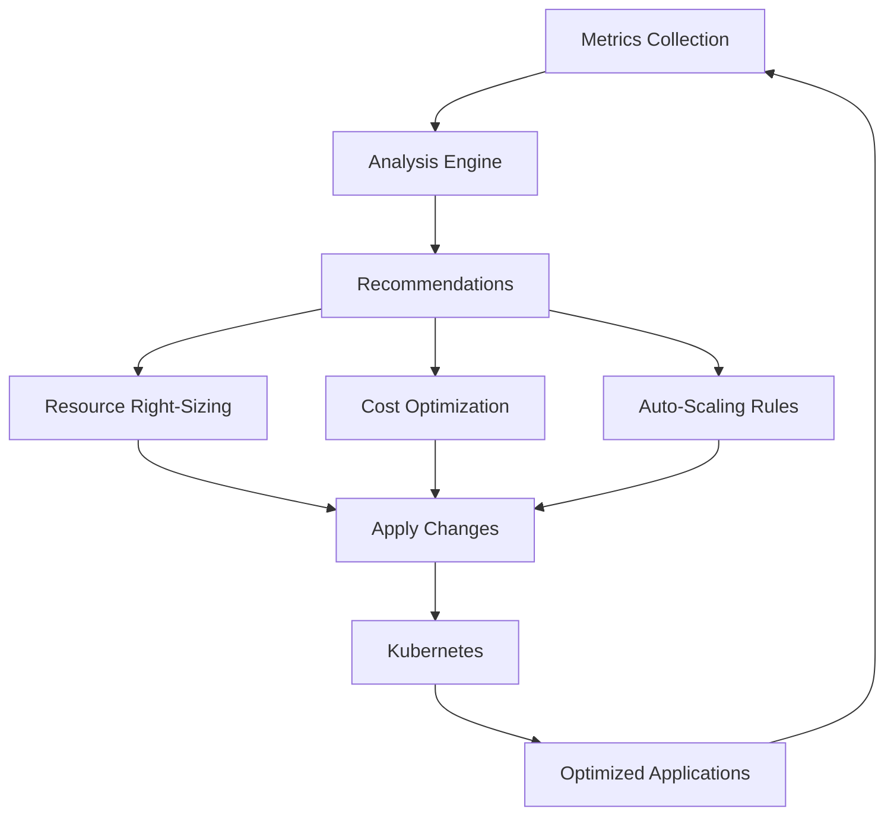

## Overview

Qovery Optimize helps you maximize efficiency and minimize costs through intelligent resource management, auto-scaling, and performance optimization. Right-size your infrastructure, eliminate waste, and ensure optimal performance for your applications.

## What Qovery Optimize Does

<CardGroup cols={2}>
  <Card title="Resource Optimization" icon="microchip">
    Right-size CPU and memory based on actual usage patterns
  </Card>
  <Card title="Cost Management" icon="dollar-sign">
    Track spending and identify cost-saving opportunities
  </Card>
  <Card title="Auto-Scaling" icon="arrows-left-right-to-line">
    Automatically scale based on demand and custom metrics
  </Card>
  <Card title="Performance Tuning" icon="gauge-high">
    Optimize application performance and resource efficiency
  </Card>
</CardGroup>

## Optimization Architecture



## Resource Right-Sizing

### Understanding Resource Requests and Limits

<Tabs>
  <Tab title="Requests">
    **What are Requests?**

    The **guaranteed** minimum resources allocated to your application.

    ```yaml
    Resources:
      CPU Request: 500m (0.5 vCPU)
      Memory Request: 512 MB

    Behavior:
      - Kubernetes reserves these resources
      - Application guaranteed this capacity
      - Used for scheduling decisions
    ```

    **Best Practice**: Set requests based on **average usage**
  </Tab>

  <Tab title="Limits">
    **What are Limits?**

    The **maximum** resources your application can use.

    ```yaml
    Resources:
      CPU Limit: 1000m (1 vCPU)
      Memory Limit: 1024 MB

    Behavior:
      - Application can burst up to limit
      - CPU throttled at limit
      - Memory: OOM kill at limit
    ```

    **Best Practice**: Set limits based on **peak usage + buffer**
  </Tab>

  <Tab title="Recommended Settings">
    **General Guidelines**:

    ```yaml
    Small Application:
      CPU Request: 250m
      CPU Limit: 500m
      Memory Request: 256 MB
      Memory Limit: 512 MB

    Medium Application:
      CPU Request: 500m
      CPU Limit: 1000m
      Memory Request: 512 MB
      Memory Limit: 1024 MB

    Large Application:
      CPU Request: 1000m
      CPU Limit: 2000m
      Memory Request: 1024 MB
      Memory Limit: 2048 MB

    Database/Stateful:
      CPU Request: 2000m
      CPU Limit: 4000m
      Memory Request: 4096 MB
      Memory Limit: 8192 MB
    ```
  </Tab>
</Tabs>

### Right-Sizing Process

<Steps>
  <Step title="Collect Usage Data">
    Monitor application for at least 7 days to capture usage patterns:

    ```bash
    # View historical metrics via CLI
    qovery metrics --application backend-api --since 7d

    # Export metrics to CSV
    qovery metrics --format csv > metrics-analysis.csv
    ```
  </Step>

  <Step title="Calculate Optimal Resources">
    Use this formula:

    **CPU Request** = Average CPU usage + 20% buffer
    **CPU Limit** = Peak CPU usage + 30% buffer

    **Memory Request** = Average memory usage + 30% buffer
    **Memory Limit** = Peak memory usage + 40% buffer

    **Example Calculation**:
    ```yaml
    Observed Metrics:
      CPU Average: 320m
      CPU Peak: 750m
      Memory Average: 450 MB
      Memory Peak: 680 MB

    Recommended Settings:
      CPU Request: 384m (320m * 1.2) → Round to 500m
      CPU Limit: 975m (750m * 1.3) → Round to 1000m
      Memory Request: 585 MB (450 * 1.3) → Round to 600 MB
      Memory Limit: 952 MB (680 * 1.4) → Round to 1000 MB
    ```
  </Step>

  <Step title="Update Resource Configuration">
    Apply the optimized settings:

    <Tabs>
      <Tab title="Console">
        1. Go to Application → **Settings**
        2. Update **CPU** and **Memory** values
        3. Click **Save** and **Redeploy**
      </Tab>

      <Tab title="Terraform">
        ```hcl
        resource "qovery_application" "backend_api" {
          name = "backend-api"

          # Optimized resources
          cpu    = 500  # millicores
          memory = 600  # MB

          # Optional: Set limits separately
          cpu_limit    = 1000
          memory_limit = 1000
        }
        ```
      </Tab>

      <Tab title="API">
        ```bash
        curl -X PUT \
          "https://api.qovery.com/application/{application_id}" \
          -H "Authorization: Token YOUR_API_TOKEN" \
          -H "Content-Type: application/json" \
          -d '{
            "cpu": 500,
            "memory": 600,
            "cpu_limit": 1000,
            "memory_limit": 1000
          }'
        ```
      </Tab>
    </Tabs>
  </Step>

  <Step title="Monitor and Validate">
    After optimization, monitor for 48 hours:

    **Success Indicators**:
    - No CPU throttling
    - No OOM errors
    - Response times unchanged or improved
    - Cost reduced

    **If Issues Occur**:
    - Increase resources by 25%
    - Investigate unexpected usage spikes
    - Check for memory leaks
  </Step>
</Steps>

## Auto-Scaling Configuration

### Horizontal Pod Autoscaling (HPA)

Automatically scale the number of application instances based on metrics.

<Tabs>
  <Tab title="CPU-Based Scaling">
    **Scale based on CPU utilization**:

    ```yaml
    Auto-Scaling Configuration:
      Min Instances: 2
      Max Instances: 10
      Target CPU Utilization: 70%

    Behavior:
      - Scale up when CPU > 70%
      - Scale down when CPU < 70%
      - Scale up quickly (30 seconds)
      - Scale down slowly (5 minutes)
    ```

    **Configure via Console**:
    1. Go to Application → **Settings** → **Advanced Settings**
    2. Enable **Auto-Scaling**
    3. Set min/max instances
    4. Set target CPU percentage
  </Tab>

  <Tab title="Memory-Based Scaling">
    **Scale based on memory utilization**:

    ```yaml
    Auto-Scaling Configuration:
      Min Instances: 2
      Max Instances: 8
      Target Memory Utilization: 75%

    Use Case:
      - Memory-intensive applications
      - Caching services
      - Data processing workloads
    ```

    **Warning**: Memory-based scaling can be unpredictable. Prefer CPU or custom metrics.
  </Tab>

  <Tab title="Custom Metrics Scaling">
    **Scale based on application-specific metrics**:

    ```yaml
    Examples:
      - HTTP requests per second
      - Queue length
      - Active connections
      - Custom business metrics

    Configuration:
      Metric: http_requests_per_second
      Target Value: 1000
      Min Instances: 3
      Max Instances: 15
    ```

    **Implementation**:
    ```yaml
    # Custom HPA with Prometheus metrics
    apiVersion: autoscaling/v2
    kind: HorizontalPodAutoscaler
    metadata:
      name: backend-api-hpa
    spec:
      scaleTargetRef:
        apiVersion: apps/v1
        kind: Deployment
        name: backend-api
      minReplicas: 3
      maxReplicas: 15
      metrics:
        - type: Pods
          pods:
            metric:
              name: http_requests_per_second
            target:
              type: AverageValue
              averageValue: "1000"
    ```
  </Tab>
</Tabs>

### Vertical Pod Autoscaling (VPA)

Automatically adjust CPU and memory requests/limits.

<Steps>
  <Step title="Install VPA">
    Deploy Vertical Pod Autoscaler on your cluster:

    ```bash
    # VPA is available as a Helm chart
    # Deploy via Qovery Helm service
    Repository: https://charts.fairwinds.com/stable
    Chart: vpa
    ```
  </Step>

  <Step title="Create VPA Resource">
    ```yaml
    apiVersion: autoscaling.k8s.io/v1
    kind: VerticalPodAutoscaler
    metadata:
      name: backend-api-vpa
    spec:
      targetRef:
        apiVersion: apps/v1
        kind: Deployment
        name: backend-api
      updatePolicy:
        updateMode: "Auto"  # or "Recreate" or "Initial"
      resourcePolicy:
        containerPolicies:
          - containerName: "*"
            minAllowed:
              cpu: 250m
              memory: 256Mi
            maxAllowed:
              cpu: 2000m
              memory: 2Gi
    ```
  </Step>

  <Step title="Monitor VPA Recommendations">
    VPA provides recommendations after analyzing usage:

    ```bash
    kubectl get vpa backend-api-vpa -o yaml

    # Output shows recommendations:
    # Recommended:
    #   cpu: 750m
    #   memory: 800Mi
    ```
  </Step>
</Steps>

### Scaling Best Practices

<CardGroup cols={2}>
  <Card title="Set Appropriate Boundaries" icon="arrows-left-right">
    Min instances ≥ 2 for production (high availability)
  </Card>

  <Card title="Scale Gradually" icon="chart-line">
    Avoid aggressive scaling that causes instability
  </Card>

  <Card title="Consider Startup Time" icon="clock">
    Account for application cold start duration
  </Card>

  <Card title="Test Scaling Behavior" icon="flask">
    Load test to verify scaling works as expected
  </Card>

  <Card title="Monitor Scaling Events" icon="eye">
    Track scaling patterns to optimize thresholds
  </Card>

  <Card title="Use Multiple Metrics" icon="gauge-high">
    Combine CPU, memory, and custom metrics
  </Card>
</CardGroup>

## Cost Optimization Strategies

### 1. Environment Scheduling

Stop non-production environments outside business hours:

<Tabs>
  <Tab title="Console Scheduling">
    **Configure via Console**:
    1. Go to Environment → **Settings**
    2. Enable **Schedule**
    3. Set active hours:

    ```yaml
    Schedule:
      Monday-Friday: 8:00 AM - 8:00 PM (EST)
      Saturday-Sunday: Off
      Timezone: America/New_York

    Estimated Savings:
      Current Cost: $500/month
      Optimized Cost: $150/month
      Savings: $350/month (70%)
    ```
  </Tab>

  <Tab title="Terraform Scheduling">
    ```hcl
    resource "qovery_environment" "development" {
      name       = "development"
      project_id = qovery_project.my_project.id
      cluster_id = qovery_cluster.my_cluster.id

      # Schedule environment
      schedule = {
        enabled = true

        # Monday to Friday, 8 AM to 8 PM EST
        cron_start = "0 8 * * 1-5"
        cron_stop  = "0 20 * * 1-5"
        timezone   = "America/New_York"
      }
    }
    ```
  </Tab>

  <Tab title="Copilot Scheduling">
    Use Qovery Copilot for intelligent scheduling:

    ```
    Prompt: "Stop all development environments every
    weekday at 8 PM and start them at 8 AM EST"

    Prompt: "During weekends, keep only staging
    environment running"

    Prompt: "Stop environment if no deployments
    for 3 days"
    ```
  </Tab>
</Tabs>

### 2. Cluster Optimization

<Tabs>
  <Tab title="Node Right-Sizing">
    **Optimize cluster node types**:

    ```yaml
    # Before Optimization
    Cluster Configuration:
      Instance Type: t3.xlarge (4 vCPU, 16 GB)
      Nodes: 5 (fixed)
      Cost: $600/month

    Resource Utilization:
      CPU: 35% average
      Memory: 45% average

    # After Optimization
    Cluster Configuration:
      Instance Type: t3.large (2 vCPU, 8 GB)
      Nodes: 3-8 (auto-scaling)
      Cost: $280/month

    Savings: $320/month (53%)
    ```
  </Tab>

  <Tab title="Spot Instances">
    **Use spot instances for non-critical workloads**:

    ```yaml
    Node Pool Configuration:
      Production Pool:
        Instance Type: t3.large
        Pricing: On-Demand
        Min Nodes: 3
        Max Nodes: 10

      Development Pool:
        Instance Type: t3.large
        Pricing: Spot (70% discount)
        Min Nodes: 1
        Max Nodes: 5
        Fallback: On-Demand

    Estimated Savings: 40-60% for dev workloads
    ```

    **Best Practices**:
    - Use spot for development/staging
    - Enable fallback to on-demand
    - Use multiple instance types
    - Implement graceful shutdown
  </Tab>

  <Tab title="Multi-Region Strategy">
    **Optimize by region**:

    ```yaml
    Cost Comparison (per month):
      AWS us-east-1: $2,100 (baseline)
      AWS us-west-2: $2,250 (+7%)
      AWS eu-west-1: $2,450 (+17%)
      GCP us-central1: $1,950 (-7%)
      Azure eastus: $2,300 (+10%)

    Strategy:
      - Production: AWS us-east-1
      - Development: GCP us-central1 (lower cost)
      - Staging: Share cluster with production
    ```
  </Tab>
</Tabs>

### 3. Database Optimization

<Tabs>
  <Tab title="Right-Size Databases">
    **Optimize database resources**:

    ```yaml
    # PostgreSQL Example
    Current:
      Instance: db.r5.2xlarge
      CPU: 8 vCPU
      Memory: 64 GB
      Storage: 500 GB
      Cost: $1,200/month

    Actual Usage:
      CPU: 25% average
      Memory: 35% average
      Storage: 180 GB used
      IOPS: 2,000 average

    Recommended:
      Instance: db.r5.xlarge
      CPU: 4 vCPU
      Memory: 32 GB
      Storage: 300 GB
      Cost: $600/month

    Savings: $600/month (50%)
    ```
  </Tab>

  <Tab title="Use Read Replicas">
    **Offload read traffic**:

    ```yaml
    Configuration:
      Primary: db.r5.xlarge ($600/month)
      Read Replica 1: db.t3.large ($150/month)
      Read Replica 2: db.t3.large ($150/month)

    Total: $900/month

    vs Single Large Instance:
      Instance: db.r5.2xlarge
      Cost: $1,200/month

    Savings: $300/month + better performance
    ```
  </Tab>

  <Tab title="Storage Optimization">
    **Optimize storage costs**:

    ```yaml
    Storage Types:
      General Purpose (gp3): $0.08/GB
      Provisioned IOPS (io2): $0.125/GB + IOPS cost
      Magnetic (standard): $0.05/GB

    Recommendation:
      - Use gp3 for most workloads
      - Reserve io2 for high-IOPS databases
      - Enable automatic storage scaling

    Backup Optimization:
      - Retention: 7 days (vs 30 days)
      - Snapshots: Weekly (vs daily)
      - Cross-region: Disabled for dev/staging
    ```
  </Tab>
</Tabs>

### 4. Application-Level Optimization

<CardGroup cols={2}>
  <Card title="Enable Caching" icon="database">
    Use Redis/Memcached to reduce database load and improve performance
  </Card>

  <Card title="Optimize Images" icon="box">
    Use smaller base images (Alpine) and multi-stage builds
  </Card>

  <Card title="Connection Pooling" icon="link">
    Reuse database connections to reduce overhead
  </Card>

  <Card title="Lazy Loading" icon="hourglass-half">
    Load resources only when needed
  </Card>

  <Card title="CDN for Static Assets" icon="globe">
    Offload static content to CloudFront/CloudFlare
  </Card>

  <Card title="Code Optimization" icon="code">
    Profile and optimize hot paths in your code
  </Card>
</CardGroup>

## Performance Optimization

### Application Performance

<Tabs>
  <Tab title="Response Time">
    **Improve API latency**:

    ```yaml
    Current Performance:
      p50: 150ms
      p95: 450ms
      p99: 1200ms

    Optimization Techniques:
      1. Database Query Optimization
         - Add indexes on frequent queries
         - Use query explain plans
         - Implement query result caching

      2. N+1 Query Prevention
         - Use eager loading
         - Batch database queries
         - Implement DataLoader pattern

      3. Enable HTTP/2
         - Multiplexing
         - Header compression
         - Server push

      4. Implement Caching
         - Redis for session data
         - Memcached for query results
         - CDN for static assets

    Target Performance:
      p50: 50ms
      p95: 200ms
      p99: 500ms
    ```
  </Tab>

  <Tab title="Throughput">
    **Increase requests per second**:

    ```yaml
    Current: 500 req/sec
    Target: 2,000 req/sec

    Strategies:
      1. Horizontal Scaling
         - Increase replicas from 3 to 10
         - Enable auto-scaling

      2. Load Balancer Optimization
         - Enable keep-alive
         - Tune connection limits
         - Use least-connections algorithm

      3. Application Tuning
         - Increase worker threads
         - Optimize event loop
         - Use async/await properly

      4. Database Connection Pool
         - Increase pool size
         - Tune timeout settings
         - Monitor connection usage
    ```
  </Tab>

  <Tab title="Resource Efficiency">
    **Optimize resource utilization**:

    ```javascript
    // Bad: Synchronous operations block event loop
    const data = fs.readFileSync('large-file.txt');
    processData(data);

    // Good: Async operations don't block
    const data = await fs.promises.readFile('large-file.txt');
    await processData(data);

    // Bad: Memory leak
    const cache = {};
    function cacheData(key, value) {
      cache[key] = value; // Never cleaned up
    }

    // Good: LRU cache with size limit
    const LRU = require('lru-cache');
    const cache = new LRU({ max: 500 });
    function cacheData(key, value) {
      cache.set(key, value);
    }
    ```
  </Tab>
</Tabs>

### Database Performance

<Steps>
  <Step title="Analyze Slow Queries">
    ```sql
    -- PostgreSQL: Find slow queries
    SELECT
      query,
      mean_exec_time,
      calls
    FROM pg_stat_statements
    ORDER BY mean_exec_time DESC
    LIMIT 10;

    -- Enable query logging
    ALTER DATABASE mydb SET log_min_duration_statement = 100;
    ```
  </Step>

  <Step title="Add Indexes">
    ```sql
    -- Find missing indexes
    SELECT
      schemaname,
      tablename,
      attname,
      n_distinct,
      correlation
    FROM pg_stats
    WHERE schemaname NOT IN ('pg_catalog', 'information_schema')
    ORDER BY n_distinct DESC;

    -- Add indexes on frequently queried columns
    CREATE INDEX idx_users_email ON users(email);
    CREATE INDEX idx_orders_user_id ON orders(user_id);
    CREATE INDEX idx_orders_created_at ON orders(created_at);
    ```
  </Step>

  <Step title="Optimize Queries">
    ```sql
    -- Bad: Full table scan
    SELECT * FROM orders WHERE status = 'pending';

    -- Good: Indexed lookup with specific columns
    CREATE INDEX idx_orders_status ON orders(status);
    SELECT id, user_id, total FROM orders WHERE status = 'pending';

    -- Bad: N+1 queries
    -- Get users, then query orders for each user

    -- Good: JOIN query
    SELECT
      users.id,
      users.name,
      orders.id as order_id,
      orders.total
    FROM users
    LEFT JOIN orders ON orders.user_id = users.id
    WHERE users.active = true;
    ```
  </Step>

  <Step title="Configure Connection Pooling">
    ```javascript
    // Node.js with PostgreSQL
    const { Pool } = require('pg');

    const pool = new Pool({
      host: process.env.DATABASE_HOST,
      database: process.env.DATABASE_NAME,
      user: process.env.DATABASE_USER,
      password: process.env.DATABASE_PASSWORD,

      // Optimize pool settings
      max: 20,              // Maximum connections
      idleTimeoutMillis: 30000,
      connectionTimeoutMillis: 2000,
    });

    // Recommended pool size formula:
    // connections = ((core_count * 2) + effective_spindle_count)
    // For 4 cores: (4 * 2) + 1 = 9 connections per instance
    ```
  </Step>
</Steps>

## Monitoring Optimization Impact

### Key Metrics to Track

<CardGroup cols={2}>
  <Card title="Cost Metrics" icon="dollar-sign">
    Track monthly spending trends and savings
  </Card>

  <Card title="Performance Metrics" icon="tachometer-alt">
    Monitor response time, throughput, error rate
  </Card>

  <Card title="Resource Utilization" icon="chart-bar">
    Track CPU, memory, disk, network usage
  </Card>

  <Card title="Scaling Events" icon="arrows-left-right-to-line">
    Monitor auto-scaling frequency and effectiveness
  </Card>
</CardGroup>

### Create Optimization Dashboard

```yaml
Dashboard Sections:

1. Cost Overview:
   - Monthly cost trend
   - Cost by service type
   - Cost by environment
   - Savings from optimization

2. Resource Efficiency:
   - CPU utilization by application
   - Memory utilization by application
   - Over/under-provisioned services
   - Scaling event frequency

3. Performance Impact:
   - Response time trends
   - Throughput trends
   - Error rate trends
   - Before/after comparison

4. Recommendations:
   - Right-sizing opportunities
   - Scheduling opportunities
   - Instance type recommendations
   - Database optimization suggestions
```

## Troubleshooting

<AccordionGroup>
  <Accordion title="Application Performance Degraded After Optimization">
    **Symptoms**: Increased latency or errors after reducing resources

    **Diagnosis**:
    1. Check if CPU is being throttled
    2. Look for OOM errors in logs
    3. Review auto-scaling behavior

    **Resolution**:
    - Increase resources by 25%
    - Adjust CPU/memory limits
    - Enable auto-scaling if not already
    - Review application metrics for bottlenecks
  </Accordion>

  <Accordion title="Auto-Scaling Not Triggering">
    **Common Causes**:
    - Metrics not being collected
    - Thresholds set incorrectly
    - Insufficient cluster capacity
    - Scaling limits reached

    **Debug**:
    ```bash
    # Check HPA status
    kubectl get hpa

    # View HPA details
    kubectl describe hpa backend-api-hpa

    # Check metrics
    kubectl top pods

    # Review scaling events
    kubectl get events --sort-by='.lastTimestamp'
    ```

    **Solutions**:
    - Verify metrics-server is installed
    - Lower scaling threshold (e.g., 60% instead of 80%)
    - Increase cluster max nodes
    - Reduce min instances if at minimum
  </Accordion>

  <Accordion title="Unexpected Cost Increase">
    **Investigate**:
    1. Review cost breakdown by service
    2. Check for unscheduled resources
    3. Look for scaling events
    4. Verify data transfer costs

    **Common Causes**:
    - Auto-scaling triggered by traffic spike
    - Forgotten development environments
    - Large data transfer between regions
    - Database storage growth
    - Snapshot/backup costs

    **Prevention**:
    - Set up cost alerts
    - Enable environment scheduling
    - Regular cost review meetings
    - Implement tagging strategy
  </Accordion>
</AccordionGroup>

## Best Practices

<CardGroup cols={2}>
  <Card title="Start Conservative" icon="shield">
    Begin with generous resources, optimize gradually
  </Card>

  <Card title="Monitor Continuously" icon="chart-line">
    Track metrics before and after changes
  </Card>

  <Card title="Test in Staging" icon="flask">
    Validate optimizations in non-production first
  </Card>

  <Card title="Document Changes" icon="file-lines">
    Keep record of optimizations and their impact
  </Card>

  <Card title="Review Regularly" icon="calendar">
    Schedule monthly optimization reviews
  </Card>

  <Card title="Automate When Possible" icon="robot">
    Use auto-scaling and VPA for continuous optimization
  </Card>

  <Card title="Balance Cost and Performance" icon="scale-balanced">
    Don't sacrifice user experience for cost savings
  </Card>

  <Card title="Consider Total Cost" icon="calculator">
    Factor in developer time, not just infrastructure costs
  </Card>
</CardGroup>

## Next Steps

<CardGroup cols={2}>
  <Card title="Secure Your Infrastructure" icon="shield" href="/guides/qovery-101/secure">
    Implement security best practices and compliance
  </Card>

  <Card title="Advanced Scaling" icon="arrows-left-right-to-line" href="/configuration/service-advanced-settings">
    Configure advanced auto-scaling policies
  </Card>

  <Card title="Cost Management" icon="dollar-sign" href="/using-qovery/organization/cost-management">
    Set up budgets and cost alerts
  </Card>

  <Card title="Performance Monitoring" icon="gauge-high" href="/guides/qovery-101/observe">
    Monitor application performance and metrics
  </Card>
</CardGroup>
