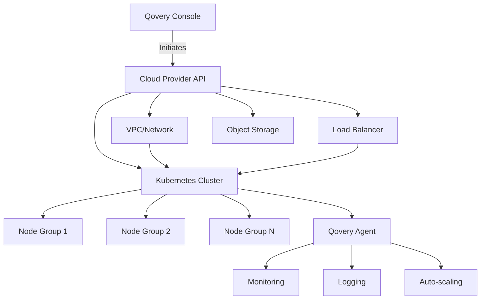

## Overview

Qovery Provision automates the setup and configuration of your cloud infrastructure on AWS, GCP, Azure, or Scaleway. It handles the complexities of cluster provisioning, networking, and infrastructure management, allowing you to focus on deploying applications rather than managing infrastructure.

## What Qovery Provision Does

<CardGroup cols={2}>
  <Card title="Cluster Creation" icon="server">
    Automated Kubernetes cluster provisioning with optimized configurations
  </Card>
  <Card title="Network Setup" icon="network-wired">
    VPC, subnets, load balancers, and DNS configuration
  </Card>
  <Card title="Security Configuration" icon="shield">
    IAM roles, security groups, and encryption by default
  </Card>
  <Card title="Cloud Resources" icon="cloud">
    Object storage, container registries, and monitoring infrastructure
  </Card>
</CardGroup>

## Getting Started with Provision

### Prerequisites

Before provisioning infrastructure with Qovery, you need:

<Tabs>
  <Tab title="AWS">
    - **Qovery account** and Organization
    - **AWS account** with appropriate permissions
    - For BYOK: Kubernetes cluster with minimum **4 CPUs** and **8GB RAM**
  </Tab>

  <Tab title="GCP">
    - **Qovery account** and Organization
    - **GCP account**
    - **GCP project with billing activated and linked**
    - **Minimum quotas**: At least **4 CPUs** and **8 GB of memory** available in your GCP quotas

    <Info>
    You can request quota increases through GCP support if needed.
    </Info>
  </Tab>

  <Tab title="Azure">
    - **Qovery account** and Organization
    - **Azure account**
    - **Azure tenant with an active subscription**
    - For BYOK: Kubernetes cluster with minimum **4 CPUs** and **8GB RAM**
  </Tab>

  <Tab title="Scaleway">
    - **Qovery account** and Organization
    - **Scaleway account** with billing configured
    - For BYOK: Kubernetes cluster with minimum **4 CPUs** and **8GB RAM**
  </Tab>

  <Tab title="BYOK (Bring Your Own Kubernetes)">
    - **Qovery account** at https://start.qovery.com
    - **Operational Kubernetes cluster** (any cloud or on-premise)
    - **Minimum resources**: 4 CPUs and 8GB RAM
    - **`kubectl`** installed and configured
    - **`helm`** installed and configured

    <Warning>
    Qovery does **not manage the Kubernetes cluster** for you. You are responsible for managing dependency components (ingress, DNS, logging, etc.).
    </Warning>
  </Tab>
</Tabs>

### Step 1: Connect Cloud Provider

<Steps>
  <Step title="Navigate to Cluster Section">
    In Qovery Console, click **Clusters** in the left panel
  </Step>

  <Step title="Add Cloud Credentials">
    When creating a new cluster, you'll be prompted to add cloud credentials if you haven't already:
    Select your cloud provider and configure credentials:

    <Tabs>
      <Tab title="AWS">
        **Two authentication methods available:**

        **1. STS Assume Role (Strongly Recommended)**

        <Warning>
        **We strongly recommend using Assume Role via STS.** Static credentials are long-lived and more exposed to leaks, while Assume Role provides short-lived, automatically refreshed credentials with granular access control, reducing security risks.
        </Warning>

        How it works:
        1. Qovery provides a **CloudFormation template**
        2. The template automatically creates the necessary IAM role and grants assume role permissions
        3. You acknowledge that CloudFormation will create IAM resources
        4. Copy the Role ARN from CloudFormation outputs back to Qovery

        **2. Static Credentials (Alternative)**

        Use IAM user access keys (requires manual rotation every 90 days for security)

        <Info>
        **Detailed setup guide:** [AWS Credentials Configuration →](/integrations/kubernetes/eks/managed#step-3-connect-aws-account)

        Includes step-by-step instructions for both STS Assume Role and Static Credentials.

        **Note:** Credentials are managed centrally at the organization level.
        </Info>
      </Tab>

      <Tab title="GCP">
        **Upload GCP Service Account JSON key file**

        You need to create a service account in GCP with the required permissions and download the JSON key file.

        <Info>
        **Detailed setup guide:** [GCP Credentials Configuration →](/integrations/kubernetes/gke/managed#step-1-create-cluster)

        Includes instructions for creating service accounts with proper permissions.
        </Info>
      </Tab>

      <Tab title="Azure">
        **Provide Azure Service Principal credentials:**
        - Subscription ID
        - Tenant ID
        - Client ID
        - Client Secret

        <Info>
        **Detailed setup guide:** [Azure Credentials Configuration →](/integrations/kubernetes/aks/managed)

        Includes instructions for creating service principals with proper permissions.
        </Info>
      </Tab>

      <Tab title="Scaleway">
        **Provide Scaleway API credentials:**
        - Access Key
        - Secret Key

        <Info>
        **Detailed setup guide:** [Scaleway Credentials Configuration →](/integrations/kubernetes/scaleway/managed)

        Includes instructions for generating API keys with proper permissions.
        </Info>
      </Tab>
    </Tabs>
  </Step>

  <Step title="Verify Connection">
    Qovery will verify your credentials and display available regions
  </Step>
</Steps>

### Step 2: Create a Cluster

Once your cloud credentials are connected, create your first cluster:

<CardGroup cols={2}>
  <Card title="Install on AWS" icon="aws" href="/integrations/kubernetes/eks/overview">
    Complete guide to create EKS cluster with Karpenter auto-scaling
  </Card>
  <Card title="Install on GCP" icon="google" href="/integrations/kubernetes/gke/overview">
    Complete guide to create GKE cluster with auto-scaling
  </Card>
  <Card title="Install on Azure" icon="microsoft" href="/integrations/kubernetes/aks/overview">
    Complete guide to create AKS cluster with auto-scaling
  </Card>
  <Card title="Install on Scaleway" icon="/images/logos/cloud-providers/scaleway-icon-light.svg" href="/integrations/kubernetes/scaleway/overview">
    Complete guide to create Kapsule cluster with auto-scaling
  </Card>
</CardGroup>

Each installation guide covers:
- Cluster configuration and sizing
- Network setup (VPC, subnets, load balancers)
- Auto-scaling configuration
- Security and IAM setup
- What gets provisioned automatically
- Cost estimation

**General Cluster Configuration**:
- **Cluster Name**: e.g., `production-us-east-1`
- **Region**: Geographic region closest to your users (choose datacenter near your user base to minimize latency)
- **Instance Type**: Based on workload (start with t3.large/e2-standard-4)
- **Auto-scaling**: Min 3 nodes, max 10 nodes (adjustable)

<Info>
**Multi-cluster Support**: You can create **multiple clusters on the same cloud account with different VPCs**, or across different accounts. Each cluster is independently managed.
</Info>

**Provisioning Timeline**:
- **AWS**: Up to 30 minutes
- **GCP**: Up to 20 minutes
- **Azure**: Up to 20 minutes
- **Scaleway**: Up to 20 minutes

<Tip>
**Start working immediately!** While your cluster provisions, you can **already configure your first application** in Qovery Console. Your app will deploy automatically once the cluster is ready.
</Tip>

<Info>
**Post-deployment configuration**: Many cluster settings can be changed after deployment. You're not locked into your initial choices.
</Info>

## Cluster Provisioning Architecture

When you create a cluster, Qovery provisions:



**Components Provisioned**:
1. **VPC/Virtual Network**: Isolated network infrastructure
2. **Kubernetes Control Plane**: Managed Kubernetes API server
3. **Node Groups**: Worker nodes with auto-scaling
4. **Load Balancer**: External traffic routing
5. **Object Storage**: Container images and logs
6. **IAM Roles**: Service accounts and permissions
7. **Qovery Agent**: Cluster management and monitoring

## Cluster Types

### Managed Clusters

Qovery provisions and manages the entire cluster lifecycle.

**Pros**:
- Fully automated setup and maintenance
- Automatic updates and security patches
- Integrated monitoring and logging
- Cost optimization features

**Best For**: Production workloads, teams without dedicated DevOps

### BYOK (Bring Your Own Kubernetes)

Connect your existing Kubernetes cluster to Qovery. Designed for **Kubernetes experts** managing their own clusters.

**What Qovery Manages**:
- ✅ Qovery components (automatically updated via Helm chart)
- ✅ Application deployments and orchestration
- ✅ Monitoring and observability for your apps

**What You Manage**:
- ❌ Kubernetes cluster itself
- ❌ Dependency components (ingress, DNS, logging, etc.)
- ❌ Kubernetes version upgrades
- ❌ Infrastructure maintenance

<Warning>
Qovery does **not manage the Kubernetes cluster** for you. Components bundled with the Helm chart (ingress, DNS, logging) are **not maintained by Qovery**—you're responsible for their upkeep.
</Warning>

**Pros**:
- Use existing infrastructure (on-premise, edge, any cloud)
- Full control over cluster configuration
- Integrate with existing tooling
- No vendor lock-in

**Best For**: Organizations with existing Kubernetes expertise

#### Installation Steps

<Steps>
  <Step title="Install Qovery CLI">
    ```bash
    curl -s https://get.qovery.com | bash
    ```

    The CLI will be installed and ready to use.
  </Step>

  <Step title="Authenticate with Qovery">
    ```bash
    qovery auth
    ```

    This opens your browser for authentication. For environments without GUI (servers, CI/CD), use:

    ```bash
    qovery auth --headless
    ```
  </Step>

  <Step title="Deploy Qovery to Your Cluster">
    ```bash
    qovery cluster install
    ```

    Follow the interactive prompts to:
    - Select your Kubernetes context
    - Configure cluster settings
    - Install Qovery Agent and components
  </Step>

  <Step title="Validate Installation">
    1. Go to [console.qovery.com](https://console.qovery.com)
    2. Verify your cluster appears in the cluster list
    3. Check that cluster status shows as "Running"
    4. Deploy a test application to confirm everything works
  </Step>
</Steps>

<Info>
**Manual Helm Installation**: Advanced users can also install directly via Helm:

```bash
helm repo add qovery https://helm.qovery.com
helm repo update

helm install qovery-agent qovery/qovery-agent \
  --namespace qovery \
  --create-namespace \
  --set agent.clusterToken=YOUR_CLUSTER_TOKEN
```

Get your cluster token from Qovery Console → Clusters → Create BYOK Cluster.
</Info>

## Multi-Cloud Strategy

Qovery supports multi-cloud provisioning for:

**Geographic Distribution**:
```
AWS US-East (Production - Americas)
GCP Europe-West (Production - Europe)
Azure Southeast-Asia (Production - APAC)
```

**Disaster Recovery**:
```
Primary: AWS us-east-1
Failover: AWS us-west-2
```

**Cost Optimization**:
```
Production: AWS (established workloads)
Development: Scaleway (cost-effective)
```

## Infrastructure as Code

### Terraform Provider

Provision clusters using Terraform:

```hcl
resource "qovery_cluster" "production" {
  organization_id   = qovery_organization.my_org.id
  name              = "production-aws-us-east-1"
  cloud_provider    = "AWS"
  region            = "us-east-1"

  kubernetes_version = "1.28"

  min_running_nodes = 3
  max_running_nodes = 10

  instance_type    = "t3.xlarge"
  disk_size        = 100

  features {
    vpc_subnet = "10.0.0.0/16"
    static_ip  = true
  }
}
```

### Qovery API

Provision clusters via API:

```bash
curl -X POST "https://api.qovery.com/organization/{org_id}/cluster" \
  -H "Authorization: Token YOUR_API_TOKEN" \
  -H "Content-Type: application/json" \
  -d '{
    "name": "production-cluster",
    "cloud_provider": "AWS",
    "region": "us-east-1",
    "kubernetes_version": "1.28",
    "min_running_nodes": 3,
    "max_running_nodes": 10,
    "instance_type": "t3.xlarge"
  }'
```

## Cost Management

### Right-Sizing Clusters

**Small Workloads** (Dev/Test):
- Instance Type: `t3.medium` or `e2-standard-2`
- Min Nodes: 1-2
- Max Nodes: 3-5

**Medium Workloads** (Staging):
- Instance Type: `t3.large` or `e2-standard-4`
- Min Nodes: 2-3
- Max Nodes: 5-8

**Large Workloads** (Production):
- Instance Type: `t3.xlarge` or `e2-standard-8`
- Min Nodes: 3-5
- Max Nodes: 10-20

### Cost Optimization Features

<AccordionGroup>
  <Accordion title="Auto-Scaling">
    Automatically scale nodes based on resource utilization to avoid over-provisioning.
  </Accordion>

  <Accordion title="Spot/Preemptible Instances">
    Use spot instances for non-critical workloads to reduce costs by up to 70%.
  </Accordion>

  <Accordion title="Cluster Scheduling">
    Stop development clusters outside business hours to save costs.
  </Accordion>

  <Accordion title="Resource Monitoring">
    Track cluster costs and identify optimization opportunities.
  </Accordion>
</AccordionGroup>

## Advanced Cluster Features

### Cluster Management Operations

<AccordionGroup>
  <Accordion title="Instance Configuration">
    **Edit after deployment:**
    - Instance type (upgrade/downgrade)
    - Minimum and maximum number of instances
    - Spot instance configuration (indicated by hourglass icon in UI)
    - Node pool definitions (for Karpenter-based clusters)

    Track reserved resources:
    - CPU capacity per node
    - Memory allocation per node
    - Disk size and age
  </Accordion>

  <Accordion title="Kubernetes Version Management">
    **Automatic upgrades**: Qovery handles Kubernetes upgrades automatically.

    <Warning>
    **DO NOT** upgrade Kubernetes versions independently through your cloud provider (AWS, GCP, Azure). Always use Qovery's upgrade mechanism.
    </Warning>

    **Manual upgrade**: When new versions are available, click **"Upgrade to XX.XX"** in the cluster menu.

    Qovery will warn you about unsupported or incompatible versions.
  </Accordion>

  <Accordion title="Cluster Actions">
    Available operations:
    - **Update**: Modify cluster configuration
    - **Stop/Pause** (AWS only): Stop cluster to save costs
    - **Restart**: Bring paused cluster back online
    - **Delete**: Remove cluster (multiple confirmation options)
    - **Download Kubeconfig**: Direct cluster access via kubectl
  </Accordion>

  <Accordion title="Custom Domain & Wildcard TLS (Beta)">
    **Feature**: Custom domain with wildcard TLS certificate for the entire cluster

    **How it works**:
    - Integrate with Cloudflare
    - Apply wildcard TLS to all services in the cluster
    - Bypass Let's Encrypt rate limits

    **Best for**: Organizations with multiple subdomains that would otherwise hit Let's Encrypt's rate limits.

    <Info>
    This feature is currently in Beta. Contact support for setup assistance.
    </Info>
  </Accordion>

  <Accordion title="Monitoring & Observability">
    Built-in cluster monitoring:
    - Real-time cluster status tracking
    - Deployment status monitoring
    - Comprehensive logging with error detail tabs
    - Health checks for cluster and deployments
    - Audit log filtering by cluster
    - Reserved resource tracking (CPU, memory, disk)
  </Accordion>

  <Accordion title="Image Mirroring">
    Configure image mirroring registry to:
    - Cache container images locally
    - Reduce pull times and bandwidth
    - Improve deployment reliability
    - Work around registry rate limits
  </Accordion>
</AccordionGroup>

## Best Practices

<CardGroup cols={2}>
  <Card title="Use Multiple Availability Zones" icon="sitemap">
    Distribute nodes across multiple AZs for high availability
  </Card>

  <Card title="Enable Auto-Scaling" icon="arrows-left-right-to-line">
    Configure min/max nodes to handle traffic fluctuations
  </Card>

  <Card title="Separate Environments" icon="layer-group">
    Use different clusters for dev, staging, and production
  </Card>

  <Card title="Monitor Resource Usage" icon="chart-line">
    Regularly review cluster metrics and optimize sizing
  </Card>

  <Card title="Use Terraform/IaC" icon="code">
    Manage infrastructure as code for reproducibility
  </Card>

  <Card title="Plan Capacity" icon="gauge-high">
    Leave 30% capacity buffer for traffic spikes
  </Card>
</CardGroup>

## Frequently Asked Questions

<AccordionGroup>
  <Accordion title="How do I choose the right region?">
    **Best practice**: Select a datacenter **geographically close to your user base** to minimize latency.

    **Example**:
    - US users → `us-east-1` (AWS) or `us-central1` (GCP)
    - European users → `eu-west-1` (AWS) or `europe-west1` (GCP)
    - Asian users → `ap-southeast-1` (AWS) or `asia-southeast1` (GCP)
  </Accordion>

  <Accordion title="What if my region isn't available?">
    If you can't find the AWS/GCP/Azure region you need in Qovery Console:

    1. **Contact us** to check the status—we may be testing support for that region
    2. Check the [public roadmap](https://roadmap.qovery.com) for upcoming regions
    3. Vote for your region on the roadmap to prioritize it
  </Accordion>

  <Accordion title="Can I migrate a cluster to another region?">
    **No.** You **cannot migrate an environment from one region to another** after it has been created.

    **Workaround**:
    1. Create a new cluster in the target region
    2. Recreate environments and deploy applications to the new cluster
    3. Update DNS/routing to point to new cluster
    4. Delete old cluster once migration is complete

    <Info>
    If this is a critical feature for you, please [vote on the roadmap](https://roadmap.qovery.com) to help us prioritize it!
    </Info>
  </Accordion>

  <Accordion title="How long does cluster setup take?">
    **Typical provisioning time**:
    - **Managed Clusters**: 15-30 minutes (includes VPC, Kubernetes, Qovery installation)
    - **BYOK**: 5-10 minutes (Qovery Agent installation only)

    **What's created**:
    - Kubernetes control plane and worker nodes
    - VPC with public/private subnets
    - Load balancers and networking
    - IAM roles and security groups
    - Qovery Agent for management
  </Accordion>

  <Accordion title="What about data security and encryption?">
    **Security model**:
    - All data is **encrypted at rest** using cloud provider's native encryption (AWS KMS, GCP KMS, Azure Key Vault)
    - Data is stored in **your cloud account**, not Qovery's infrastructure
    - **Qovery cannot access your data**—we only manage the infrastructure
    - Production databases use cloud provider managed services (RDS, Cloud SQL, etc.)

    **Compliance**: See [Security & Compliance](/security-and-compliance/overview) for SOC2, GDPR, HIPAA details.
  </Accordion>

  <Accordion title="Can I stop a cluster to save costs?">
    **AWS only**: Yes! You can **pause/stop clusters** when not in use (e.g., development clusters outside business hours).

    **How it works**:
    1. Click cluster → **Stop**
    2. Cluster infrastructure is paused (no compute charges)
    3. Click **Restart** to bring it back online

    **Other clouds**: GCP, Azure, Scaleway don't currently support pause/stop. Vote on the roadmap if you need this feature!
  </Accordion>
</AccordionGroup>

## Troubleshooting

<AccordionGroup>
  <Accordion title="Cluster Creation Failed">
    **Common Causes**:
    - Insufficient cloud provider quotas
    - Invalid credentials or permissions
    - Region capacity limitations

    **Resolution**:
    1. Verify credentials have required permissions
    2. Check quota limits in cloud provider console
    3. Try alternative region or instance type
    4. Contact Qovery support with cluster ID
  </Accordion>

  <Accordion title="Slow Provisioning">
    **Expected Duration**: 15-30 minutes for managed clusters

    **If Exceeding 30 Minutes**:
    - Check cloud provider status page
    - Review provisioning logs in Qovery Console
    - Contact support if stuck
  </Accordion>

  <Accordion title="Cannot Connect to Cluster">
    **Verify**:
    1. Cluster status is "Running" (green)
    2. Download fresh kubeconfig from Qovery Console
    3. Check network connectivity/VPN
    4. Verify kubectl version compatibility
  </Accordion>
</AccordionGroup>

## Next Steps

<CardGroup cols={2}>
  <Card title="Deploy Your First App" icon="rocket" href="/guides/qovery-101/deploy">
    Learn how to deploy applications on your provisioned cluster
  </Card>

  <Card title="Cluster Advanced Settings" icon="sliders" href="/configuration/clusters">
    Fine-tune cluster configuration for your needs
  </Card>

  <Card title="Multi-Cluster Management" icon="/images/logos/cloud-providers/scaleway-icon-light.svg" href="/guides/use-cases/multi-kubernetes-clusters-management">
    Manage multiple clusters across regions
  </Card>

  <Card title="Kubernetes Integrations" icon="dharmachakra" href="/integrations/kubernetes/overview">
    Explore cloud-specific Kubernetes features
  </Card>
</CardGroup>
