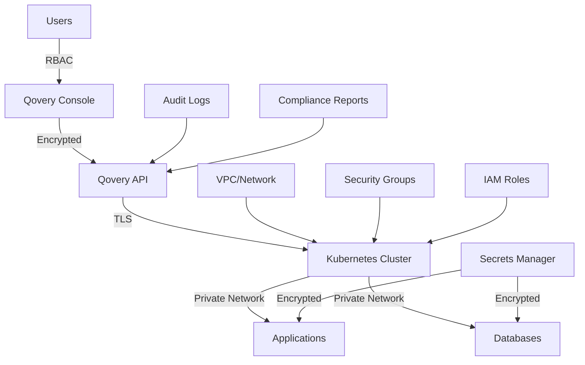

## Overview

Qovery Secure provides comprehensive security features to protect your applications, infrastructure, and data. Implement industry best practices, maintain compliance, and ensure your infrastructure meets enterprise security requirements.

## What Qovery Secure Does

<CardGroup cols={2}>
  <Card title="Secrets Management" icon="key">
    Encrypted storage and secure injection of sensitive data
  </Card>
  <Card title="Network Security" icon="shield-halved">
    VPC isolation, IP whitelisting, and private networking
  </Card>
  <Card title="Access Control" icon="user-lock">
    Role-based access control (RBAC) and audit logging
  </Card>
  <Card title="Compliance" icon="file-shield">
    SOC 2, GDPR, HIPAA compliance features
  </Card>
</CardGroup>

## Security Architecture



## Quick Start

<CardGroup cols={2}>
  <Card title="Organization Security" icon="building-shield" href="/configuration/organization">
    Configure SSO, RBAC, and access control for your organization
  </Card>
  <Card title="Secrets Management" icon="key" href="/configuration/environment-variables">
    Securely manage environment variables and secrets
  </Card>
</CardGroup>

---

## Secrets Management

### Creating and Using Secrets

<Tabs>
  <Tab title="Console">
    **Create Secret**:
    1. Navigate to Environment → **Variables**
    2. Click **Add Variable** → **Secret**
    3. Enter key and value
    4. Click **Save**

    **Use in Application**:
    ```bash
    # Secret is injected as environment variable
    DATABASE_PASSWORD=secret:POSTGRES_PASSWORD
    API_KEY=secret:STRIPE_API_KEY
    ```

    **Secret Visibility**:
    - Values are encrypted at rest
    - Never shown in UI (only first/last 3 characters)
    - Not included in logs
    - Redacted in API responses
  </Tab>

  <Tab title="CLI">
    ```bash
    # Create secret
    qovery env create SECRET_KEY --secret

    # Enter secret value (hidden input)
    Enter value: ****************

    # List secrets (values hidden)
    qovery env list
    # Output:
    # DATABASE_PASSWORD  secret:***  (secret)
    # API_KEY           secret:***  (secret)

    # Update secret
    qovery env update SECRET_KEY --secret

    # Delete secret
    qovery env delete SECRET_KEY
    ```
  </Tab>

  <Tab title="Terraform">
    ```hcl
    # Store secrets in Terraform variables (use secure backend)
    variable "database_password" {
      type      = string
      sensitive = true
    }

    resource "qovery_application" "backend_api" {
      name           = "backend-api"
      environment_id = qovery_environment.production.id

      secrets = [
        {
          key   = "DATABASE_PASSWORD"
          value = var.database_password
        },
        {
          key   = "API_KEY"
          value = var.stripe_api_key
        }
      ]
    }

    # Best Practice: Use external secret management
    data "aws_secretsmanager_secret_version" "db_password" {
      secret_id = "production/database/password"
    }

    # Reference in Qovery
    secrets = [
      {
        key   = "DATABASE_PASSWORD"
        value = data.aws_secretsmanager_secret_version.db_password.secret_string
      }
    ]
    ```
  </Tab>
</Tabs>

### External Secrets Management

Integrate with enterprise secret managers:

<Tabs>
  <Tab title="AWS Secrets Manager">
    ```yaml
    # Deploy External Secrets Operator
    Helm Chart: external-secrets/external-secrets

    # Configure AWS Secrets Manager backend
    apiVersion: external-secrets.io/v1beta1
    kind: SecretStore
    metadata:
      name: aws-secrets-manager
    spec:
      provider:
        aws:
          service: SecretsManager
          region: us-east-1
          auth:
            jwt:
              serviceAccountRef:
                name: external-secrets

    # Create ExternalSecret
    apiVersion: external-secrets.io/v1beta1
    kind: ExternalSecret
    metadata:
      name: backend-api-secrets
    spec:
      refreshInterval: 1h
      secretStoreRef:
        name: aws-secrets-manager
        kind: SecretStore
      target:
        name: backend-api-secrets
      data:
        - secretKey: DATABASE_PASSWORD
          remoteRef:
            key: production/database/password
        - secretKey: API_KEY
          remoteRef:
            key: production/stripe/api-key
    ```
  </Tab>

  <Tab title="HashiCorp Vault">
    ```yaml
    # Configure Vault backend
    apiVersion: external-secrets.io/v1beta1
    kind: SecretStore
    metadata:
      name: vault-backend
    spec:
      provider:
        vault:
          server: "https://vault.company.com"
          path: "secret"
          version: "v2"
          auth:
            kubernetes:
              mountPath: "kubernetes"
              role: "backend-api"

    # Sync secrets from Vault
    apiVersion: external-secrets.io/v1beta1
    kind: ExternalSecret
    metadata:
      name: backend-api-secrets
    spec:
      secretStoreRef:
        name: vault-backend
      target:
        name: backend-api-secrets
      data:
        - secretKey: database-password
          remoteRef:
            key: production/database
            property: password
    ```
  </Tab>

  <Tab title="Google Secret Manager">
    ```yaml
    # Configure GCP Secret Manager
    apiVersion: external-secrets.io/v1beta1
    kind: SecretStore
    metadata:
      name: gcp-secret-manager
    spec:
      provider:
        gcpsm:
          projectID: "my-project-123456"
          auth:
            workloadIdentity:
              clusterLocation: us-central1
              clusterName: production
              serviceAccountRef:
                name: external-secrets

    # Sync secrets
    apiVersion: external-secrets.io/v1beta1
    kind: ExternalSecret
    metadata:
      name: backend-api-secrets
    spec:
      secretStoreRef:
        name: gcp-secret-manager
      target:
        name: backend-api-secrets
      data:
        - secretKey: database_password
          remoteRef:
            key: production-database-password
    ```
  </Tab>
</Tabs>

## Network Security

### VPC and Network Isolation

<Steps>
  <Step title="Configure VPC">
    Qovery automatically creates isolated VPCs for each cluster:

    ```yaml
    Default VPC Configuration:
      CIDR: 10.0.0.0/16 (configurable)
      Subnets:
        - Public: 10.0.0.0/20 (Load balancers)
        - Private: 10.0.16.0/20 (Applications)
        - Database: 10.0.32.0/20 (Databases)

      Availability Zones: 3 (for high availability)
      NAT Gateway: Enabled
      Internet Gateway: Enabled
    ```

    **Custom VPC Configuration**:
    1. Go to **Cluster Settings** → **Network**
    2. Configure custom CIDR ranges
    3. Enable/disable public access
    4. Configure NAT gateway settings
  </Step>

  <Step title="Enable Private Networking">
    Restrict access to internal networks:

    **Application Settings**:
    ```yaml
    Network Configuration:
      Publicly Accessible: No
      Internal Port: 3000
      Protocol: HTTP

    Access:
      - From other applications in same environment: Yes
      - From other environments: No (default)
      - From internet: No
    ```

    **Database Settings**:
    ```yaml
    Network Configuration:
      Publicly Accessible: No
      Port: 5432

    Access:
      - From applications in same environment: Yes
      - From VPN: Yes (if configured)
      - From internet: No
    ```
  </Step>

  <Step title="Configure VPC Peering">
    Connect Qovery VPC with your existing infrastructure:

    **AWS VPC Peering**:
    ```yaml
    Peering Configuration:
      Source VPC: qovery-production (10.0.0.0/16)
      Target VPC: company-network (172.16.0.0/16)

    Route Tables:
      - Qovery VPC → 172.16.0.0/16 → Peering Connection
      - Company VPC → 10.0.0.0/16 → Peering Connection

    Security Groups:
      - Allow specific ports from company network
      - Deny all other traffic
    ```

    See detailed guide: [AWS VPC Peering](/integrations/aws/vpc-peering)
  </Step>
</Steps>

### IP Whitelisting

<Tabs>
  <Tab title="Application Level">
    **Restrict access by IP address**:

    ```yaml
    # Via Console
    Application → Settings → Network → IP Whitelist:
      - 203.0.113.0/24 (Office Network)
      - 198.51.100.50/32 (VPN Gateway)
      - 192.0.2.0/24 (Partner Network)

    Behavior:
      - Only listed IPs can access application
      - All other requests receive 403 Forbidden
      - Applied at load balancer level
    ```

    **Use Cases**:
    - Admin panels
    - Internal tools
    - Staging environments
    - Partner APIs
  </Tab>

  <Tab title="Database Level">
    **Restrict database access**:

    ```yaml
    Database → Settings → Security:
      Allowed IPs:
        - 10.0.0.0/16 (Qovery VPC)
        - 203.0.113.50/32 (Admin Workstation)
        - 192.0.2.0/24 (Analytics Platform)

    Default: Deny all external access
    ```
  </Tab>

  <Tab title="Cluster Level">
    **Control cluster API access**:

    ```yaml
    Cluster → Settings → Security:
      Kubernetes API Access:
        - 203.0.113.0/24 (DevOps Team)
        - 198.51.100.0/24 (CI/CD Platform)

    SSH Access (if enabled):
      - 203.0.113.0/24 (Operations Team)
    ```
  </Tab>
</Tabs>

### TLS/SSL Configuration

All traffic is encrypted by default:

<Tabs>
  <Tab title="Automatic TLS">
    **Qovery automatically provisions TLS certificates**:

    ```yaml
    Default Configuration:
      Certificate Provider: Let's Encrypt
      Renewal: Automatic (60 days before expiry)
      Protocols: TLS 1.2, TLS 1.3
      Cipher Suites: Modern (secure)

    Your Domain:
      URL: https://api.example.com
      Certificate: Issued and managed automatically
      Grade: A+ (SSL Labs)
    ```
  </Tab>

  <Tab title="Custom Certificates">
    **Use your own TLS certificates**:

    ```yaml
    # Upload custom certificate
    Application → Settings → Domain → Custom Certificate:
      Certificate: [Upload .crt file]
      Private Key: [Upload .key file]
      CA Bundle: [Upload ca-bundle.crt] (optional)

    # Or use AWS Certificate Manager
    Domain Configuration:
      Domain: api.example.com
      Certificate Source: AWS ACM
      Certificate ARN: arn:aws:acm:us-east-1:123456789:certificate/abc123
    ```
  </Tab>

  <Tab title="mTLS (Mutual TLS)">
    **Require client certificates**:

    ```yaml
    # Configure mTLS for service-to-service communication
    apiVersion: networking.istio.io/v1beta1
    kind: PeerAuthentication
    metadata:
      name: default
    spec:
      mtls:
        mode: STRICT

    # Application configuration
    Service Mesh: Enabled
    mTLS: Strict
    Client Certificate: Required
    ```
  </Tab>
</Tabs>

## Access Control (RBAC)

### Organization Roles

<Tabs>
  <Tab title="Owner">
    **Full administrative access**:

    ```yaml
    Permissions:
      ✅ Manage organization settings
      ✅ Manage billing
      ✅ Invite/remove members
      ✅ Create/delete clusters
      ✅ Create/delete projects
      ✅ Deploy/manage all environments
      ✅ View audit logs
      ✅ Manage API tokens

    Typical Users:
      - CTO
      - Engineering Directors
      - Platform Administrators
    ```
  </Tab>

  <Tab title="Admin">
    **Administrative access without billing**:

    ```yaml
    Permissions:
      ✅ Invite/remove members
      ✅ Create/delete clusters
      ✅ Create/delete projects
      ✅ Deploy/manage all environments
      ✅ View audit logs
      ❌ Manage billing
      ❌ Delete organization

    Typical Users:
      - DevOps Engineers
      - Platform Engineers
      - Technical Leads
    ```
  </Tab>

  <Tab title="Developer">
    **Deploy and manage assigned projects**:

    ```yaml
    Permissions:
      ✅ Deploy applications
      ✅ Manage environment variables
      ✅ View logs and metrics
      ✅ Rollback deployments
      ❌ Create/delete projects
      ❌ Manage cluster settings
      ❌ Invite members

    Typical Users:
      - Software Engineers
      - Backend Developers
      - Frontend Developers
    ```
  </Tab>

  <Tab title="Viewer">
    **Read-only access**:

    ```yaml
    Permissions:
      ✅ View projects and environments
      ✅ View logs and metrics
      ✅ View configurations
      ❌ Deploy or modify anything
      ❌ Access secrets
      ❌ Invite members

    Typical Users:
      - Product Managers
      - Business Analysts
      - External Auditors
    ```
  </Tab>
</Tabs>

### Project-Level Permissions

Grant granular access to specific projects:

```yaml
# Example: Multi-team organization
Organization: Acme Corp

Project: Customer Portal
  Team: Frontend Team
    - Alice (Admin): Full access
    - Bob (Developer): Deploy dev/staging
    - Carol (Developer): Deploy dev only

Project: Payment Service
  Team: Backend Team
    - David (Admin): Full access
    - Eve (Developer): Deploy all environments
    - Frank (Developer): Deploy dev only

  Team: Finance Team
    - Grace (Viewer): Read-only access

Project: Analytics Platform
  Team: Data Team
    - Henry (Admin): Full access
    - Iris (Developer): Deploy dev/staging
```

**Configure Project Permissions**:
1. Go to **Project Settings** → **Members**
2. Click **Add Member**
3. Select user and role
4. Optionally restrict to specific environments

## Compliance and Auditing

### SOC 2 Compliance

<CardGroup cols={2}>
  <Card title="Security" icon="shield">
    Protection against unauthorized access and disclosure
  </Card>
  <Card title="Availability" icon="check-circle">
    System availability and performance monitoring
  </Card>
  <Card title="Confidentiality" icon="lock">
    Data encryption at rest and in transit
  </Card>
  <Card title="Processing Integrity" icon="gears">
    System processing accuracy and authorization
  </Card>
</CardGroup>

**Qovery SOC 2 Features**:
```yaml
Infrastructure Security:
  ✅ Encrypted data at rest (AES-256)
  ✅ Encrypted data in transit (TLS 1.2+)
  ✅ Regular security audits
  ✅ Vulnerability scanning
  ✅ Penetration testing

Access Control:
  ✅ Multi-factor authentication
  ✅ Role-based access control
  ✅ SSO integration
  ✅ Session management
  ✅ Audit logging

Monitoring:
  ✅ 24/7 infrastructure monitoring
  ✅ Incident response procedures
  ✅ Automated alerting
  ✅ Performance tracking
```

### GDPR Compliance

<Steps>
  <Step title="Data Location Control">
    Choose where your data is stored:

    ```yaml
    Regional Clusters:
      - EU: eu-west-1, eu-central-1 (GDPR compliant)
      - US: us-east-1, us-west-2
      - APAC: ap-southeast-1, ap-northeast-1

    Data Residency:
      - Application data: Stays in chosen region
      - Logs: Stored in same region
      - Backups: Stored in same region
      - Metadata: Encrypted and distributed
    ```
  </Step>

  <Step title="Right to Access">
    Export all data via API:

    ```bash
    # Export user data
    curl -X GET \
      "https://api.qovery.com/organization/{org_id}/data-export" \
      -H "Authorization: Token YOUR_API_TOKEN"

    # Export audit logs
    curl -X GET \
      "https://api.qovery.com/organization/{org_id}/audit-logs/export" \
      -H "Authorization: Token YOUR_API_TOKEN"
    ```
  </Step>

  <Step title="Right to Erasure">
    Delete user data:

    ```yaml
    Data Deletion:
      - User account deletion
      - Organization deletion
      - Environment deletion
      - Log retention configuration

    Backup Retention:
      - Configurable retention periods
      - Automatic backup deletion
      - Secure data wiping
    ```
  </Step>

  <Step title="Data Processing Agreements">
    Qovery provides standard DPA:

    - Data processing terms
    - Security measures
    - Sub-processor list
    - Data breach notification
    - Available in organization settings
  </Step>
</Steps>

### HIPAA Compliance

For healthcare applications:

<Tabs>
  <Tab title="Infrastructure">
    ```yaml
    HIPAA-Compliant Setup:
      Cluster Configuration:
        - Dedicated cluster (no shared resources)
        - Encrypted EBS volumes (AWS KMS)
        - Private networking only
        - VPC endpoint for AWS services

      Database:
        - Encrypted at rest (KMS)
        - Encrypted in transit (SSL)
        - Automatic backups encrypted
        - Audit logging enabled

      Access:
        - MFA required for all users
        - IP whitelisting enforced
        - Audit logs retained 7 years
        - BAA (Business Associate Agreement) signed
    ```
  </Tab>

  <Tab title="Application Configuration">
    ```yaml
    Security Hardening:
      Network:
        - No public access to databases
        - TLS 1.2+ only
        - No unencrypted connections

      Application:
        - PHI data encrypted in application
        - Secure session management
        - Access logs for all PHI access
        - Automatic session timeout

      Monitoring:
        - Alert on unauthorized access
        - Alert on failed login attempts
        - Monitor data export activities
        - Track all configuration changes
    ```
  </Tab>

  <Tab title="Compliance Checklist">
    ```yaml
    Required Actions:
      ✅ Sign BAA with Qovery
      ✅ Enable MFA for all users
      ✅ Configure audit logging
      ✅ Set up dedicated cluster
      ✅ Enable encryption at rest
      ✅ Configure VPC peering
      ✅ Restrict network access
      ✅ Implement application-level encryption
      ✅ Configure backup retention
      ✅ Set up monitoring and alerting
      ✅ Document security procedures
      ✅ Train staff on HIPAA requirements
    ```
  </Tab>
</Tabs>

## Security Best Practices

<CardGroup cols={2}>
  <Card title="Principle of Least Privilege" icon="user-lock">
    Grant minimum required permissions to users and services
  </Card>

  <Card title="Defense in Depth" icon="layer-group">
    Implement multiple layers of security controls
  </Card>

  <Card title="Regular Updates" icon="arrows-rotate">
    Keep all components updated with security patches
  </Card>

  <Card title="Secrets Rotation" icon="key">
    Rotate credentials and API keys regularly (quarterly)
  </Card>

  <Card title="Network Segmentation" icon="network-wired">
    Isolate environments and services with network policies
  </Card>

  <Card title="Monitoring and Alerting" icon="bell">
    Set up alerts for suspicious activities
  </Card>

  <Card title="Incident Response Plan" icon="file-shield">
    Document procedures for security incidents
  </Card>

  <Card title="Security Training" icon="graduation-cap">
    Regularly train team on security best practices
  </Card>
</CardGroup>

### Security Checklist

<AccordionGroup>
  <Accordion title="Organization Security">
    ```yaml
    ✅ Enable 2FA for all users
    ✅ Configure SSO (if applicable)
    ✅ Set up audit logging
    ✅ Define RBAC roles
    ✅ Review access quarterly
    ✅ Remove inactive users
    ✅ Rotate API tokens
    ✅ Set up security alerts
    ```
  </Accordion>

  <Accordion title="Network Security">
    ```yaml
    ✅ Use private networking for databases
    ✅ Configure IP whitelisting
    ✅ Enable VPC peering (if needed)
    ✅ Use TLS for all connections
    ✅ Restrict public access
    ✅ Configure security groups
    ✅ Enable DDoS protection
    ✅ Monitor network traffic
    ```
  </Accordion>

  <Accordion title="Application Security">
    ```yaml
    ✅ Use secrets for sensitive data
    ✅ Never commit secrets to Git
    ✅ Implement input validation
    ✅ Use secure dependencies
    ✅ Enable security headers
    ✅ Implement rate limiting
    ✅ Use secure session management
    ✅ Regular security scanning
    ```
  </Accordion>

  <Accordion title="Data Security">
    ```yaml
    ✅ Encrypt data at rest
    ✅ Encrypt data in transit
    ✅ Configure backup retention
    ✅ Encrypt backups
    ✅ Implement data classification
    ✅ Set up data retention policies
    ✅ Enable audit logging
    ✅ Regular backup testing
    ```
  </Accordion>
</AccordionGroup>

## Troubleshooting

<AccordionGroup>
  <Accordion title="Cannot Access Application">
    **If using IP whitelisting**:

    ```bash
    # Check your current IP
    curl ifconfig.me

    # Verify IP is in whitelist
    # Application → Settings → Network → IP Whitelist

    # Add your IP if missing
    203.0.113.100/32
    ```

    **If using VPN**:
    - Ensure VPN is connected
    - Verify VPN IP is whitelisted
    - Check VPC peering configuration
  </Accordion>

  <Accordion title="Secrets Not Working">
    **Debug steps**:

    ```bash
    # Verify secret exists
    qovery env list

    # Check secret is referenced correctly
    DATABASE_PASSWORD=secret:POSTGRES_PASSWORD

    # Not this:
    DATABASE_PASSWORD=POSTGRES_PASSWORD

    # View environment variables in running container
    qovery shell --command "env | grep -v SECRET"

    # Redeploy application
    qovery deploy
    ```
  </Accordion>

  <Accordion title="TLS Certificate Issues">
    **Common causes**:
    - Domain DNS not pointing to Qovery load balancer
    - Certificate renewal failed
    - Custom certificate expired

    **Resolution**:
    ```bash
    # Check DNS configuration
    dig api.example.com

    # Verify points to correct load balancer
    # Check certificate status in Qovery Console
    # Application → Settings → Domain

    # Force certificate renewal
    # Remove and re-add domain
    ```
  </Accordion>

  <Accordion title="SSO Login Failing">
    **Debug steps**:
    1. Verify SSO configuration in identity provider
    2. Check redirect URLs are correct
    3. Verify user has access in identity provider
    4. Check SAML response for errors
    5. Contact Qovery support with error details

    **Common issues**:
    - Incorrect redirect URI
    - User not assigned to Qovery app
    - SAML assertion expired
    - Clock skew between systems
  </Accordion>
</AccordionGroup>

## Next Steps

<CardGroup cols={2}>
  <Card title="Observe Your Apps" icon="chart-line" href="/guides/qovery-101/observe">
    Monitor security events and audit logs
  </Card>

  <Card title="Compliance Documentation" icon="file-shield" href="/using-qovery/compliance-and-security/overview">
    Learn more about Qovery's compliance certifications
  </Card>

  <Card title="Advanced Security" icon="shield" href="/configuration/service-advanced-settings">
    Configure network policies and security contexts
  </Card>

  <Card title="Secrets Management" icon="key" href="/configuration/environment-variables">
    Advanced secrets configuration and rotation
  </Card>
</CardGroup>
