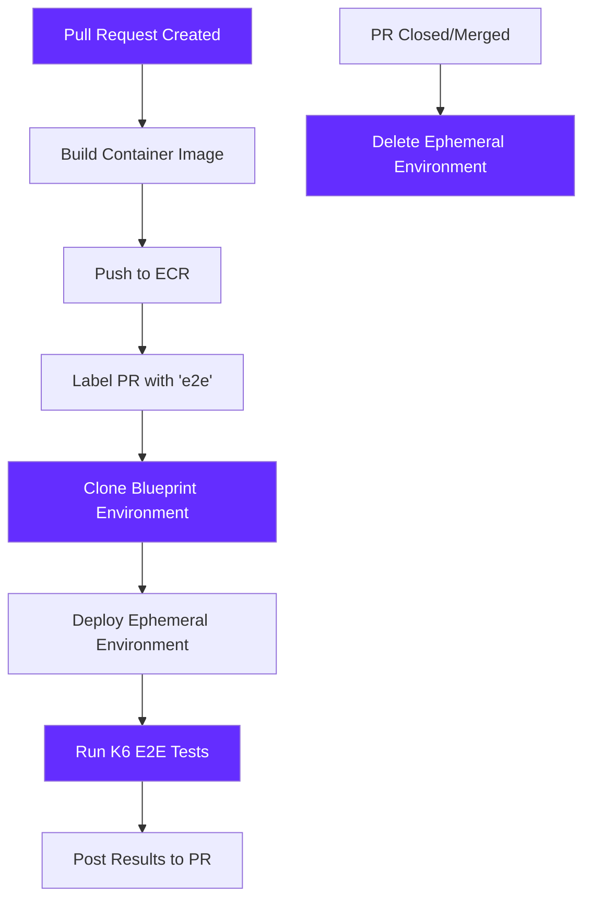
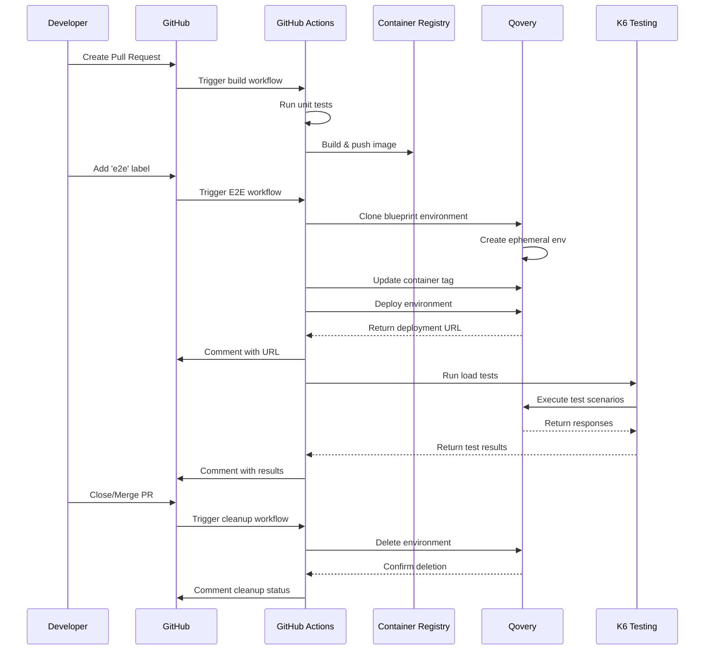

## Overview

Ephemeral environments are temporary, isolated environments that are automatically created for specific purposes (like feature development or testing) and destroyed when no longer needed. They provide developers with production-like environments without the cost and complexity of maintaining permanent infrastructure.

Qovery offers **two approaches** to create and manage ephemeral environments, depending on your team's needs and technical requirements.

### Why E2E Testing Matters

End-to-end testing validates that your application works cohesively from start to finish, mimicking real-world user scenarios. While unit and integration tests provide value, they don't replicate how multiple components interact in live environments.

<Frame>
  
</Frame>

## Prerequisites

<Warning>
**Cluster Required**: Before setting up ephemeral environments, you need a Kubernetes cluster. Ephemeral environments will be created on this cluster.
</Warning>

**Don't have a cluster yet?**

Choose your deployment option:

<CardGroup cols={2}>
  <Card title="Managed Cluster (Recommended)" icon="cloud" href="/quickstart/cloud">
    Let Qovery provision and manage your Kubernetes cluster on AWS, GCP, Azure, or Scaleway

    **Time:** ~30 minutes | **Maintenance:** Qovery handles it
  </Card>

  <Card title="Bring Your Own Cluster (BYOK)" icon="server" href="/integrations/kubernetes/byok">
    Connect your existing Kubernetes cluster or create your own

    **Time:** ~20 minutes | **Maintenance:** You handle it
  </Card>
</CardGroup>

**Already have a cluster connected to Qovery?** Continue with this guide below.

## Benefits of Ephemeral Environments

<CardGroup cols={3}>
  <Card title="Faster Development" icon="rocket">
    Test changes in isolation without affecting other developers
  </Card>

  <Card title="Cost Savings" icon="dollar-sign">
    Pay only for environments when they're in use
  </Card>

  <Card title="Improved Testing" icon="flask">
    Test in production-like environments before deployment
  </Card>

  <Card title="Better Collaboration" icon="users">
    Stakeholders can review changes in live environments
  </Card>

  <Card title="Reduced Risk" icon="shield">
    Catch issues early before they reach production
  </Card>

  <Card title="Faster Feedback" icon="comments">
    Get immediate feedback from team members and stakeholders
  </Card>
</CardGroup>

## Two Ways to Create Ephemeral Environments

<CardGroup cols={2}>
  <Card title="Simple Approach" icon="bolt" href="/configuration/environment#preview-environments">
    **Fully Automated Preview Environments**

    Turn on auto-preview environment feature in Qovery and let it handle everything automatically.

    - Zero configuration required
    - Instant setup (enable and go)
    - Automatic creation/destruction
    - Perfect for quick feedback
    - Best for teams wanting simplicity
  </Card>

  <Card title="Advanced Approach" icon="code" href="#advanced-cicd-integration-with-e2e-testing">
    **Custom CI/CD Integration**

    Integrate ephemeral environments into your existing CI/CD pipeline for complete control.

    - Full workflow customization
    - E2E testing automation
    - Custom creation/deletion logic
    - Integration with GitHub Actions, GitLab CI, etc.
    - Best for advanced testing scenarios
  </Card>
</CardGroup>

---

## Advanced CI/CD Integration with E2E Testing

For teams requiring more control, custom workflows, and automated E2E testing, you can integrate ephemeral environments directly into your CI/CD pipeline. This approach is demonstrated in the comprehensive tutorial below.

<Info>
This tutorial shows how to build a complete E2E testing workflow using GitHub Actions, Qovery, and K6 load testing. The same principles apply to GitLab CI, CircleCI, Jenkins, and other CI/CD platforms.
</Info>

### Tutorial: Building E2E Testing Ephemeral Environments

This advanced tutorial demonstrates how to:
- Automatically create ephemeral environments for each pull request
- Run comprehensive E2E tests using K6
- Display test results in PR comments
- Automatically cleanup environments when PRs are closed

#### What You'll Build

<CardGroup cols={3}>
  <Card title="Automated Creation" icon="plus">
    Ephemeral environments created automatically when PR is labeled
  </Card>

  <Card title="E2E Testing" icon="vial">
    Run load tests and integration tests against live environments
  </Card>

  <Card title="Auto Cleanup" icon="trash">
    Environments destroyed automatically when PR closes
  </Card>
</CardGroup>

#### Architecture Overview



<Frame>
  
</Frame>

#### Prerequisites

<Steps>
  <Step title="Required Tools">
    - **Qovery Account**: Sign up at [qovery.com](https://www.qovery.com)
    - **GitHub Repository**: For hosting your application code
    - **AWS Account**: For container registry (ECR) or use another registry
    - **Qovery CLI**: Install from [qovery.com/install](https://www.qovery.com/docs/using-qovery/interface/cli/)
  </Step>

  <Step title="GitHub Secrets">
    Configure the following secrets in your GitHub repository:

    - `QOVERY_API_TOKEN`: Your Qovery API token
    - `AWS_ACCESS_KEY_ID`: AWS credentials for ECR
    - `AWS_SECRET_ACCESS_KEY`: AWS credentials for ECR
    - `QOVERY_ORGANIZATION_ID`: Your Qovery organization ID
    - `QOVERY_PROJECT_ID`: Your Qovery project ID
    - `QOVERY_CLUSTER_ID`: Your Qovery cluster ID
  </Step>

  <Step title="Qovery Blueprint Environment">
    Create a base "blueprint" environment in Qovery that will be cloned for each PR:

    - Set up your application with proper configuration
    - Add database (PostgreSQL, MySQL, etc.)
    - Configure environment variables
    - Ensure it's working properly

    This blueprint will be the template for all ephemeral environments.

    <Frame>
      
    </Frame>
  </Step>
</Steps>

#### Step 1: Build and Push Container Image

First, create a GitHub Actions workflow to build your Docker image and push it to a container registry (AWS ECR in this example).

**Create `.github/workflows/build-and-push-image.yml`**:

```yaml
name: Build and Push Container Image

on:
  push:
    branches: [main]
  pull_request:
    branches: [main]

jobs:
  run-unit-tests:
    runs-on: ubuntu-latest
    steps:
      - name: Checkout code
        uses: actions/checkout@v3

      - name: Run unit tests
        run: |
          # Add your unit test commands here
          echo "Running unit tests..."
          # npm test
          # pytest
          # go test ./...

  build-and-push-container:
    runs-on: ubuntu-latest
    needs: run-unit-tests
    steps:
      - name: Checkout code
        uses: actions/checkout@v3

      - name: Configure AWS credentials
        uses: aws-actions/configure-aws-credentials@v2
        with:
          aws-access-key-id: ${{ secrets.AWS_ACCESS_KEY_ID }}
          aws-secret-access-key: ${{ secrets.AWS_SECRET_ACCESS_KEY }}
          aws-region: eu-west-3

      - name: Login to Amazon ECR
        id: login-ecr
        uses: aws-actions/amazon-ecr-login@v1
        with:
          mask-password: 'true'

      - name: Build, Tag, and push image to Amazon ECR
        env:
          ECR_REGISTRY: ${{ steps.login-ecr.outputs.registry }}
          ECR_REPOSITORY: todo-app
          IMAGE_TAG: ${{ github.sha }}
        run: |
          docker build -t $ECR_REGISTRY/$ECR_REPOSITORY:$IMAGE_TAG .
          docker tag $ECR_REGISTRY/$ECR_REPOSITORY:$IMAGE_TAG $ECR_REGISTRY/$ECR_REPOSITORY:latest
          docker push $ECR_REGISTRY/$ECR_REPOSITORY:$IMAGE_TAG
          docker push $ECR_REGISTRY/$ECR_REPOSITORY:latest
```

<Info>
**What This Does**: Builds your Docker image on every push and pull request, then pushes it to Amazon ECR with both the commit SHA as a tag and the latest tag. This ensures you have a versioned image for each commit.
</Info>

#### Step 2: Create Ephemeral Environment and Run E2E Tests

Create a workflow that clones your blueprint environment, deploys it with the new container image, and runs E2E tests.

**Create `.github/workflows/pull-request-run-e2e-tests.yml`**:

```yaml
name: Pull Request E2E Tests

on:
  pull_request:
    types: [labeled]

jobs:
  create-ephemeral-environment:
    if: contains(github.event.pull_request.labels.*.name, 'e2e')
    runs-on: ubuntu-latest
    outputs:
      environment_name: ${{ steps.create-env.outputs.environment_name }}
      application_url: ${{ steps.deploy-env.outputs.application_url }}

    steps:
      - name: Checkout code
        uses: actions/checkout@v3

      - name: Install Qovery CLI
        run: |
          curl -s https://get.qovery.com | bash
          echo "$HOME/.qovery/bin" >> $GITHUB_PATH

      - name: Create Ephemeral Environment
        id: create-env
        env:
          QOVERY_API_TOKEN: ${{ secrets.QOVERY_API_TOKEN }}
          QOVERY_ORGANIZATION_ID: ${{ secrets.QOVERY_ORGANIZATION_ID }}
          QOVERY_PROJECT_ID: ${{ secrets.QOVERY_PROJECT_ID }}
          QOVERY_CLUSTER_ID: ${{ secrets.QOVERY_CLUSTER_ID }}
          BLUEPRINT_ENV_ID: ${{ secrets.QOVERY_BLUEPRINT_ENV_ID }}
        run: |
          # Set the environment name
          ENV_NAME="pr-${{ github.event.number }}"
          echo "environment_name=$ENV_NAME" >> $GITHUB_OUTPUT

          # Clone the blueprint environment
          qovery environment clone \
            --organization-id $QOVERY_ORGANIZATION_ID \
            --project-id $QOVERY_PROJECT_ID \
            --environment-id $BLUEPRINT_ENV_ID \
            --new-environment-name $ENV_NAME \
            --cluster-id $QOVERY_CLUSTER_ID

      - name: Update Application Container Tag
        env:
          QOVERY_API_TOKEN: ${{ secrets.QOVERY_API_TOKEN }}
          IMAGE_TAG: ${{ github.sha }}
        run: |
          ENV_NAME="pr-${{ github.event.number }}"

          # Get the application ID from the new environment
          APP_ID=$(qovery application list --environment $ENV_NAME --output json | jq -r '.[0].id')

          # Update the container image tag
          qovery application update $APP_ID \
            --tag $IMAGE_TAG

      - name: Deploy Ephemeral Environment
        id: deploy-env
        env:
          QOVERY_API_TOKEN: ${{ secrets.QOVERY_API_TOKEN }}
        run: |
          ENV_NAME="pr-${{ github.event.number }}"

          # Deploy the environment
          qovery environment deploy $ENV_NAME --wait

          # Get the application URL
          APP_URL=$(qovery application list --environment $ENV_NAME --output json | jq -r '.[0].url')
          echo "application_url=$APP_URL" >> $GITHUB_OUTPUT

      - name: Comment PR with Environment Info
        uses: actions/github-script@v6
        with:
          script: |
            const envName = 'pr-${{ github.event.number }}';
            const appUrl = '${{ steps.deploy-env.outputs.application_url }}';

            github.rest.issues.createComment({
              issue_number: context.issue.number,
              owner: context.repo.owner,
              repo: context.repo.repo,
              body: `## Ephemeral Environment Created\n\n` +
                    `**Environment**: ${envName}\n` +
                    `**URL**: ${appUrl}\n\n` +
                    `E2E tests are now running...`
            })

<Frame>
  
</Frame>

  run-e2e-tests:
    needs: create-ephemeral-environment
    runs-on: ubuntu-latest

    steps:
      - name: Checkout code
        uses: actions/checkout@v3

      - name: Install K6
        run: |
          sudo gpg -k
          sudo gpg --no-default-keyring --keyring /usr/share/keyrings/k6-archive-keyring.gpg --keyserver hkp://keyserver.ubuntu.com:80 --recv-keys C5AD17C747E3415A3642D57D77C6C491D6AC1D69
          echo "deb [signed-by=/usr/share/keyrings/k6-archive-keyring.gpg] https://dl.k6.io/deb stable main" | sudo tee /etc/apt/sources.list.d/k6.list
          sudo apt-get update
          sudo apt-get install k6

      - name: Run K6 E2E Tests
        id: k6-tests
        env:
          API_HOST: ${{ needs.create-ephemeral-environment.outputs.application_url }}
        run: |
          # Run K6 tests and save results
          k6 run tests/e2e/load-test.js --out json=test-results.json

          # Parse results for summary
          cat test-results.json | jq -s 'last' > test-summary.json

      - name: Post Test Results to PR
        if: always()
        uses: actions/github-script@v6
        with:
          script: |
            const fs = require('fs');
            const testResults = fs.readFileSync('test-summary.json', 'utf8');
            const results = JSON.parse(testResults);

            const passed = results.metrics.checks.values.passes || 0;
            const failed = results.metrics.checks.values.fails || 0;
            const total = passed + failed;
            const passRate = ((passed / total) * 100).toFixed(2);

            const body = `## E2E Test Results\n\n` +
              `**Status**: ${failed === 0 ? '✅ PASSED' : '❌ FAILED'}\n` +
              `**Total Checks**: ${total}\n` +
              `**Passed**: ${passed}\n` +
              `**Failed**: ${failed}\n` +
              `**Pass Rate**: ${passRate}%\n\n` +
              `**Duration**: ${results.metrics.iteration_duration.values.avg.toFixed(2)}ms (avg)\n` +
              `**HTTP Requests**: ${results.metrics.http_reqs.values.count}\n` +
              `**Failed Requests**: ${results.metrics.http_req_failed.values.passes || 0}\n\n` +
              `View full test results in the workflow run.`;

            github.rest.issues.createComment({
              issue_number: context.issue.number,
              owner: context.repo.owner,
              repo: context.repo.repo,
              body: body
            })

<Frame>
  
</Frame>

      - name: Upload Test Results
        if: always()
        uses: actions/upload-artifact@v3
        with:
          name: k6-test-results
          path: |
            test-results.json
            test-summary.json
```

<Warning>
**Important**: This workflow is triggered only when you add the `e2e` label to a pull request. This prevents creating ephemeral environments for every PR and helps control costs.
</Warning>

#### Step 3: K6 Load Test Script

Create a K6 test script to perform load testing against your ephemeral environment.

**Create `tests/e2e/load-test.js`**:

```javascript
import http from 'k6/http';
import { check, group, sleep, fail } from 'k6';
import { Rate } from 'k6/metrics';

// Custom metrics
const errorRate = new Rate('errors');

// Test configuration
export const options = {
  stages: [
    { duration: '30s', target: 20 },  // Ramp up to 20 users
    { duration: '2m', target: 100 },  // Ramp up to 100 users
    { duration: '1m', target: 50 },   // Scale down to 50 users
    { duration: '30s', target: 0 },   // Ramp down to 0 users
  ],
  thresholds: {
    'http_req_duration': ['p(95)<500'], // 95% of requests should be below 500ms
    'http_req_failed': ['rate<0.01'],   // Error rate should be less than 1%
    'errors': ['rate<0.1'],             // Custom error rate below 10%
  },
};

// Get API host from environment variable
const API_HOST = __ENV.API_HOST || 'http://localhost:3000';

// Helper function to generate UUID
function uuidv4() {
  return 'xxxxxxxx-xxxx-4xxx-yxxx-xxxxxxxxxxxx'.replace(/[xy]/g, function(c) {
    const r = Math.random() * 16 | 0;
    const v = c === 'x' ? r : (r & 0x3 | 0x8);
    return v.toString(16);
  });
}

// Setup: Run once before tests
export function setup() {
  console.log(`Starting tests against: ${API_HOST}`);

  // Add test data to the database
  const params = {
    headers: {
      'Content-Type': 'application/json',
    },
  };

  const testItems = [];
  for (let i = 0; i < 20; i++) {
    const payload = JSON.stringify({
      title: `Test Item ${i + 1} - ${uuidv4()}`,
      completed: false,
    });

    const res = http.post(`${API_HOST}/api/todos`, payload, params);

    const success = check(res, {
      'setup: item created': (r) => r.status === 201 || r.status === 200,
    });

    if (success && res.json('id')) {
      testItems.push(res.json('id'));
    }
  }

  console.log(`Setup completed. Created ${testItems.length} test items.`);
  return { testItems };
}

// Main test function
export default function(data) {
  // Test 1: Get all todos
  group('Get All Todos', function() {
    const res = http.get(`${API_HOST}/api/todos`);

    const success = check(res, {
      'status is 200': (r) => r.status === 200,
      'response has todos': (r) => Array.isArray(r.json()) && r.json().length > 0,
      'response time < 500ms': (r) => r.timings.duration < 500,
    });

    errorRate.add(!success);
  });

  sleep(1);

  // Test 2: Create a new todo
  group('Create Todo', function() {
    const payload = JSON.stringify({
      title: `New Todo - ${uuidv4()}`,
      completed: false,
    });

    const params = {
      headers: {
        'Content-Type': 'application/json',
      },
    };

    const res = http.post(`${API_HOST}/api/todos`, payload, params);

    const success = check(res, {
      'status is 201 or 200': (r) => r.status === 201 || r.status === 200,
      'todo created with id': (r) => r.json('id') !== undefined,
      'response time < 1000ms': (r) => r.timings.duration < 1000,
    });

    errorRate.add(!success);

    // Store the created todo ID for later tests
    if (success && res.json('id')) {
      data.testItems = data.testItems || [];
      data.testItems.push(res.json('id'));
    }
  });

  sleep(1);

  // Test 3: Get a specific todo
  if (data.testItems && data.testItems.length > 0) {
    group('Get Single Todo', function() {
      const randomId = data.testItems[Math.floor(Math.random() * data.testItems.length)];
      const res = http.get(`${API_HOST}/api/todos/${randomId}`);

      const success = check(res, {
        'status is 200': (r) => r.status === 200,
        'todo has id': (r) => r.json('id') !== undefined,
        'response time < 300ms': (r) => r.timings.duration < 300,
      });

      errorRate.add(!success);
    });

    sleep(1);

    // Test 4: Update a todo
    group('Update Todo', function() {
      const randomId = data.testItems[Math.floor(Math.random() * data.testItems.length)];
      const payload = JSON.stringify({
        title: `Updated Todo - ${uuidv4()}`,
        completed: true,
      });

      const params = {
        headers: {
          'Content-Type': 'application/json',
        },
      };

      const res = http.put(`${API_HOST}/api/todos/${randomId}`, payload, params);

      const success = check(res, {
        'status is 200': (r) => r.status === 200,
        'todo updated': (r) => r.json('completed') === true,
        'response time < 500ms': (r) => r.timings.duration < 500,
      });

      errorRate.add(!success);
    });

    sleep(1);

    // Test 5: Delete a todo
    group('Delete Todo', function() {
      const randomId = data.testItems[Math.floor(Math.random() * data.testItems.length)];
      const res = http.del(`${API_HOST}/api/todos/${randomId}`);

      const success = check(res, {
        'status is 204 or 200': (r) => r.status === 204 || r.status === 200,
        'response time < 500ms': (r) => r.timings.duration < 500,
      });

      errorRate.add(!success);
    });
  }

  sleep(1);
}

// Teardown: Run once after all tests
export function teardown(data) {
  console.log('Tests completed.');
}

// Handle summary to output results
export function handleSummary(data) {
  return {
    'stdout': textSummary(data, { indent: ' ', enableColors: true }),
  };
}

function textSummary(data, options) {
  const indent = options.indent || '';
  const enableColors = options.enableColors || false;

  let summary = `\n${indent}Test Summary:\n`;
  summary += `${indent}  Total Requests: ${data.metrics.http_reqs.values.count}\n`;
  summary += `${indent}  Failed Requests: ${data.metrics.http_req_failed.values.passes || 0}\n`;
  summary += `${indent}  Request Duration (avg): ${data.metrics.http_req_duration.values.avg.toFixed(2)}ms\n`;
  summary += `${indent}  Request Duration (p95): ${data.metrics.http_req_duration.values['p(95)'].toFixed(2)}ms\n`;
  summary += `${indent}  Checks Passed: ${data.metrics.checks.values.passes}\n`;
  summary += `${indent}  Checks Failed: ${data.metrics.checks.values.fails}\n`;

  return summary;
}
```

<Accordion title="K6 Test Configuration Explained">
**Stages**: The test has 4 stages that simulate realistic user behavior:
- Stage 1 (30s): Ramp up from 0 to 20 virtual users
- Stage 2 (2m): Ramp up to 100 virtual users (peak load)
- Stage 3 (1m): Scale down to 50 users
- Stage 4 (30s): Ramp down to 0 users

**Thresholds**: Pass/fail criteria for the test:
- 95% of requests must complete in under 500ms
- Less than 1% of requests can fail
- Custom error rate must be below 10%

**Test Groups**: The script tests 5 key operations:
1. Get all todos
2. Create a new todo
3. Get a specific todo
4. Update a todo
5. Delete a todo

Each operation has specific checks to validate correctness and performance.
</Accordion>

#### Step 4: Destroy Ephemeral Environment

Create a workflow to automatically clean up the ephemeral environment when the PR is closed.

**Create `.github/workflows/pull-request-destroy-e2e-environment.yml`**:

```yaml
name: Destroy Ephemeral Environment

on:
  pull_request:
    types: [closed]

jobs:
  destroy-environment:
    runs-on: ubuntu-latest

    steps:
      - name: Install Qovery CLI
        run: |
          curl -s https://get.qovery.com | bash
          echo "$HOME/.qovery/bin" >> $GITHUB_PATH

      - name: Delete Ephemeral Environment
        env:
          QOVERY_API_TOKEN: ${{ secrets.QOVERY_API_TOKEN }}
        run: |
          ENV_NAME="pr-${{ github.event.number }}"

          # Check if environment exists
          if qovery environment list | grep -q "$ENV_NAME"; then
            echo "Deleting environment: $ENV_NAME"
            qovery environment delete $ENV_NAME --force
            echo "Environment deleted successfully"
          else
            echo "Environment $ENV_NAME does not exist, skipping deletion"
          fi

      - name: Comment PR with Cleanup Status
        uses: actions/github-script@v6
        with:
          script: |
            const envName = 'pr-${{ github.event.number }}';

            github.rest.issues.createComment({
              issue_number: context.issue.number,
              owner: context.repo.owner,
              repo: context.repo.repo,
              body: `## Ephemeral Environment Cleaned Up\n\n` +
                    `**Environment**: ${envName}\n` +
                    `**Status**: Deleted\n\n` +
                    `All resources have been cleaned up.`
            })
```

<Info>
**Automatic Cleanup**: This workflow triggers when a PR is closed (either merged or closed without merging), ensuring that ephemeral environments don't linger and incur unnecessary costs.
</Info>

#### Step 5: Testing the Workflow

<Steps>
  <Step title="Create a Pull Request">
    1. Make changes to your application code
    2. Push changes to a new branch
    3. Create a pull request

    The `build-and-push-image.yml` workflow will automatically build and push your container image.
  </Step>

  <Step title="Trigger Environment Creation">
    Add the `e2e` label to your pull request. This will trigger the `pull-request-run-e2e-tests.yml` workflow which will:

    1. Clone your blueprint environment
    2. Deploy the new container image
    3. Run K6 E2E tests
    4. Post results as PR comments
  </Step>

  <Step title="Review Test Results">
    Check the PR comments for:
    - Environment URL
    - E2E test results (pass/fail)
    - Performance metrics
    - Request statistics
  </Step>

  <Step title="Close the PR">
    When you close or merge the PR, the `pull-request-destroy-e2e-environment.yml` workflow will automatically delete the ephemeral environment.
  </Step>
</Steps>

#### Workflow Diagram



### Advanced Configurations

<AccordionGroup>
  <Accordion title="Conditional Testing" icon="filter">
    **Only run E2E tests for specific paths**:

    ```yaml
    on:
      pull_request:
        types: [labeled]
        paths:
          - 'src/**'
          - 'api/**'
          - 'tests/**'
    ```

    **Skip E2E tests for documentation changes**:

    ```yaml
    on:
      pull_request:
        types: [labeled]
        paths-ignore:
          - 'docs/**'
          - '**.md'
          - '.github/**'
    ```
  </Accordion>

  <Accordion title="Multiple Test Suites" icon="list-check">
    Run different test suites based on labels:

    ```yaml
    jobs:
      smoke-tests:
        if: contains(github.event.pull_request.labels.*.name, 'smoke-test')
        steps:
          - run: k6 run tests/smoke.js

      load-tests:
        if: contains(github.event.pull_request.labels.*.name, 'load-test')
        steps:
          - run: k6 run tests/load.js

      integration-tests:
        if: contains(github.event.pull_request.labels.*.name, 'integration-test')
        steps:
          - run: k6 run tests/integration.js
    ```
  </Accordion>

  <Accordion title="Parallel Testing" icon="bolt">
    Run tests in parallel for faster feedback:

    ```yaml
    jobs:
      e2e-tests:
        strategy:
          matrix:
            test: [api, ui, integration, performance]
        steps:
          - name: Run ${{ matrix.test }} tests
            run: k6 run tests/${{ matrix.test }}.js
    ```
  </Accordion>

  <Accordion title="Slack Notifications" icon="bell">
    Send test results to Slack:

    ```yaml
    - name: Notify Slack
      uses: slackapi/slack-github-action@v1
      with:
        payload: |
          {
            "text": "E2E Tests ${{ job.status }}",
            "blocks": [
              {
                "type": "section",
                "text": {
                  "type": "mrkdwn",
                  "text": "*PR #${{ github.event.number }}*\nE2E Tests: ${{ job.status }}\nEnvironment: pr-${{ github.event.number }}\nURL: ${{ needs.create-ephemeral-environment.outputs.application_url }}"
                }
              }
            ]
          }
      env:
        SLACK_WEBHOOK_URL: ${{ secrets.SLACK_WEBHOOK_URL }}
    ```
  </Accordion>

  <Accordion title="Cost Controls" icon="dollar-sign">
    **Limit concurrent ephemeral environments**:

    ```yaml
    jobs:
      create-environment:
        concurrency:
          group: ephemeral-environments
          cancel-in-progress: false
    ```

    **Auto-delete after time limit**:

    ```yaml
    - name: Schedule Auto-Deletion
      run: |
        # Delete environment after 24 hours
        qovery environment update pr-${{ github.event.number }} \
          --ttl 24h
    ```

    **Resource limits**:

    ```yaml
    - name: Set Resource Limits
      run: |
        qovery application update $APP_ID \
          --cpu 500m \
          --memory 1Gi \
          --instances-min 1 \
          --instances-max 2
    ```
  </Accordion>

  <Accordion title="Database Seeding" icon="seedling">
    Populate ephemeral environment with test data:

    ```yaml
    - name: Seed Test Data
      env:
        DATABASE_URL: ${{ steps.get-db-url.outputs.url }}
      run: |
        # Wait for database to be ready
        sleep 30

        # Run database migrations
        npm run db:migrate

        # Seed test data
        npm run db:seed
    ```
  </Accordion>
</AccordionGroup>

### Troubleshooting Common Issues

<AccordionGroup>
  <Accordion title="Environment Creation Fails" icon="circle-xmark">
    **Symptom**: Workflow fails when cloning blueprint environment

    **Common Causes**:
    - Invalid Qovery credentials
    - Blueprint environment doesn't exist
    - Insufficient permissions
    - Resource quota exceeded

    **Solutions**:
    ```yaml
    # Add error handling
    - name: Create Environment with Retry
      run: |
        for i in {1..3}; do
          if qovery environment clone ...; then
            echo "Environment created successfully"
            break
          else
            echo "Attempt $i failed, retrying..."
            sleep 10
          fi
        done
    ```

    - Verify all GitHub secrets are set correctly
    - Check Qovery API token permissions
    - Ensure blueprint environment is accessible
    - Review cluster resource limits
  </Accordion>

  <Accordion title="Tests Fail to Connect" icon="link-slash">
    **Symptom**: K6 tests cannot reach the ephemeral environment

    **Common Causes**:
    - Environment not fully deployed
    - Incorrect URL
    - DNS not propagated
    - Application health checks failing

    **Solutions**:
    ```yaml
    # Wait for deployment to be ready
    - name: Wait for Application
      run: |
        echo "Waiting for application to be ready..."
        for i in {1..30}; do
          if curl -f ${{ steps.deploy-env.outputs.application_url }}/health; then
            echo "Application is ready"
            break
          fi
          echo "Waiting... ($i/30)"
          sleep 10
        done
    ```

    - Add health check endpoint to your application
    - Increase wait time before running tests
    - Verify DNS and SSL certificate generation
  </Accordion>

  <Accordion title="High Test Failure Rate" icon="triangle-exclamation">
    **Symptom**: K6 tests report many failures

    **Common Causes**:
    - Database not seeded
    - Environment variables missing
    - Resource constraints
    - Load too high for environment

    **Solutions**:
    - Reduce K6 test load (fewer virtual users)
    - Ensure database seeding completes before tests
    - Check application logs for errors
    - Increase environment resources

    ```yaml
    # View application logs
    - name: Debug Application
      if: failure()
      run: |
        qovery log --environment pr-${{ github.event.number }} --tail 100
    ```
  </Accordion>

  <Accordion title="Environment Not Deleted" icon="trash">
    **Symptom**: Ephemeral environments persist after PR closes

    **Common Causes**:
    - Workflow not triggered
    - Qovery API error
    - Environment name mismatch

    **Solutions**:
    ```yaml
    # Add forced deletion
    - name: Force Delete Environment
      run: |
        qovery environment delete pr-${{ github.event.number }} \
          --force \
          --delete-database \
          --wait
    ```

    - Manually check for orphaned environments periodically
    - Set up TTL (time-to-live) in Qovery
    - Add scheduled cleanup workflow
  </Accordion>
</AccordionGroup>

### CI/CD Platform Alternatives

While this tutorial uses GitHub Actions, the same approach works with other CI/CD platforms:

<Tabs>
  <Tab title="GitLab CI">
    ```yaml
    # .gitlab-ci.yml
    stages:
      - build
      - test
      - cleanup

    create_environment:
      stage: test
      only:
        - merge_requests
      script:
        - curl -s https://get.qovery.com | bash
        - qovery environment clone --new-environment-name mr-$CI_MERGE_REQUEST_IID
        - qovery environment deploy mr-$CI_MERGE_REQUEST_IID

    run_tests:
      stage: test
      needs: [create_environment]
      script:
        - k6 run tests/e2e/load-test.js

    cleanup:
      stage: cleanup
      when: on_success
      script:
        - qovery environment delete mr-$CI_MERGE_REQUEST_IID --force
    ```
  </Tab>

  <Tab title="CircleCI">
    ```yaml
    # .circleci/config.yml
    version: 2.1

    jobs:
      create_environment:
        docker:
          - image: cimg/base:stable
        steps:
          - checkout
          - run:
              name: Install Qovery CLI
              command: curl -s https://get.qovery.com | bash
          - run:
              name: Create Ephemeral Environment
              command: |
                qovery environment clone --new-environment-name pr-$CIRCLE_PR_NUMBER
                qovery environment deploy pr-$CIRCLE_PR_NUMBER

      run_tests:
        docker:
          - image: grafana/k6:latest
        steps:
          - checkout
          - run:
              name: Run E2E Tests
              command: k6 run tests/e2e/load-test.js

    workflows:
      version: 2
      test:
        jobs:
          - create_environment
          - run_tests:
              requires:
                - create_environment
    ```
  </Tab>

  <Tab title="Jenkins">
    ```groovy
    // Jenkinsfile
    pipeline {
      agent any

      environment {
        QOVERY_API_TOKEN = credentials('qovery-api-token')
      }

      stages {
        stage('Create Environment') {
          steps {
            sh '''
              curl -s https://get.qovery.com | bash
              export PATH="$HOME/.qovery/bin:$PATH"
              qovery environment clone --new-environment-name pr-${CHANGE_ID}
              qovery environment deploy pr-${CHANGE_ID}
            '''
          }
        }

        stage('Run E2E Tests') {
          steps {
            sh 'k6 run tests/e2e/load-test.js'
          }
        }

        stage('Cleanup') {
          steps {
            sh 'qovery environment delete pr-${CHANGE_ID} --force'
          }
        }
      }
    }
    ```
  </Tab>
</Tabs>

## Next Steps

<CardGroup cols={2}>
  <Card title="CI/CD Integration Guide" icon="rotate" href="/guides/advanced/ci-cd-integration">
    Deep dive into integrating Qovery with your CI/CD pipeline
  </Card>

  <Card title="CLI Reference" icon="terminal" href="/cli/commands">
    Complete CLI command reference for automation
  </Card>

  <Card title="API Documentation" icon="code" href="/api-reference">
    Use Qovery API for advanced automation scenarios
  </Card>

  <Card title="Multi-Environment Setup" icon="layer-group" href="/guides/use-cases/production-environment-management">
    Manage development, staging, and production environments
  </Card>
</CardGroup>
