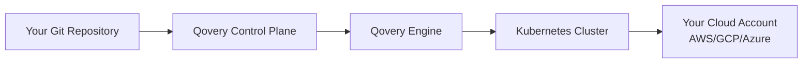
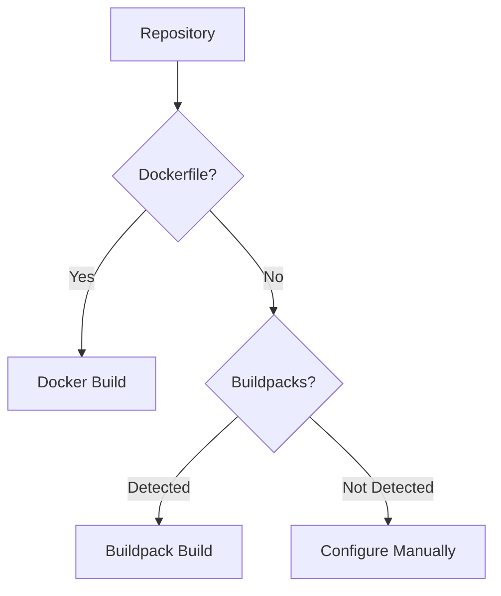
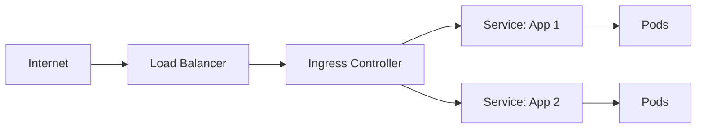
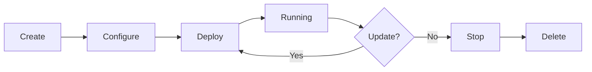
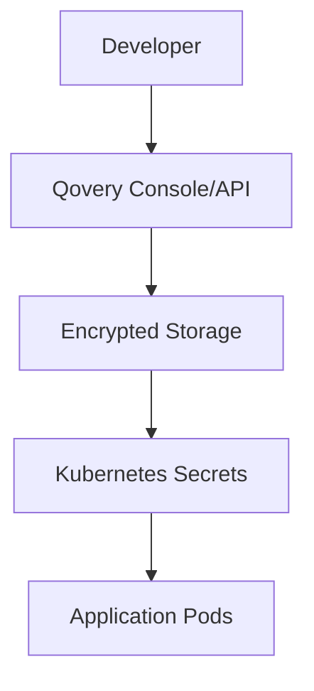
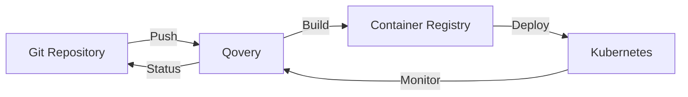
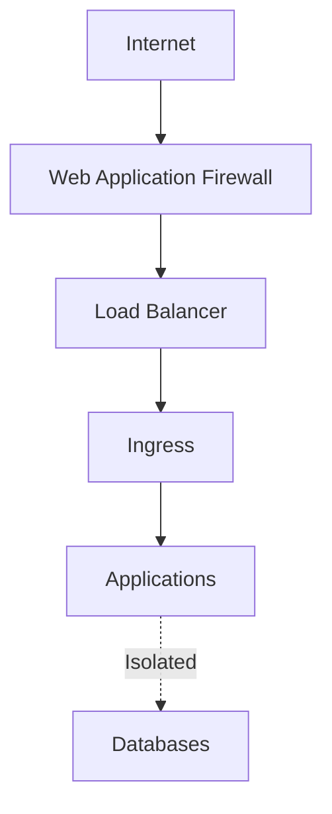

## Architecture Overview

Qovery operates as a control plane that orchestrates your cloud infrastructure. Here's how the components work together:



## Core Components

### 1. Qovery Control Plane

The control plane is the brain of Qovery, hosted and managed by Qovery:

- **Web Console** - User interface for managing infrastructure
- **API Server** - REST API for programmatic access
- **Orchestration Engine** - Coordinates deployments and updates
- **State Management** - Tracks infrastructure state
- **Authentication** - User and API token management

<Note>
The control plane only stores metadata and configuration. Your code, data, and applications run entirely in your own cloud infrastructure.
</Note>

### 2. Qovery Engine

The engine is the open-source deployment component that runs in your cluster:

- **Deployment Executor** - Executes deployment plans
- **Health Monitoring** - Tracks application and service health
- **Log Aggregation** - Collects logs from applications
- **Metrics Collection** - Gathers performance metrics
- **Agent Communication** - Reports status back to control plane

<Info>
Qovery Engine is open source and available on [GitHub](https://github.com/Qovery/engine).
</Info>

### 3. Kubernetes Cluster

Your applications run on Kubernetes in your cloud account:

- Managed by you (EKS, GKE, AKS) or provisioned by Qovery
- Full control over cluster configuration
- Standard Kubernetes resources (Deployments, Services, etc.)
- Access via kubectl if needed

## Deployment Workflow

Here's what happens when you deploy an application:

<Steps>
  <Step title="Code Push">
    You push code to your Git repository (GitHub, GitLab, Bitbucket).
  </Step>

  <Step title="Webhook Trigger">
    Git provider sends a webhook to Qovery control plane.
  </Step>

  <Step title="Build Initiation">
    Qovery initiates a build in your cluster:
    - Clones repository
    - Detects language/framework
    - Builds container image
    - Pushes to container registry
  </Step>

  <Step title="Deployment">
    Qovery Engine deploys to Kubernetes:
    - Updates Kubernetes manifests
    - Applies configurations
    - Manages rolling updates
    - Configures networking and ingress
  </Step>

  <Step title="Health Checks">
    Monitors deployment health:
    - Waits for pods to be ready
    - Runs health checks
    - Reports status to control plane
  </Step>

  <Step title="Live">
    Application is running and accessible.
  </Step>
</Steps>

## Build Process

### Automatic Detection

Qovery automatically detects how to build your application:



### Build Methods

<Tabs>
  <Tab title="Dockerfile">
    If a Dockerfile is present, Qovery uses it to build your container:

    ```dockerfile
    FROM node:18-alpine
    WORKDIR /app
    COPY package*.json ./
    RUN npm install
    COPY . .
    EXPOSE 3000
    CMD ["npm", "start"]
    ```
  </Tab>

  <Tab title="Buildpacks">
    Cloud Native Buildpacks automatically detect and build your application:

    - Auto-detects Node.js, Python, Go, Java, Ruby, PHP
    - Installs dependencies automatically
    - Optimizes container images
    - Security updates included
  </Tab>

  <Tab title="Pre-built Image">
    Use an existing container image from any registry:

    ```
    registry.example.com/my-app:v1.0.0
    ```
  </Tab>
</Tabs>

## Networking

### Ingress & Load Balancing



### Domain & SSL

- **Automatic HTTPS** - Free SSL certificates via Let's Encrypt
- **Custom Domains** - Use your own domain names
- **DNS Management** - Automatic DNS configuration
- **CDN Integration** - Optional CDN for static assets

### Internal Networking

Applications within the same environment can communicate via:

- **Service Names** - `my-database:5432`
- **Environment Variables** - Automatically injected
- **Network Policies** - Secure by default

## Environment Management

### Environment Types

<CardGroup cols={3}>
  <Card title="Development" icon="code">
    For active development with frequent updates
  </Card>
  <Card title="Staging" icon="flask">
    Pre-production testing environment
  </Card>
  <Card title="Production" icon="rocket">
    Live environment with high availability
  </Card>
</CardGroup>

### Environment Lifecycle



### Preview Environments

Qovery can automatically create temporary environments for pull requests:

1. Open a PR in your repository
2. Qovery creates a new environment
3. Deploys your PR code
4. Provides a unique URL for testing
5. Deletes environment when PR is merged/closed

## Database Management

### Provisioning

Qovery manages database lifecycle:

<Steps>
  <Step title="Creation">
    Select database type and version (PostgreSQL, MySQL, MongoDB, Redis, etc.)
  </Step>

  <Step title="Configuration">
    Set resources (CPU, memory, storage) and configuration parameters
  </Step>

  <Step title="Deployment">
    Qovery provisions the database:
    - Managed service (AWS RDS, Cloud SQL) or
    - Container-based database in your cluster
  </Step>

  <Step title="Connection">
    Credentials automatically injected into your applications via environment variables
  </Step>

  <Step title="Backups">
    Automatic daily backups with point-in-time recovery
  </Step>
</Steps>

### Connection Management

Applications receive database credentials via environment variables:

```bash
DATABASE_HOST=postgres-xyz.internal
DATABASE_PORT=5432
DATABASE_NAME=myapp
DATABASE_USER=app_user
DATABASE_PASSWORD=<auto-generated-secret>
```

## Secrets Management

### Secret Storage



### Security Features

- **Encryption at Rest** - All secrets encrypted in database
- **Encryption in Transit** - TLS for all communications
- **Access Control** - RBAC for secret management
- **Audit Logging** - Track all secret access
- **No Plaintext** - Never displayed in logs or UI after creation

## Monitoring & Observability

### Built-in Monitoring

Qovery provides integrated monitoring:

- **Metrics** - CPU, memory, network usage
- **Logs** - Centralized log aggregation
- **Events** - Deployment events and status changes
- **Alerts** - Configurable alerting (coming soon)

### Integration Points

Connect external monitoring tools:

- **Prometheus** - Metrics export
- **Datadog** - APM integration
- **New Relic** - Performance monitoring
- **Sentry** - Error tracking

## Scaling

### Horizontal Scaling

Automatically scale the number of instances:

```yaml
min_instances: 1
max_instances: 10
target_cpu_percentage: 70
```

### Vertical Scaling

Adjust resources per instance:

```yaml
cpu: 500     # 0.5 CPU cores
memory: 1024 # 1 GB RAM
```

### Auto-Scaling

Qovery automatically scales based on:

- **CPU Usage** - Scale when CPU exceeds threshold
- **Memory Usage** - Scale when memory exceeds threshold
- **Custom Metrics** - Scale based on custom metrics (coming soon)

## High Availability

### Production Configurations

For production environments, Qovery ensures:

- **Multiple Replicas** - Run multiple instances across availability zones
- **Health Checks** - Automatic restart of unhealthy instances
- **Rolling Updates** - Zero-downtime deployments
- **Rollback** - Automatic rollback on failed deployments

### Disaster Recovery

- **Automated Backups** - Daily backups of databases
- **Point-in-Time Recovery** - Restore to any point in time
- **Infrastructure as Code** - Recreate entire stack from configuration
- **Multi-Region** - Deploy across multiple regions (enterprise)

## GitOps Workflow

Qovery follows GitOps principles:



### Benefits

- **Version Control** - All changes tracked in Git
- **Reproducibility** - Recreate any environment state
- **Collaboration** - Use PR workflow for infrastructure changes
- **Audit Trail** - Complete history of changes

## Security Architecture

### Network Security



### Security Layers

1. **Network Policies** - Restrict pod-to-pod communication
2. **TLS Everywhere** - Encrypted traffic by default
3. **Private Networking** - Databases not exposed to internet
4. **RBAC** - Role-based access control
5. **Secret Encryption** - All secrets encrypted

## Performance Optimization

### Caching

- **Build Caching** - Speed up container builds
- **Dependency Caching** - Cache npm, pip, maven dependencies
- **Container Registry** - Use nearby registry for faster pulls

### Resource Optimization

- **Right-sizing** - Recommendations for resource allocation
- **Spot Instances** - Use spot instances for cost savings
- **Node Affinity** - Optimize pod placement

## Next Steps

<CardGroup cols={2}>
  <Card title="Installation" icon="download" href="/installation">
    Install Qovery on your infrastructure
  </Card>
  <Card title="Configuration" icon="sliders" href="/configuration/overview">
    Learn about configuration options
  </Card>
  <Card title="Security" icon="shield" href="/security/overview">
    Understand security features
  </Card>
  <Card title="Quickstart" icon="rocket" href="/quickstart">
    Deploy your first application
  </Card>
</CardGroup>
