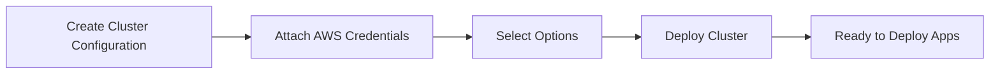

Install Qovery on your AWS account in less than 30 minutes. Qovery will create a Kubernetes cluster for you and manage it for you.

<Info>
To install Qovery on an existing Kubernetes cluster, please refer to the [Kubernetes installation guide](/installation/kubernetes).
</Info>

## Before You Begin

This guide assumes the following:

<Check>You have an account and an Organization on Qovery</Check>
<Check>You have an AWS account</Check>
<Check>You have AWS credentials with appropriate permissions</Check>

## Installation Overview

Qovery installation on AWS involves four main steps:



## Step 1: Create a Kubernetes Cluster

<Steps>
  <Step title="Navigate to Cluster Creation">
    From your Qovery console, go to your organization settings and navigate to the **Clusters** section.
  </Step>

  <Step title="Click New Cluster">
    Click on **Create Cluster** button to start the cluster creation wizard.
  </Step>

  <Step title="Select AWS">
    Choose **AWS** as your cloud provider.
  </Step>

  <Step title="Configure Cluster">
    Provide the following information:

    - **Cluster Name**: A unique name for your cluster (e.g., `production-cluster`)
    - **Description**: Optional description
    - **AWS Region**: Select your preferred AWS region (e.g., `us-east-1`)
    - **Cluster Type**: Choose **Managed by Qovery** for automatic management
  </Step>
</Steps>

<Note>
You can create multiple clusters on the same AWS account with different VPCs. You can also create multiple clusters on different AWS accounts. Qovery will manage them all for you.
</Note>

## Step 2: Attach AWS Credentials

Qovery needs AWS credentials to provision and manage resources in your AWS account.

<Steps>
  <Step title="Create IAM User">
    In your AWS console, create a new IAM user with programmatic access:

    1. Go to **IAM** > **Users** > **Add users**
    2. Enter user name: `qovery-admin`
    3. Select **Programmatic access**
    4. Attach the **AdministratorAccess** policy (or use custom policy with required permissions)
    5. Complete the user creation
    6. **Save** the Access Key ID and Secret Access Key
  </Step>

  <Step title="Add Credentials to Qovery">
    Back in the Qovery console:

    1. In the cluster creation wizard, click **Add Credentials**
    2. Enter your **AWS Access Key ID**
    3. Enter your **AWS Secret Access Key**
    4. Click **Save**
  </Step>

  <Step title="Attach Credentials">
    Select the credentials you just created and click **Continue**.
  </Step>
</Steps>

<Warning>
Store your AWS credentials securely. Qovery encrypts credentials at rest, but you should also keep a secure backup.
</Warning>

### Required IAM Permissions

If you prefer to use a custom IAM policy instead of AdministratorAccess, here are the required permissions:

<Accordion title="View Required IAM Permissions">
```json
{
  "Version": "2012-10-17",
  "Statement": [
    {
      "Effect": "Allow",
      "Action": [
        "ec2:*",
        "eks:*",
        "elasticloadbalancing:*",
        "autoscaling:*",
        "iam:*",
        "s3:*",
        "rds:*",
        "route53:*",
        "acm:*",
        "logs:*",
        "cloudwatch:*",
        "ecr:*"
      ],
      "Resource": "*"
    }
  ]
}
```
</Accordion>

## Step 3: Select Your Options

Qovery provides multiple configuration options to customize your installation.

### Instance Type

Choose the EC2 instance type for your cluster nodes:

- **t3.medium** (2 vCPU, 4GB RAM) - Good for development
- **t3.large** (2 vCPU, 8GB RAM) - Light production workloads
- **t3.xlarge** (4 vCPU, 16GB RAM) - Standard production workloads
- **t3.2xlarge** (8 vCPU, 32GB RAM) - Heavy production workloads
- **Custom** - Choose your own instance type

### Cluster Features

<CardGroup cols={2}>
  <Card title="VPC Configuration" icon="network-wired">
    - **CIDR Block**: Default `10.0.0.0/16`
    - **Availability Zones**: Multi-AZ by default
    - **Public/Private Subnets**: Automatically configured
  </Card>

  <Card title="Kubernetes Version" icon="kubernetes">
    - Latest stable version by default
    - Automatic patch updates
    - Manual major version upgrades
  </Card>

  <Card title="Auto-scaling" icon="chart-line">
    - **Min Nodes**: Default 3
    - **Max Nodes**: Default 10
    - Auto-scales based on workload
  </Card>

  <Card title="Managed Services" icon="server">
    - Nginx Ingress Controller
    - Cert-Manager (SSL/TLS)
    - External DNS
    - Loki (Logs)
    - Metrics Server
  </Card>
</CardGroup>

### Advanced Options

<AccordionGroup>
  <Accordion title="Storage Configuration">
    - **EBS Volume Type**: gp3 (default)
    - **Volume Size**: Configurable per application
    - **Snapshots**: Automatic daily backups
  </Accordion>

  <Accordion title="Networking">
    - **Load Balancer Type**: Application Load Balancer (default)
    - **SSL/TLS**: Automatic with Let's Encrypt
    - **Private Cluster**: Option to keep API server private
  </Accordion>

  <Accordion title="Monitoring & Logging">
    - **CloudWatch Integration**: Enabled by default
    - **Log Retention**: 90 days (configurable)
    - **Metrics**: Prometheus-compatible
  </Accordion>
</AccordionGroup>

## Step 4: Install Qovery

<Steps>
  <Step title="Review Configuration">
    Review all your cluster configuration settings.
  </Step>

  <Step title="Click Create and Deploy">
    Click the **Create and Deploy** button to start the installation process.
  </Step>

  <Step title="Wait for Installation">
    The installation process takes approximately **20-30 minutes**. During this time, Qovery will:

    - Create VPC and networking infrastructure
    - Provision EKS cluster
    - Configure node groups
    - Install Qovery agents and services
    - Set up load balancers and DNS
    - Configure monitoring and logging
  </Step>

  <Step title="Monitor Progress">
    You can monitor the installation progress in the Qovery console. The status will update as each component is installed.
  </Step>
</Steps>

<Note>
While the cluster is being created, you can already start configuring your first application. It will deploy once the cluster is ready.
</Note>

## Verify Installation

Once the installation is complete:

<Steps>
  <Step title="Check Cluster Status">
    Your cluster should show a **Running** status in the Qovery console.
  </Step>

  <Step title="View Cluster Details">
    Click on your cluster to view:
    - Cluster information
    - Node status
    - Installed services
    - Resource usage
  </Step>

  <Step title="Verify in AWS Console">
    In your AWS console, you should see:
    - New VPC created
    - EKS cluster running
    - EC2 instances (cluster nodes)
    - Load balancers
    - S3 buckets for logs and backups
  </Step>
</Steps>

## What's Created in Your AWS Account

Qovery creates the following resources in your AWS account:

### Compute Resources
- **EKS Cluster**: Managed Kubernetes control plane
- **EC2 Instances**: Worker nodes for running applications
- **Auto Scaling Groups**: For automatic node scaling
- **Launch Templates**: Node configuration templates

### Networking
- **VPC**: Isolated network for your cluster
- **Subnets**: Public and private subnets across multiple AZs
- **Internet Gateway**: For public internet access
- **NAT Gateways**: For private subnet internet access
- **Route Tables**: Network routing configuration
- **Security Groups**: Firewall rules
- **Load Balancers**: Application Load Balancer for ingress

### Storage
- **EBS Volumes**: Block storage for applications
- **S3 Buckets**: For logs, backups, and artifacts
- **ECR Repositories**: Private Docker image registry

### Security & Management
- **IAM Roles**: For cluster and application permissions
- **KMS Keys**: For encryption at rest
- **CloudWatch Log Groups**: For centralized logging
- **Route53 Records**: For DNS management

## Cost Considerations

Your AWS costs will primarily consist of:

| Resource Type | Typical Monthly Cost | Description |
|--------------|---------------------|-------------|
| EKS Control Plane | $72 | Fixed cost per cluster |
| EC2 Instances | $100-500+ | Depends on instance type and count |
| Load Balancers | $20-30 | Per ALB |
| EBS Volumes | $10-50 | Depends on size and type |
| Data Transfer | Variable | Outbound data transfer costs |
| NAT Gateway | $30-45 | Per availability zone |

<Tip>
**Cost Optimization Tips:**
- Use spot instances for development environments
- Enable cluster auto-scaling to match actual demand
- Use deployment rules to stop dev environments outside working hours
- Monitor costs with AWS Cost Explorer
</Tip>

## Troubleshooting

<AccordionGroup>
  <Accordion title="Installation Stuck or Failed">
    **Problem**: Installation doesn't complete or fails

    **Solutions**:
    - Check AWS service quotas (vCPUs, VPCs, Elastic IPs)
    - Verify IAM permissions are correct
    - Check AWS region availability
    - Contact Qovery support with cluster logs
  </Accordion>

  <Accordion title="AWS Quota Limits">
    **Problem**: "Quota exceeded" error

    **Solutions**:
    - Request quota increase in AWS Service Quotas console
    - Common limits: EC2 instances, Elastic IPs, VPCs
    - Contact AWS support for faster approval
  </Accordion>

  <Accordion title="Credential Issues">
    **Problem**: "Invalid credentials" or permission errors

    **Solutions**:
    - Verify Access Key ID and Secret Access Key
    - Check IAM user has required permissions
    - Ensure credentials are not expired
    - Test credentials with AWS CLI
  </Accordion>
</AccordionGroup>

## Next Steps

Congratulations! Qovery is now installed on your AWS account. You can now:

<CardGroup cols={2}>
  <Card title="Deploy Your First Application" icon="rocket" href="/guides/getting-started/deploy-your-first-application">
    Follow our quickstart guide
  </Card>
  <Card title="Configure Your Cluster" icon="sliders" href="/using-qovery/configuration/clusters">
    Customize cluster settings
  </Card>
  <Card title="Add Team Members" icon="users" href="/using-qovery/configuration/organization">
    Invite your team and set permissions
  </Card>
  <Card title="Set Up Monitoring" icon="chart-line" href="/using-qovery/observability/monitoring">
    Configure monitoring and alerts
  </Card>
</CardGroup>

## Additional Resources

- [AWS EKS Documentation](https://docs.aws.amazon.com/eks/)
- [Qovery AWS Best Practices](https://hub.qovery.com)
- [Community Forum](https://discuss.qovery.com)
- [Qovery Status Page](https://status.qovery.com)
