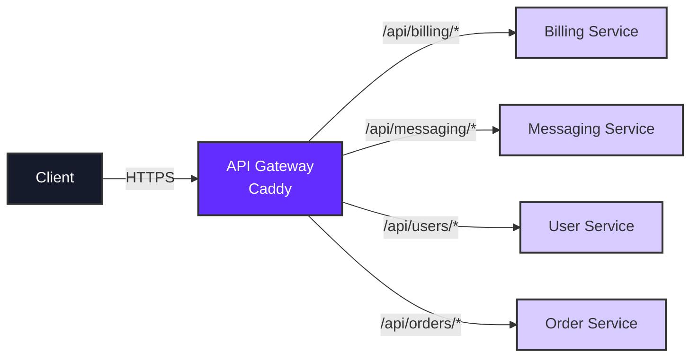

## Introduction

Caddy is a modern, production-ready web server that's significantly simpler than NGINX. It provides automatic HTTPS with Let's Encrypt, requires minimal configuration, and is perfect for API gateway use cases on Qovery.

This guide demonstrates how to deploy a Caddy-based API gateway on Qovery to:

- Route traffic to multiple backend services through a single domain
- Configure the entire Caddyfile via Qovery environment variables (File type)
- Get automatic HTTPS without manual certificate management
- Implement path-based routing with minimal configuration
- Handle WebSocket connections effortlessly

<Tip>
**Why Caddy over NGINX?**
- **Simpler syntax**: No semicolons, brackets, or complex directives
- **Automatic HTTPS**: Zero-config SSL/TLS with Let's Encrypt
- **Env var configuration**: Entire Caddyfile can be a File-type environment variable in Qovery
- **Modern defaults**: HTTP/2, HTTPS redirects, and security headers out of the box
</Tip>

## Architecture Overview

The API gateway pattern with Caddy creates a single entry point that routes requests to appropriate backend services:



### Key Benefits

<CardGroup cols={2}>
  <Card title="Automatic HTTPS" icon="lock">
    Caddy automatically obtains and renews SSL/TLS certificates from Let's Encrypt - no configuration needed
  </Card>
  <Card title="Simple Configuration" icon="code">
    Human-readable Caddyfile syntax that's easy to understand and maintain
  </Card>
  <Card title="Environment Variables" icon="file-lines">
    Configure the entire Caddyfile as a File-type environment variable in Qovery - no Git repository needed
  </Card>
  <Card title="Modern Defaults" icon="star">
    HTTP/2, automatic HTTPS redirects, security headers, and WebSocket support enabled by default
  </Card>
</CardGroup>

## Caddy vs NGINX: Why Simpler is Better

<AccordionGroup>
  <Accordion title="Configuration Comparison">
    **NGINX Configuration** (Complex):
    ```nginx
    server {
        listen 80;
        server_name api.yourdomain.com;

        location ~ ^/api/billing/?(.*) {
            proxy_pass http://billing-service$request_uri;
            proxy_set_header Host $host;
            proxy_set_header X-Real-IP $remote_addr;
            proxy_set_header X-Forwarded-For $proxy_add_x_forwarded_for;
            proxy_set_header X-Forwarded-Proto $scheme;
        }
    }
    ```

    **Caddy Configuration** (Simple):
    ```caddy
    api.yourdomain.com {
        reverse_proxy /api/billing/* billing-service:8000
    }
    ```

    Caddy requires 3 lines versus NGINX's 12 lines for the same functionality.
  </Accordion>

  <Accordion title="HTTPS Setup Comparison">
    **NGINX**:
    - Manual SSL certificate configuration
    - Install and configure Certbot
    - Set up auto-renewal cron jobs
    - Configure SSL protocols and ciphers
    - Manage certificate paths and keys

    **Caddy**:
    - Automatic HTTPS is enabled by default
    - No configuration required
    - Automatic renewal handled internally
    - Modern TLS protocols configured automatically

    With Caddy, HTTPS "just works" - no manual steps required.
  </Accordion>

  <Accordion title="Deployment Approach">
    **NGINX**:
    - Requires Git repository for configuration files
    - Need Dockerfile to build custom image
    - Complex templating with envsubst
    - CI/CD pipeline for configuration changes

    **Caddy**:
    - Configure via Qovery File-type environment variable
    - Use official Caddy Docker image directly
    - No Git repository needed
    - Update configuration in Console without rebuilding
  </Accordion>
</AccordionGroup>

## Prerequisites

Before setting up your Caddy API gateway, ensure you have:

- A Qovery account with at least one project and environment
- One or more backend services (applications, containers, or jobs) deployed on Qovery
- Basic understanding of reverse proxy concepts
- (Optional) A custom domain for the API gateway

<Info>
No Git repository or Dockerfile required - we'll configure everything via Qovery environment variables!
</Info>

## Quick Start

Get a Caddy API gateway running in 5 minutes:

<Steps>
  <Step title="Create Container Service">
    In Qovery Console:
    1. Navigate to your environment
    2. Click **Create Container**
    3. Enter these settings:
       - **Name**: `api-gateway`
       - **Registry**: Docker Hub
       - **Image**: `caddy:2.8-alpine`
       - **Tag**: `latest`
  </Step>

  <Step title="Configure Port">
    Set the network configuration:
    - **Port**: 80
    - **Protocol**: HTTP
    - **Publicly Accessible**: Enable
  </Step>

  <Step title="Add Caddyfile as Environment Variable">
    1. Go to **Variables** tab
    2. Click **Add Variable**
    3. Configure:
       - **Key**: `CADDYFILE`
       - **Type**: File
       - **Mount Path**: `/etc/caddy/Caddyfile`
       - **Value**: See Quick Start Configuration below
  </Step>

  <Step title="Deploy">
    Click **Deploy** and your API gateway is live!
  </Step>
</Steps>

**Quick Start Configuration**:

```caddy
http:// {
    bind 0.0.0.0
    reverse_proxy /api/billing/* billing-service:8000
    reverse_proxy /api/users/* user-service:8000
}
```

<Tip>
Replace `billing-service` and `user-service` with your actual service names. You can find these in the Qovery Console under each service's variables tab (look for `QOVERY_APPLICATION_HOSTNAME`).
</Tip>

## Complete Tutorial

### Step 1: Create Caddy Container in Qovery

Deploy Caddy as a container application using the official Docker image.

<Steps>
  <Step title="Create New Container">
    1. Navigate to your Qovery environment in the Console
    2. Click **Create Container**
    3. Configure basic settings:
       - **Name**: `caddy-gateway`
       - **Registry**: Docker Hub
       - **Image Name**: `caddy`
       - **Image Tag**: `2.8-alpine`
  </Step>

  <Step title="Configure Network">
    Set up port configuration:
    - **Port**: 80 (Caddy's default HTTP port)
    - **Protocol**: HTTP
    - **Publicly Accessible**: Enable this option

    <Info>
    When using custom domains, Caddy will automatically handle HTTPS. For internal routing without a domain, HTTP is sufficient.
    </Info>
  </Step>

  <Step title="Configure Resources">
    Set reasonable resource limits:
    - **CPU**: 250m - 500m
    - **Memory**: 256Mi - 512Mi

    <Tip>
    Caddy is lightweight and efficient. Start with lower resources and scale up if needed.
    </Tip>
  </Step>

  <Step title="Create Container">
    Click **Create** to add the container to your environment.

    <Warning>
    Don't deploy yet - we need to configure the Caddyfile first!
    </Warning>
  </Step>
</Steps>

### Step 2: Configure Caddyfile via Environment Variable

This is where Caddy shines on Qovery - configure the entire Caddyfile as a File-type environment variable without needing a Git repository.

<Steps>
  <Step title="Access Environment Variables">
    1. Select your `caddy-gateway` container
    2. Navigate to **Variables** tab
    3. Click **Add Variable**
  </Step>

  <Step title="Create Caddyfile Variable">
    Configure the File-type environment variable:

    | Field | Value |
    |-------|-------|
    | **Variable Key** | `CADDYFILE` |
    | **Variable Type** | File |
    | **Mount Path** | `/etc/caddy/Caddyfile` |
    | **Scope** | Service |

    <Info>
    The mount path `/etc/caddy/Caddyfile` is where Caddy looks for its configuration by default.
    </Info>
  </Step>

  <Step title="Add Backend Service Variables">
    For each backend service, add environment variables to reference their internal hostnames:

    | Variable Key | Variable Type | Value | Scope |
    |--------------|---------------|-------|-------|
    | `BILLING_HOST` | Alias | `qovery.application.z9a8b7c6.hostname` | Service |
    | `MESSAGING_HOST` | Alias | `qovery.application.a1b2c3d4.hostname` | Service |
    | `USER_HOST` | Alias | `qovery.application.j1k2l3m4.hostname` | Service |

    <Accordion title="Finding Service Hostnames">
    To get the correct hostname alias for each service:
    1. Navigate to the backend service in Qovery Console
    2. Go to **Variables** tab
    3. Find the built-in variable `QOVERY_APPLICATION_HOSTNAME`
    4. Copy the variable reference (e.g., `qovery.application.ID.hostname`)
    5. Use this as the value for your alias
    </Accordion>
  </Step>
</Steps>

### Step 3: Create Your Caddyfile Configuration

Now configure the routing rules in your Caddyfile. Choose a configuration based on your needs:

<Tabs>
  <Tab title="Basic Reverse Proxy">
    Simple path-based routing to different backend services:

    ```caddy
    http:// {
        bind 0.0.0.0

        # Billing service routes
        reverse_proxy /api/billing/* {$BILLING_HOST}:8000

        # Messaging service routes
        reverse_proxy /api/messaging/* {$MESSAGING_HOST}:8000

        # User service routes
        reverse_proxy /api/users/* {$USER_HOST}:8000
    }
    ```

    <Info>
    The `http://` site address disables automatic HTTPS, useful for internal routing. Use your actual domain (e.g., `api.yourdomain.com`) to enable automatic HTTPS.
    </Info>
  </Tab>

  <Tab title="With Custom Domain">
    Production setup with custom domain and automatic HTTPS:

    ```caddy
    api.yourdomain.com {
        # Billing service
        reverse_proxy /api/billing/* {$BILLING_HOST}:8000

        # Messaging service with WebSocket support
        reverse_proxy /api/messaging/ws/* {$MESSAGING_HOST}:3001

        # Messaging HTTP routes
        reverse_proxy /api/messaging/* {$MESSAGING_HOST}:8000

        # User service
        reverse_proxy /api/users/* {$USER_HOST}:8000

        # Health check endpoint
        respond /health 200
    }
    ```

    This configuration automatically:
    - Obtains SSL certificate from Let's Encrypt
    - Redirects HTTP to HTTPS
    - Enables HTTP/2
    - Handles WebSocket connections
  </Tab>

  <Tab title="Multi-Service Routing">
    Complex routing with multiple backends and path rewriting:

    ```caddy
    api.yourdomain.com {
        # Billing service with custom headers
        reverse_proxy /api/billing/* {$BILLING_HOST}:8000 {
            header_up X-Gateway-Source "Caddy"
            header_up X-Forwarded-By "Qovery"
        }

        # Messaging service with timeout
        reverse_proxy /api/messaging/* {$MESSAGING_HOST}:8000 {
            flush_interval -1
            transport http {
                read_timeout 5m
                write_timeout 5m
            }
        }

        # User service v1
        reverse_proxy /api/v1/users/* {$USER_HOST_V1}:8000

        # User service v2 (different backend)
        reverse_proxy /api/v2/users/* {$USER_HOST_V2}:8000

        # Static file server
        handle /docs/* {
            root * /usr/share/caddy
            file_server
        }

        # Health check
        respond /health 200 {
            body "OK"
        }

        # Catch-all 404
        respond 404 {
            body "API endpoint not found"
        }
    }
    ```
  </Tab>

  <Tab title="WebSocket + Load Balancing">
    Advanced configuration with load balancing and WebSocket support:

    ```caddy
    api.yourdomain.com {
        # WebSocket endpoints (no buffering)
        reverse_proxy /ws/* {$MESSAGING_HOST}:3001 {
            flush_interval -1
        }

        # Load balanced API endpoints
        reverse_proxy /api/* {
            to {$BILLING_HOST_1}:8000
            to {$BILLING_HOST_2}:8000
            to {$BILLING_HOST_3}:8000

            lb_policy least_conn
            health_uri /health
            health_interval 10s
        }

        # File uploads with size limit
        reverse_proxy /api/upload/* {$UPLOAD_HOST}:8000 {
            request_body {
                max_size 100MB
            }
        }
    }
    ```
  </Tab>
</Tabs>

<Warning>
After configuring your Caddyfile, make sure to save the environment variable in Qovery Console before deploying.
</Warning>

### Step 4: Configure Custom Domain (Optional)

To enable automatic HTTPS, add a custom domain to your Caddy service.

<Steps>
  <Step title="Add Domain in Qovery">
    1. Select your `caddy-gateway` container
    2. Navigate to **Settings** > **Domain**
    3. Click **Add Domain**
    4. Enter your domain: `api.yourdomain.com`
  </Step>

  <Step title="Update DNS Records">
    Configure DNS with your provider:

    - **Record Type**: CNAME
    - **Name**: `api`
    - **Value**: Provided by Qovery (e.g., `xyz123.lb.qovery.io`)
    - **TTL**: 300 seconds

    <Tip>
    You can find the CNAME target in Qovery Console after adding the domain.
    </Tip>
  </Step>

  <Step title="Update Caddyfile">
    Change your Caddyfile site address from `http://` to your actual domain:

    ```caddy
    # Change from:
    http:// {
        # ...
    }

    # To:
    api.yourdomain.com {
        # ...
    }
    ```

    Update the CADDYFILE environment variable with this change.
  </Step>

  <Step title="Wait for DNS Propagation">
    DNS changes typically take 5-15 minutes to propagate:

    ```bash
    # Check DNS resolution
    dig api.yourdomain.com

    # Verify CNAME points to Qovery
    dig api.yourdomain.com CNAME
    ```
  </Step>
</Steps>

<Info>
Caddy will automatically obtain an SSL certificate from Let's Encrypt once DNS is properly configured. No manual certificate management required!
</Info>

### Step 5: Deploy and Test

Deploy your Caddy API gateway and verify it's working correctly.

<Steps>
  <Step title="Deploy the Gateway">
    1. Return to your `caddy-gateway` container
    2. Click **Deploy**
    3. Monitor the deployment logs

    You should see Caddy start successfully:
    ```
    {"level":"info","msg":"serving initial configuration"}
    ```
  </Step>

  <Step title="Verify Service Health">
    Check that Caddy is running:

    ```bash
    # Check service status
    qovery status

    # View Caddy logs
    qovery log caddy-gateway --follow
    ```

    Successful startup shows:
    ```json
    {"level":"info","ts":"...","msg":"autosaved config"}
    {"level":"info","ts":"...","msg":"serving initial configuration"}
    ```
  </Step>

  <Step title="Test API Routes">
    Test each configured route:

    ```bash
    # Get the gateway URL from Qovery
    GATEWAY_URL="https://api.yourdomain.com"

    # Test billing route
    curl $GATEWAY_URL/api/billing/invoices

    # Test messaging route
    curl $GATEWAY_URL/api/messaging/messages

    # Test user route
    curl $GATEWAY_URL/api/users/profile

    # Test health endpoint
    curl $GATEWAY_URL/health
    ```

    Expected responses should come from your backend services.
  </Step>

  <Step title="Verify HTTPS">
    If using a custom domain, verify automatic HTTPS:

    ```bash
    # Check SSL certificate
    openssl s_client -connect api.yourdomain.com:443 -servername api.yourdomain.com

    # Verify HTTP redirects to HTTPS
    curl -I http://api.yourdomain.com
    # Should return: HTTP/1.1 308 Permanent Redirect
    ```
  </Step>

  <Step title="Test WebSocket Connections">
    If you configured WebSocket routes:

    ```bash
    # Install websocat for testing
    brew install websocat  # or apt-get install websocat

    # Test WebSocket connection
    websocat wss://api.yourdomain.com/ws/chat
    ```
  </Step>
</Steps>

## Configuration Examples

### Real-World Example: Windmill Enterprise

Here's a real production configuration for Windmill's enterprise deployment:

```caddy
http:// {
    bind 0.0.0.0

    # WebSocket endpoint for Language Server Protocol
    reverse_proxy /ws/* http://{$WINDMILL_LSP_HOST}:3001

    # Main application traffic
    reverse_proxy /* http://{$WINDMILL_APP_HOST}:8000
}
```

<Accordion title="Windmill Configuration Breakdown">
This configuration demonstrates:
- **Order matters**: WebSocket route comes first to match before the catch-all
- **Internal routing**: Using `http://` for internal service communication
- **Service separation**: Different backends for LSP and app functionality
- **Wildcard matching**: The `/*` pattern matches all remaining paths

To use this configuration:
1. Set `WINDMILL_LSP_HOST` to your Windmill LSP service hostname
2. Set `WINDMILL_APP_HOST` to your Windmill app service hostname
3. Caddy automatically handles WebSocket upgrade headers
</Accordion>

### Path-Based Routing

Route different URL paths to different services:

```caddy
api.yourdomain.com {
    # Billing API
    handle /api/billing/* {
        reverse_proxy {$BILLING_HOST}:8000
    }

    # Orders API
    handle /api/orders/* {
        reverse_proxy {$ORDERS_HOST}:8000
    }

    # Payments API
    handle /api/payments/* {
        reverse_proxy {$PAYMENTS_HOST}:8000
    }

    # Admin API (different subdomain pattern)
    handle /admin/* {
        reverse_proxy {$ADMIN_HOST}:8000
    }

    # Default response
    respond 404
}
```

### WebSocket Support

Caddy handles WebSocket connections automatically, no special configuration needed:

```caddy
api.yourdomain.com {
    # WebSocket route
    reverse_proxy /ws/chat/* {$CHAT_HOST}:3000 {
        # Disable buffering for real-time communication
        flush_interval -1
    }

    # Regular HTTP routes
    reverse_proxy /api/* {$API_HOST}:8000
}
```

### Authentication

Add basic authentication at the gateway level:

```caddy
api.yourdomain.com {
    # Public routes (no auth)
    handle /api/public/* {
        reverse_proxy {$API_HOST}:8000
    }

    # Protected routes
    handle /api/* {
        # Basic authentication
        basicauth {
            alice $2a$14$Zkx19XLiW6VYouLHR5NmfOFU0z2GTNmpkT/5qqR7hx4IjWJPDhjvG
            bob $2a$14$gTbJQGpQdJKhPXw6NQlZWOVjGRKQEVDTFfKsXVaXGSGTJLmMQlVcS
        }
        reverse_proxy {$API_HOST}:8000
    }
}
```

<Accordion title="Generating Password Hashes">
Generate bcrypt password hashes using Caddy:

```bash
# Hash a password
caddy hash-password --plaintext 'your-password'

# Output example:
# $2a$14$Zkx19XLiW6VYouLHR5NmfOFU0z2GTNmpkT/5qqR7hx4IjWJPDhjvG
```

Add the hash to your Caddyfile basicauth section.
</Accordion>

### Rate Limiting

Protect your APIs from abuse with rate limiting:

```caddy
api.yourdomain.com {
    # Rate limit: 100 requests per minute per IP
    rate_limit {
        zone api {
            key {remote_host}
            events 100
            window 1m
        }
    }

    reverse_proxy /api/* {$API_HOST}:8000
}
```

<Info>
Rate limiting requires the `caddy-ratelimit` plugin. Use the image `caddy:2.8-alpine-builder` or build a custom image with the plugin.
</Info>

### CORS Configuration

Enable CORS for browser-based API clients:

```caddy
api.yourdomain.com {
    # CORS headers for all API routes
    @cors_preflight {
        method OPTIONS
    }

    handle @cors_preflight {
        header {
            Access-Control-Allow-Origin "*"
            Access-Control-Allow-Methods "GET, POST, PUT, DELETE, OPTIONS"
            Access-Control-Allow-Headers "Authorization, Content-Type"
            Access-Control-Max-Age "3600"
        }
        respond 204
    }

    reverse_proxy /api/* {$API_HOST}:8000 {
        header_up Origin {http.request.header.Origin}

        header_down {
            Access-Control-Allow-Origin "*"
            Access-Control-Allow-Methods "GET, POST, PUT, DELETE, OPTIONS"
            Access-Control-Allow-Headers "Authorization, Content-Type"
        }
    }
}
```

### API Versioning

Route traffic to different service versions:

```caddy
api.yourdomain.com {
    # API v1 - legacy version
    reverse_proxy /api/v1/* {$API_V1_HOST}:8000 {
        header_down X-API-Version "1.0"
    }

    # API v2 - current stable
    reverse_proxy /api/v2/* {$API_V2_HOST}:8000 {
        header_down X-API-Version "2.0"
    }

    # API v3 - beta version
    reverse_proxy /api/v3/* {$API_V3_HOST}:8000 {
        header_down X-API-Version "3.0-beta"
    }

    # Default to v2 for unversioned requests
    reverse_proxy /api/* {$API_V2_HOST}:8000 {
        header_down X-API-Version "2.0"
    }
}
```

### Load Balancing

Distribute traffic across multiple backend instances:

```caddy
api.yourdomain.com {
    reverse_proxy /api/* {
        # Multiple backend servers
        to {$API_HOST_1}:8000
        to {$API_HOST_2}:8000
        to {$API_HOST_3}:8000

        # Load balancing policy
        lb_policy least_conn

        # Health checks
        health_uri /health
        health_interval 10s
        health_timeout 5s
        health_status 200

        # Retry failed requests
        lb_try_duration 5s
        lb_try_interval 250ms
    }
}
```

## Environment Variable Configuration in Qovery

One of Caddy's biggest advantages on Qovery is the ability to configure everything via environment variables without needing a Git repository.

### File-Type Environment Variables

<Steps>
  <Step title="Create File Variable">
    In Qovery Console:
    1. Go to your Caddy container
    2. Navigate to **Variables** tab
    3. Click **Add Variable**
    4. Select **File** as the type
  </Step>

  <Step title="Configure Mount Path">
    Set the mount path where Caddy expects the configuration:

    - **Key**: `CADDYFILE`
    - **Type**: File
    - **Mount Path**: `/etc/caddy/Caddyfile`
    - **Scope**: Service
  </Step>

  <Step title="Add Configuration Content">
    Paste your entire Caddyfile configuration as the value:

    ```caddy
    api.yourdomain.com {
        reverse_proxy /api/billing/* {$BILLING_HOST}:8000
        reverse_proxy /api/users/* {$USER_HOST}:8000
        respond /health 200
    }
    ```
  </Step>

  <Step title="Use Variable Substitution">
    Reference other environment variables in your Caddyfile using `{$VAR_NAME}` syntax:

    ```caddy
    {$DOMAIN} {
        reverse_proxy /api/* {$BACKEND_HOST}:{$BACKEND_PORT}
    }
    ```

    Then create additional variables:
    - `DOMAIN` = `api.yourdomain.com`
    - `BACKEND_HOST` = (alias to service hostname)
    - `BACKEND_PORT` = `8000`
  </Step>
</Steps>

### Multiple Caddyfile Configurations

Create different configurations for different environments:

<Tabs>
  <Tab title="Development">
    ```caddy
    http:// {
        bind 0.0.0.0

        # Verbose logging for debugging
        log {
            level DEBUG
        }

        # Development services
        reverse_proxy /api/* {$DEV_API_HOST}:8000

        # Enable file browsing
        file_server browse
    }
    ```

    Scope this to your development environment in Qovery.
  </Tab>

  <Tab title="Staging">
    ```caddy
    staging-api.yourdomain.com {
        # Standard logging
        log {
            level INFO
        }

        # Staging services
        reverse_proxy /api/* {$STAGING_API_HOST}:8000

        # Basic auth for staging access
        basicauth {
            staging $2a$14$hashed_password
        }
    }
    ```

    Scope this to your staging environment in Qovery.
  </Tab>

  <Tab title="Production">
    ```caddy
    api.yourdomain.com {
        # Production logging (errors only)
        log {
            level ERROR
            output file /var/log/caddy/access.log
        }

        # Rate limiting
        rate_limit {
            zone prod {
                key {remote_host}
                events 1000
                window 1m
            }
        }

        # Production services with load balancing
        reverse_proxy /api/* {
            to {$PROD_API_HOST_1}:8000
            to {$PROD_API_HOST_2}:8000
            to {$PROD_API_HOST_3}:8000

            lb_policy least_conn
            health_uri /health
        }

        # Security headers
        header {
            Strict-Transport-Security "max-age=31536000;"
            X-Content-Type-Options "nosniff"
            X-Frame-Options "DENY"
            Referrer-Policy "strict-origin-when-cross-origin"
        }
    }
    ```

    Scope this to your production environment in Qovery.
  </Tab>
</Tabs>

### Variable Scoping

<Info>
**Service Scope** is recommended for Caddy gateway variables:
- Configuration is specific to the gateway container
- Doesn't affect other services in the environment
- Easier to manage and update independently
- Better isolation and security

**Environment Scope** can be used for shared backend references across multiple gateways.
</Info>

## Advanced Features

### Automatic HTTPS/TLS

Caddy's killer feature - zero-config HTTPS:

```caddy
api.yourdomain.com {
    # HTTPS is automatic - just use your domain
    reverse_proxy /api/* {$API_HOST}:8000
}

# Caddy automatically:
# - Obtains certificate from Let's Encrypt
# - Renews certificates before expiration
# - Redirects HTTP to HTTPS
# - Enables HTTP/2
# - Uses modern TLS settings
```

<Accordion title="HTTPS Requirements">
For automatic HTTPS to work:
1. Your domain must be publicly resolvable
2. DNS must point to your Qovery load balancer
3. Ports 80 and 443 must be accessible
4. The domain must be added in Qovery Console

If any requirement fails, Caddy falls back to self-signed certificates.
</Accordion>

### File Server

Serve static files directly from Caddy:

```caddy
api.yourdomain.com {
    # API routes
    handle /api/* {
        reverse_proxy {$API_HOST}:8000
    }

    # Static documentation
    handle /docs/* {
        root * /usr/share/caddy/docs
        file_server
    }

    # SPA application
    handle {
        root * /usr/share/caddy/app
        try_files {path} /index.html
        file_server
    }
}
```

<Tip>
To serve files, mount them via another File-type environment variable or use an init container to copy files into the Caddy container.
</Tip>

### Request/Response Manipulation

Modify headers and rewrite requests:

```caddy
api.yourdomain.com {
    # Add custom request headers
    reverse_proxy /api/* {$API_HOST}:8000 {
        header_up X-Gateway-Source "Caddy"
        header_up X-Request-ID {uuid}
        header_up X-Real-IP {remote_host}
        header_up X-Forwarded-For {remote_host}
    }

    # Modify response headers
    handle /api/external/* {
        reverse_proxy {$EXTERNAL_API}:8000 {
            header_down -Server
            header_down -X-Powered-By
            header_down X-Gateway "Qovery-Caddy"
        }
    }

    # URL rewriting
    handle /legacy/* {
        rewrite * /api/v1{uri}
        reverse_proxy {$API_HOST}:8000
    }
}
```

### Structured Logging

Configure JSON logging for better observability:

```caddy
api.yourdomain.com {
    log {
        output file /var/log/caddy/access.log {
            roll_size 100mb
            roll_keep 5
            roll_keep_for 720h
        }

        format json {
            time_format "iso8601"
        }

        level INFO
    }

    reverse_proxy /api/* {$API_HOST}:8000
}
```

### Circuit Breaking

Protect backends from overload:

```caddy
api.yourdomain.com {
    reverse_proxy /api/* {$API_HOST}:8000 {
        # Fail fast on errors
        fail_duration 30s
        max_fails 3
        unhealthy_status 502 503

        # Connection pooling
        transport http {
            max_conns_per_host 100
            read_timeout 30s
            write_timeout 30s
        }
    }
}
```

### Compression

Enable automatic response compression:

```caddy
api.yourdomain.com {
    # Enable gzip and zstd compression
    encode gzip zstd

    reverse_proxy /api/* {$API_HOST}:8000
}
```

<Info>
Caddy automatically compresses responses based on `Accept-Encoding` headers. No manual configuration needed for most cases.
</Info>

## Common Use Cases

### Microservices Architecture

<Card title="Unified API Endpoint" icon="sitemap">
Consolidate multiple microservices behind a single domain:

```caddy
api.yourdomain.com {
    # Authentication service
    reverse_proxy /auth/* {$AUTH_SERVICE}:8000

    # Business logic services
    reverse_proxy /billing/* {$BILLING_SERVICE}:8000
    reverse_proxy /orders/* {$ORDERS_SERVICE}:8000
    reverse_proxy /inventory/* {$INVENTORY_SERVICE}:8000

    # Analytics service
    reverse_proxy /analytics/* {$ANALYTICS_SERVICE}:8000

    # Health aggregation
    respond /health 200 {
        body "All systems operational"
    }
}
```

Simpler client configuration with a single base URL.
</Card>

### Gradual Migration

<Card title="Legacy System Migration" icon="arrow-right-arrow-left">
Migrate from monolith to microservices gradually:

```caddy
api.yourdomain.com {
    # New microservices (migrated)
    reverse_proxy /api/v2/users/* {$NEW_USER_SERVICE}:8000
    reverse_proxy /api/v2/orders/* {$NEW_ORDER_SERVICE}:8000

    # Legacy monolith (remaining functionality)
    reverse_proxy /api/v1/* {$LEGACY_MONOLITH}:8000

    # Default to legacy for unknown routes
    reverse_proxy /* {$LEGACY_MONOLITH}:8000
}
```

Migrate incrementally without breaking existing clients.
</Card>

### Multi-Tenant Routing

<Card title="Tenant Isolation" icon="building">
Route requests based on tenant identifiers:

```caddy
*.api.yourdomain.com {
    # Extract tenant from subdomain
    @tenant_a host tenant-a.api.yourdomain.com
    @tenant_b host tenant-b.api.yourdomain.com

    # Route to tenant-specific backends
    handle @tenant_a {
        reverse_proxy {$TENANT_A_API}:8000
    }

    handle @tenant_b {
        reverse_proxy {$TENANT_B_API}:8000
    }

    # Default tenant routing
    handle {
        respond "Invalid tenant" 404
    }
}
```

Isolate tenant data at the infrastructure level.
</Card>

### BFF Pattern (Backend for Frontend)

<Card title="Client-Specific Backends" icon="mobile">
Route different client types to specialized backends:

```caddy
api.yourdomain.com {
    # Mobile app API (optimized for mobile)
    @mobile_client header User-Agent *Mobile*
    handle @mobile_client {
        reverse_proxy {$MOBILE_BFF}:8000
    }

    # Web app API (rich features)
    @web_client header User-Agent *Mozilla*
    handle @web_client {
        reverse_proxy {$WEB_BFF}:8000
    }

    # IoT device API (minimal payload)
    @iot_client header User-Agent *IoT*
    handle @iot_client {
        reverse_proxy {$IOT_BFF}:8000
    }

    # Default API
    handle {
        reverse_proxy {$DEFAULT_API}:8000
    }
}
```

Optimize API responses for different client types.
</Card>

## Troubleshooting

<AccordionGroup>
  <Accordion title="Caddy Not Starting">
    **Symptoms:** Container fails to start or crashes immediately

    **Common Causes:**
    1. Syntax error in Caddyfile
    2. Missing environment variables
    3. Port already in use
    4. Invalid mount path for Caddyfile

    **Solutions:**
    ```bash
    # Check Caddy logs
    qovery log caddy-gateway

    # Look for syntax errors like:
    # Error: adapting config using caddyfile: parse error

    # Validate Caddyfile syntax locally:
    caddy validate --config /path/to/Caddyfile

    # Check environment variables are set:
    qovery env list caddy-gateway
    ```

    **Fix syntax errors:**
    - Ensure Caddyfile uses correct syntax (no semicolons, proper braces)
    - Verify environment variable references use `{$VAR}` format
    - Check that mount path is `/etc/caddy/Caddyfile`
  </Accordion>

  <Accordion title="502 Bad Gateway">
    **Symptoms:** Caddy returns 502 when accessing routes

    **Common Causes:**
    1. Backend service not running
    2. Incorrect backend hostname
    3. Wrong port number
    4. Network connectivity issues

    **Solutions:**
    ```bash
    # Check backend service status
    qovery status

    # Verify environment variables
    qovery env list caddy-gateway

    # Check Caddy logs for upstream errors
    qovery log caddy-gateway | grep "dial tcp"

    # Test backend directly
    qovery shell backend-service
    curl http://localhost:8000/health
    ```

    **Fix backend connectivity:**
    1. Ensure backend service hostname is correct (use service alias)
    2. Verify backend port matches the service configuration
    3. Check backend service is healthy and accepting connections
  </Accordion>

  <Accordion title="HTTPS Certificate Issues">
    **Symptoms:** SSL certificate errors or unable to obtain certificate

    **Common Causes:**
    1. DNS not pointing to Qovery load balancer
    2. Domain not added in Qovery Console
    3. Port 443 not accessible
    4. Let's Encrypt rate limits

    **Solutions:**
    ```bash
    # Verify DNS resolution
    dig api.yourdomain.com

    # Check certificate status in logs
    qovery log caddy-gateway | grep "certificate"

    # Look for:
    # "obtaining certificate"
    # "certificate obtained successfully"
    ```

    **Fix certificate provisioning:**
    1. Add domain in Qovery Console first
    2. Update DNS CNAME to point to Qovery load balancer
    3. Wait 5-15 minutes for DNS propagation
    4. Caddy automatically retries certificate provisioning

    <Info>
    For testing, use `http://` instead of a domain to disable automatic HTTPS.
    </Info>
  </Accordion>

  <Accordion title="WebSocket Connection Failures">
    **Symptoms:** WebSocket connections fail or disconnect

    **Common Causes:**
    1. Missing flush_interval configuration
    2. Proxy timeouts too short
    3. Backend not supporting WebSockets

    **Solutions:**
    Add WebSocket-specific configuration:

    ```caddy
    api.yourdomain.com {
        reverse_proxy /ws/* {$WS_HOST}:3000 {
            # Disable buffering for real-time communication
            flush_interval -1

            # Longer timeouts for persistent connections
            transport http {
                read_timeout 0
                write_timeout 0
            }
        }
    }
    ```

    Caddy automatically handles WebSocket upgrade headers.
  </Accordion>

  <Accordion title="Environment Variables Not Substituted">
    **Symptoms:** Caddy tries to connect to literal `{$BACKEND_HOST}` instead of actual value

    **Common Causes:**
    1. Environment variables not set in Qovery
    2. Incorrect variable reference syntax
    3. Variable scope issues

    **Solutions:**
    ```bash
    # Verify variables are set
    qovery env list caddy-gateway

    # Check Caddy sees the variables
    qovery shell caddy-gateway
    env | grep HOST

    # Test configuration with variables
    caddy adapt --config /etc/caddy/Caddyfile
    ```

    **Fix variable references:**
    - Use `{$VAR_NAME}` syntax (with dollar sign and braces)
    - Ensure variables are scoped to the service
    - Set variables before deploying
  </Accordion>

  <Accordion title="High Memory Usage">
    **Symptoms:** Caddy container using excessive memory

    **Common Causes:**
    1. Too many concurrent connections
    2. Large file uploads without streaming
    3. Excessive logging

    **Solutions:**
    Optimize resource usage:

    ```caddy
    api.yourdomain.com {
        # Limit request body size
        request_body {
            max_size 10MB
        }

        # Reduce log verbosity
        log {
            level ERROR
        }

        reverse_proxy /api/* {$API_HOST}:8000 {
            # Stream large requests/responses
            flush_interval -1

            # Limit connections
            transport http {
                max_conns_per_host 100
            }
        }
    }
    ```

    Increase container resources if needed:
    - CPU: 500m - 1000m
    - Memory: 512Mi - 1Gi
  </Accordion>

  <Accordion title="CORS Errors">
    **Symptoms:** Browser shows CORS policy errors

    **Common Causes:**
    1. Missing CORS headers
    2. Backend adding conflicting headers
    3. OPTIONS preflight not handled

    **Solutions:**
    Add CORS configuration:

    ```caddy
    api.yourdomain.com {
        # Handle preflight
        @cors_preflight method OPTIONS
        handle @cors_preflight {
            header Access-Control-Allow-Origin "*"
            header Access-Control-Allow-Methods "GET, POST, PUT, DELETE"
            header Access-Control-Allow-Headers "Authorization, Content-Type"
            respond 204
        }

        # Add CORS headers to responses
        reverse_proxy /api/* {$API_HOST}:8000 {
            header_down Access-Control-Allow-Origin "*"
        }
    }
    ```

    Test CORS configuration:
    ```bash
    curl -X OPTIONS \
      -H "Origin: https://example.com" \
      -H "Access-Control-Request-Method: POST" \
      https://api.yourdomain.com/api/test
    ```
  </Accordion>
</AccordionGroup>

## Best Practices

<CardGroup cols={2}>
  <Card title="Use Environment Variables" icon="file-lines">
    Configure Caddyfile via File-type environment variables in Qovery instead of Git repositories. This enables quick updates without redeployment.
  </Card>

  <Card title="Keep It Simple" icon="wand-magic-sparkles">
    Take advantage of Caddy's simple syntax and automatic features. Don't overcomplicate configuration - let Caddy handle HTTPS, HTTP/2, and headers automatically.
  </Card>

  <Card title="Use Service Aliases" icon="link">
    Always use Qovery service aliases for backend hostnames. This ensures your gateway works across different environments.
  </Card>

  <Card title="Add Health Checks" icon="heart-pulse">
    Include a simple health endpoint that doesn't proxy to backends:
    ```caddy
    respond /health 200
    ```
    This helps monitoring tools verify gateway availability.
  </Card>

  <Card title="Enable Structured Logging" icon="list">
    Use JSON logging for easier parsing and integration with observability tools:
    ```caddy
    log {
        format json
    }
    ```
  </Card>

  <Card title="Set Reasonable Timeouts" icon="clock">
    Configure timeouts based on your backend requirements:
    ```caddy
    transport http {
        read_timeout 30s
        write_timeout 30s
    }
    ```
  </Card>

  <Card title="Use Load Balancing" icon="scale-balanced">
    Distribute traffic across multiple backend instances for high availability:
    ```caddy
    reverse_proxy {
        to host1:8000
        to host2:8000
        lb_policy least_conn
    }
    ```
  </Card>

  <Card title="Test Configuration Changes" icon="flask">
    Validate Caddyfile syntax before deploying:
    ```bash
    caddy validate --config Caddyfile
    ```
    Test in development environment first.
  </Card>
</CardGroup>

## Security Considerations

<Warning>
API gateways are critical security components. Follow these guidelines to secure your Caddy gateway:
</Warning>

### Built-In Security

Caddy provides secure defaults out of the box:

- **Automatic HTTPS**: Zero-config TLS with modern protocols
- **Secure Headers**: HTTP/2, HSTS, and security headers by default
- **No Version Leakage**: Doesn't expose server version by default

### Additional Hardening

Add extra security layers:

```caddy
api.yourdomain.com {
    # Security headers
    header {
        # HSTS
        Strict-Transport-Security "max-age=31536000; includeSubDomains; preload"

        # Prevent clickjacking
        X-Frame-Options "DENY"

        # Prevent MIME sniffing
        X-Content-Type-Options "nosniff"

        # XSS protection
        X-XSS-Protection "1; mode=block"

        # Referrer policy
        Referrer-Policy "strict-origin-when-cross-origin"

        # Remove server identification
        -Server
        -X-Powered-By
    }

    # Request size limits
    request_body {
        max_size 10MB
    }

    # Rate limiting
    rate_limit {
        zone api {
            key {remote_host}
            events 100
            window 1m
        }
    }

    reverse_proxy /api/* {$API_HOST}:8000
}
```

### Environment Variable Security

<Accordion title="Secure Practices">
1. **Never commit secrets to Git** - Use Qovery's secret management
2. **Use Service scope** - Limit variable visibility to specific services
3. **Rotate credentials regularly** - Update API keys and tokens periodically
4. **Use internal hostnames** - Services communicate over private network
5. **Enable secret variables** - Mark sensitive variables as secrets in Qovery
</Accordion>

### Authentication

Implement authentication at the gateway:

```caddy
api.yourdomain.com {
    # Public endpoints
    handle /api/public/* {
        reverse_proxy {$API_HOST}:8000
    }

    # Protected endpoints - Basic Auth
    handle /api/admin/* {
        basicauth {
            admin {$ADMIN_PASSWORD_HASH}
        }
        reverse_proxy {$API_HOST}:8000
    }

    # Protected endpoints - JWT validation (requires plugin)
    handle /api/* {
        # Validate JWT token
        jwt {
            sign_key {$JWT_SECRET}
        }
        reverse_proxy {$API_HOST}:8000
    }
}
```

## Monitoring and Observability

### Application Logs

Monitor Caddy gateway traffic:

```bash
# Real-time logs
qovery log caddy-gateway --follow

# Filter for errors
qovery log caddy-gateway --follow | grep "error"

# Filter specific routes
qovery log caddy-gateway --follow | grep "/api/billing"
```

### Structured Logging

Configure JSON logging for better observability:

```caddy
api.yourdomain.com {
    log {
        output file /var/log/caddy/access.log {
            roll_size 100mb
            roll_keep 5
        }

        format json {
            time_format "iso8601"
        }

        level INFO
    }

    reverse_proxy /api/* {$API_HOST}:8000
}
```

### Metrics Integration

<Tabs>
  <Tab title="Prometheus">
    Caddy can export Prometheus metrics:

    ```caddy
    {
        servers {
            metrics
        }
    }

    api.yourdomain.com {
        reverse_proxy /api/* {$API_HOST}:8000
    }

    # Metrics endpoint (internal only)
    :2019 {
        metrics /metrics
    }
    ```

    Create a second port (2019) in Qovery for internal metrics access.
  </Tab>

  <Tab title="Datadog">
    Use Datadog agent as sidecar:

    1. Add Datadog agent container to your environment
    2. Configure log collection from Caddy
    3. Datadog automatically collects metrics and logs

    No additional Caddy configuration needed.
  </Tab>

  <Tab title="Qovery Observe">
    Qovery Observe automatically collects:
    - Request rates and latency
    - Error rates and status codes
    - CPU and memory usage
    - Container health status

    View in Qovery Console under **Observe** tab - no configuration required.
  </Tab>
</Tabs>

### Health Monitoring

Add comprehensive health checks:

```caddy
api.yourdomain.com {
    # Simple health check
    handle /health {
        respond "OK" 200
    }

    # Detailed status with backend checks
    handle /status {
        reverse_proxy {$HEALTH_CHECKER}:8080
    }

    # Readiness probe (checks backend availability)
    handle /ready {
        # Test backend connectivity
        reverse_proxy {$API_HOST}:8000/health
    }

    # Liveness probe (Caddy itself)
    handle /live {
        respond "alive" 200
    }

    reverse_proxy /api/* {$API_HOST}:8000
}
```

## Performance Optimization

### Connection Pooling

Maintain persistent connections to backends:

```caddy
api.yourdomain.com {
    reverse_proxy /api/* {$API_HOST}:8000 {
        transport http {
            # Connection pooling
            max_conns_per_host 100
            keepalive 90s
            keepalive_idle_conns 10

            # Compression
            compression gzip

            # Timeouts
            dial_timeout 5s
            response_header_timeout 30s
        }
    }
}
```

### Response Caching

Cache responses for improved performance:

```caddy
api.yourdomain.com {
    # Enable compression
    encode gzip zstd

    # Cache public endpoints
    @cacheable {
        path /api/public/*
        method GET
    }

    handle @cacheable {
        header Cache-Control "public, max-age=300"
        reverse_proxy {$API_HOST}:8000
    }

    # No caching for authenticated requests
    reverse_proxy /api/* {$API_HOST}:8000
}
```

### Buffer Optimization

Optimize for your workload:

```caddy
api.yourdomain.com {
    # Large file uploads - disable buffering
    reverse_proxy /api/upload/* {$UPLOAD_HOST}:8000 {
        flush_interval -1
        request_body {
            max_size 1GB
        }
    }

    # Small API requests - enable buffering
    reverse_proxy /api/* {$API_HOST}:8000 {
        flush_interval 1s
    }
}
```

## Why Choose Caddy for Your API Gateway

<CardGroup cols={2}>
  <Card title="Simplicity" icon="wand-magic-sparkles">
    Caddy's clean syntax means less configuration, fewer errors, and faster development. What takes 50 lines in NGINX takes 10 in Caddy.
  </Card>

  <Card title="Automatic HTTPS" icon="lock">
    Zero-config SSL/TLS with automatic certificate provisioning and renewal. Never manually manage certificates again.
  </Card>

  <Card title="Modern Defaults" icon="star">
    HTTP/2, security headers, and best practices enabled out of the box. No need to research and configure security settings.
  </Card>

  <Card title="Qovery Integration" icon="plug">
    Configure via File-type environment variables - no Git repository needed. Update configuration instantly in the Console.
  </Card>

  <Card title="WebSocket Support" icon="signal-stream">
    WebSocket connections work automatically without special configuration. Caddy handles upgrade headers transparently.
  </Card>

  <Card title="Reliability" icon="shield-check">
    Production-ready with automatic retries, health checks, and graceful reloads. Battle-tested in demanding environments.
  </Card>
</CardGroup>

## Next Steps

<CardGroup cols={2}>
  <Card title="Deploy Multiple Environments" icon="layer-group" href="/configuration/environment">
    Create separate Caddy gateways for dev, staging, and production with environment-specific configurations
  </Card>

  <Card title="Secure Your Gateway" icon="lock" href="/integrations/secret-managers/overview">
    Implement authentication and use secret management for sensitive credentials
  </Card>

  <Card title="Monitor Performance" icon="chart-line" href="/integrations/observability/overview">
    Set up monitoring and alerting for your API gateway with Qovery Observe or third-party tools
  </Card>

  <Card title="Compare with NGINX" icon="code-compare" href="/integrations/api-gateway">
    See the NGINX guide if you need advanced features not yet available in Caddy
  </Card>
</CardGroup>

## Additional Resources

- [Caddy Documentation](https://caddyserver.com/docs/) - Official Caddy documentation
- [Caddy Docker Hub](https://hub.docker.com/_/caddy) - Official Docker images
- [Caddyfile Syntax](https://caddyserver.com/docs/caddyfile) - Complete syntax reference
- [Qovery Container Configuration](/configuration/application) - Detailed container settings
- [Environment Variables Guide](/configuration/environment-variables) - Managing environment variables
- [Custom Domains](/configuration/application#domains) - Configuring custom domains

<Tip>
**Ready to simplify your API gateway?** Start with the Quick Start guide above and have Caddy running in minutes. For complex requirements, explore the Configuration Examples section.
</Tip>

<Info>
Need help with your Caddy setup? Contact [Qovery support](https://www.qovery.com/support) or join our [community Discord](https://discord.qovery.com).
</Info>
