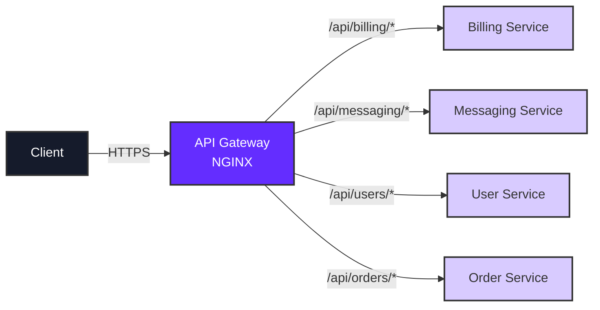

## Introduction

An API Gateway is a critical component in microservices architecture that acts as a single entry point for multiple backend services. It provides centralized routing, load balancing, authentication, rate limiting, and more.

This guide demonstrates how to deploy an NGINX-based API gateway on Qovery to:

- Route traffic to multiple backend services through a single domain
- Simplify client-side API consumption with unified endpoints
- Implement path-based routing for different microservices
- Handle HTTPS termination and security policies
- Reduce complexity in service discovery and communication

<Info>
An API Gateway is essential for production microservices architectures. It provides a unified interface that clients can use instead of managing connections to multiple services directly.
</Info>

## Architecture Overview

The API gateway pattern creates a single entry point that routes requests to appropriate backend services based on URL paths:



### Key Benefits

<CardGroup cols={2}>
  <Card title="Unified Entry Point" icon="door-open">
    Single domain for all APIs simplifies client configuration and reduces DNS management
  </Card>
  <Card title="Path-Based Routing" icon="route">
    Route requests to different services based on URL patterns without client-side logic
  </Card>
  <Card title="Security Layer" icon="shield">
    Centralized authentication, rate limiting, and HTTPS termination
  </Card>
  <Card title="Service Decoupling" icon="code-branch">
    Backend services can change without affecting client applications
  </Card>
</CardGroup>

## Prerequisites

Before setting up your API gateway, ensure you have:

- A Qovery account with at least one project and environment
- One or more backend services (applications, containers, or jobs) deployed on Qovery
- Basic understanding of NGINX configuration
- (Optional) A custom domain for the API gateway

## Step-by-Step Tutorial

### Step 1: Fork the NGINX Gateway Template

Qovery provides a pre-configured NGINX gateway template that you can customize for your needs.

<Steps>
  <Step title="Fork the Repository">
    Fork the official Qovery NGINX gateway repository to your GitHub account:

    ```bash
    # Navigate to:
    https://github.com/Qovery/nginx-gateway

    # Click "Fork" button
    ```

    This repository contains:
    - Dockerfile for NGINX
    - `routes.conf.template` for routing configuration
    - `nginx.conf` base configuration
    - Environment variable templating support
  </Step>

  <Step title="Clone Your Fork Locally">
    Clone your forked repository to customize the routing configuration:

    ```bash
    git clone https://github.com/YOUR_USERNAME/nginx-gateway.git
    cd nginx-gateway
    ```
  </Step>
</Steps>

### Step 2: Configure Routing Rules

The `routes.conf.template` file defines how NGINX routes incoming requests to backend services. This file uses environment variable substitution for dynamic configuration.

<Accordion title="Understanding routes.conf.template">
The template file uses NGINX location blocks with environment variables as placeholders for backend service URLs. When the container starts, these variables are replaced with actual service hostnames.

**Key Features:**
- Uses `~*` for case-insensitive regex matching
- `^/api/SERVICE/?(.*)` pattern captures the full path
- `proxy_pass` forwards requests to backend services
- `$request_uri` preserves original request path and query parameters
</Accordion>

<Tabs>
  <Tab title="Basic Routing">
    Configure simple path-based routing to different backend services:

    ```nginx routes.conf.template
    # Billing service routing
    location ~* ^/api/billing/?(.*) {
        proxy_pass http://$BILLING_BACKEND$request_uri;
    }

    # Messaging service routing
    location ~* ^/api/messaging/?(.*) {
        proxy_pass http://$MESSAGING_BACKEND$request_uri;
    }

    # User service routing
    location ~* ^/api/users/?(.*) {
        proxy_pass http://$USER_BACKEND$request_uri;
    }

    # Order service routing
    location ~* ^/api/orders/?(.*) {
        proxy_pass http://$ORDER_BACKEND$request_uri;
    }
    ```
  </Tab>

  <Tab title="Advanced Routing">
    Add custom headers, timeouts, and advanced proxy settings:

    ```nginx routes.conf.template
    # Billing service with custom headers
    location ~* ^/api/billing/?(.*) {
        proxy_pass http://$BILLING_BACKEND$request_uri;
        proxy_set_header Host $host;
        proxy_set_header X-Real-IP $remote_addr;
        proxy_set_header X-Forwarded-For $proxy_add_x_forwarded_for;
        proxy_set_header X-Forwarded-Proto $scheme;

        # Timeouts
        proxy_connect_timeout 60s;
        proxy_send_timeout 60s;
        proxy_read_timeout 60s;
    }

    # WebSocket support for messaging service
    location ~* ^/api/messaging/ws/?(.*) {
        proxy_pass http://$MESSAGING_BACKEND$request_uri;
        proxy_http_version 1.1;
        proxy_set_header Upgrade $http_upgrade;
        proxy_set_header Connection "upgrade";
        proxy_set_header Host $host;
    }

    # File upload with larger body size
    location ~* ^/api/uploads/?(.*) {
        proxy_pass http://$UPLOAD_BACKEND$request_uri;
        client_max_body_size 100M;
    }

    # API versioning
    location ~* ^/api/v1/users/?(.*) {
        proxy_pass http://$USER_BACKEND_V1$request_uri;
    }

    location ~* ^/api/v2/users/?(.*) {
        proxy_pass http://$USER_BACKEND_V2$request_uri;
    }
    ```
  </Tab>

  <Tab title="With Authentication">
    Add authentication checks before routing:

    ```nginx routes.conf.template
    # Authentication endpoint (public)
    location ~* ^/api/auth/?(.*) {
        proxy_pass http://$AUTH_BACKEND$request_uri;
    }

    # Protected billing routes
    location ~* ^/api/billing/?(.*) {
        # Auth subrequest
        auth_request /auth/verify;
        auth_request_set $auth_status $upstream_status;

        proxy_pass http://$BILLING_BACKEND$request_uri;
        proxy_set_header X-Auth-Status $auth_status;
    }

    # Internal auth verification
    location = /auth/verify {
        internal;
        proxy_pass http://$AUTH_BACKEND/verify;
        proxy_pass_request_body off;
        proxy_set_header Content-Length "";
        proxy_set_header X-Original-URI $request_uri;
    }
    ```
  </Tab>
</Tabs>

<Warning>
Remember to commit and push your changes to the `routes.conf.template` file:

```bash
git add routes.conf.template
git commit -m "Configure API gateway routing rules"
git push origin main
```
</Warning>

### Step 3: Create API Gateway Application in Qovery

Now deploy the NGINX gateway as an application in your Qovery environment.

<Steps>
  <Step title="Create New Application">
    1. Navigate to your Qovery environment in the Console
    2. Click **Create Application**
    3. Select your forked `nginx-gateway` repository
    4. Choose the branch (usually `main` or `master`)
  </Step>

  <Step title="Configure Build Settings">
    Set the build configuration:

    - **Build Mode**: Dockerfile
    - **Dockerfile Path**: `Dockerfile` (in repository root)
    - **Application Name**: `api-gateway` or your preferred name
  </Step>

  <Step title="Configure Port">
    Set the network configuration:

    - **Port**: 80 (NGINX default HTTP port)
    - **Protocol**: HTTP
    - **Publicly Accessible**: Enable this option

    <Info>
    Qovery handles HTTPS termination automatically when you configure a custom domain, so the gateway only needs to listen on HTTP port 80.
    </Info>
  </Step>

  <Step title="Create Application">
    Click **Create** to add the API gateway application to your environment.

    <Warning>
    Don't deploy yet - we need to configure environment variables first!
    </Warning>
  </Step>
</Steps>

### Step 4: Configure Environment Variables

The API gateway needs environment variables to know where to route requests. These variables reference the internal hostnames of your backend services.

<Tabs>
  <Tab title="Console (Web UI)">
    <Steps>
      <Step title="Access Environment Variables">
        1. Select your `api-gateway` application
        2. Navigate to **Variables** tab
        3. Click **Add Variable**
      </Step>

      <Step title="Add Backend Service Variables">
        For each backend service referenced in your `routes.conf.template`, add a variable:

        | Variable Name | Variable Type | Value | Scope |
        |--------------|---------------|-------|-------|
        | `BILLING_BACKEND` | Alias | `qovery.application.z9a8b7c6d5e4f3g2h1.hostname` | Service |
        | `MESSAGING_BACKEND` | Alias | `qovery.application.a1b2c3d4e5f6g7h8i9.hostname` | Service |
        | `USER_BACKEND` | Alias | `qovery.application.j1k2l3m4n5o6p7q8r9.hostname` | Service |

        <Info>
        **Finding Service Hostnames:**
        1. Go to the backend service in Qovery Console
        2. Navigate to **Variables** tab
        3. Look for `QOVERY_APPLICATION_HOSTNAME` or similar built-in variable
        4. Copy the variable reference (e.g., `qovery.application.ID.hostname`)
        </Info>
      </Step>

      <Step title="Use Service Aliases">
        Qovery provides a convenient alias syntax:

        - Variable Type: **Alias**
        - Value: Reference to service hostname variable
        - This ensures the gateway always points to the correct internal service URL
      </Step>
    </Steps>
  </Tab>

  <Tab title="CLI">
    Using Qovery CLI to configure environment variables:

    ```bash
    # Set context to your environment
    qovery context set

    # Add environment variables as aliases
    qovery env create api-gateway \
      --key BILLING_BACKEND \
      --value "qovery.application.z9a8b7c6d5e4f3g2h1.hostname" \
      --scope SERVICE \
      --type ALIAS

    qovery env create api-gateway \
      --key MESSAGING_BACKEND \
      --value "qovery.application.a1b2c3d4e5f6g7h8i9.hostname" \
      --scope SERVICE \
      --type ALIAS

    qovery env create api-gateway \
      --key USER_BACKEND \
      --value "qovery.application.j1k2l3m4n5o6p7q8r9.hostname" \
      --scope SERVICE \
      --type ALIAS
    ```
  </Tab>

  <Tab title="Terraform">
    Using Qovery Terraform Provider:

    ```hcl
    resource "qovery_application" "api_gateway" {
      name = "api-gateway"
      # ... other configuration ...

      environment_variables = [
        {
          key   = "BILLING_BACKEND"
          value = qovery_application.billing_service.internal_host
        },
        {
          key   = "MESSAGING_BACKEND"
          value = qovery_application.messaging_service.internal_host
        },
        {
          key   = "USER_BACKEND"
          value = qovery_application.user_service.internal_host
        }
      ]
    }
    ```
  </Tab>
</Tabs>

<Accordion title="Environment Variable Scoping">
**Service Scope** is recommended for API gateway variables because:

- Variables are specific to the gateway application
- They don't affect other services in the environment
- They're easier to manage and update
- They provide better isolation and security

**Environment Scope** can be used if multiple services need the same backend references, but this is less common for API gateways.
</Accordion>

### Step 5: Configure Custom Domain

To provide a production-ready API gateway, configure a custom domain for your NGINX service.

<Steps>
  <Step title="Access Domain Settings">
    1. Select your `api-gateway` application
    2. Navigate to **Settings** > **Domain**
    3. Click **Add Domain**
  </Step>

  <Step title="Add Your Domain">
    Enter your API gateway domain:

    ```
    api.yourdomain.com
    ```

    Or use a path-based approach:

    ```
    yourdomain.com/api
    ```

    <Info>
    Qovery automatically provisions an SSL/TLS certificate via Let's Encrypt when you add a custom domain.
    </Info>
  </Step>

  <Step title="Configure DNS">
    Update your DNS records to point to the Qovery load balancer:

    - **Record Type**: CNAME
    - **Name**: `api` (or your subdomain)
    - **Value**: Provided by Qovery (visible in domain settings)
    - **TTL**: 300 (5 minutes)

    <Accordion title="Finding Your DNS Target">
    After adding the domain in Qovery:
    1. The Console displays the CNAME target
    2. It typically looks like: `xyz123.lb.qovery.io`
    3. Create a CNAME record in your DNS provider pointing to this target
    </Accordion>
  </Step>

  <Step title="Verify Domain">
    Wait for DNS propagation (usually 5-15 minutes), then:

    ```bash
    # Check DNS resolution
    dig api.yourdomain.com

    # Test HTTPS connection
    curl https://api.yourdomain.com/api/health
    ```
  </Step>
</Steps>

### Step 6: Deploy and Test

Now deploy your API gateway and verify it's routing correctly.

<Steps>
  <Step title="Deploy API Gateway">
    1. Return to your `api-gateway` application
    2. Click **Deploy** button
    3. Monitor the deployment logs

    The deployment will:
    - Build the Docker image with NGINX
    - Substitute environment variables in `routes.conf.template`
    - Start NGINX with your routing configuration
    - Expose the service on port 80
  </Step>

  <Step title="Verify Service Health">
    Check that NGINX started successfully:

    ```bash
    # Using qovery CLI
    qovery status

    # Check logs
    qovery log api-gateway
    ```

    Look for successful NGINX startup messages:
    ```
    nginx: configuration file /etc/nginx/nginx.conf test is successful
    ```
  </Step>

  <Step title="Test API Routes">
    Test each route defined in your configuration:

    ```bash
    # Test billing service route
    curl https://api.yourdomain.com/api/billing/invoices

    # Test messaging service route
    curl https://api.yourdomain.com/api/messaging/messages

    # Test user service route
    curl https://api.yourdomain.com/api/users/profile

    # Test with authentication header
    curl -H "Authorization: Bearer TOKEN" \
      https://api.yourdomain.com/api/billing/invoices
    ```
  </Step>

  <Step title="Monitor Gateway Logs">
    Monitor real-time traffic through the gateway:

    ```bash
    # Follow logs in real-time
    qovery log api-gateway --follow

    # Filter for specific routes
    qovery log api-gateway --follow | grep "/api/billing"
    ```

    Successful routing shows:
    ```
    GET /api/billing/invoices HTTP/1.1" 200
    GET /api/messaging/messages HTTP/1.1" 200
    GET /api/users/profile HTTP/1.1" 200
    ```
  </Step>
</Steps>

## Advanced Configuration

### Health Checks

Add a health check endpoint to monitor gateway status:

```nginx routes.conf.template
# Health check endpoint
location /health {
    access_log off;
    return 200 "healthy\n";
    add_header Content-Type text/plain;
}

# Detailed status (optional, for internal monitoring)
location /status {
    access_log off;
    stub_status on;
}
```

### Rate Limiting

Implement rate limiting to protect backend services:

```nginx nginx.conf
http {
    # Define rate limit zone
    limit_req_zone $binary_remote_addr zone=api_limit:10m rate=10r/s;

    server {
        # Apply rate limiting to API routes
        location /api/ {
            limit_req zone=api_limit burst=20 nodelay;
            limit_req_status 429;

            include routes.conf;
        }
    }
}
```

### CORS Configuration

Enable Cross-Origin Resource Sharing for browser-based clients:

```nginx routes.conf.template
# CORS headers for all API routes
location /api/ {
    # Handle preflight requests
    if ($request_method = 'OPTIONS') {
        add_header 'Access-Control-Allow-Origin' '*';
        add_header 'Access-Control-Allow-Methods' 'GET, POST, PUT, DELETE, OPTIONS';
        add_header 'Access-Control-Allow-Headers' 'Authorization, Content-Type';
        add_header 'Access-Control-Max-Age' 1728000;
        add_header 'Content-Type' 'text/plain charset=UTF-8';
        add_header 'Content-Length' 0;
        return 204;
    }

    # Add CORS headers to all responses
    add_header 'Access-Control-Allow-Origin' '*' always;
    add_header 'Access-Control-Allow-Methods' 'GET, POST, PUT, DELETE, OPTIONS' always;
    add_header 'Access-Control-Allow-Headers' 'Authorization, Content-Type' always;

    include routes.conf;
}
```

### Request/Response Modification

Modify requests and responses as they pass through the gateway:

```nginx routes.conf.template
# Add custom headers to backend requests
location ~* ^/api/billing/?(.*) {
    proxy_pass http://$BILLING_BACKEND$request_uri;

    # Add gateway identification
    proxy_set_header X-Gateway "Qovery-NGINX";
    proxy_set_header X-Request-ID $request_id;

    # Hide sensitive backend headers
    proxy_hide_header X-Powered-By;
    proxy_hide_header Server;
}

# Rewrite responses
location ~* ^/api/legacy/?(.*) {
    proxy_pass http://$LEGACY_BACKEND$request_uri;

    # Modify response body (requires subs filter module)
    subs_filter 'oldapi.example.com' 'api.yourdomain.com' gi;
}
```

### Caching

Add caching for improved performance:

```nginx nginx.conf
http {
    # Define cache path and settings
    proxy_cache_path /var/cache/nginx levels=1:2 keys_zone=api_cache:10m max_size=1g
                     inactive=60m use_temp_path=off;

    server {
        location /api/public/ {
            proxy_cache api_cache;
            proxy_cache_key "$scheme$request_method$host$request_uri";
            proxy_cache_valid 200 10m;
            proxy_cache_valid 404 1m;

            # Add cache status header
            add_header X-Cache-Status $upstream_cache_status;

            include routes.conf;
        }
    }
}
```

### Load Balancing

Distribute traffic across multiple backend instances:

```nginx routes.conf.template
# Define upstream backend pool
upstream billing_backend_pool {
    least_conn;
    server $BILLING_BACKEND_1;
    server $BILLING_BACKEND_2;
    server $BILLING_BACKEND_3;

    # Health checks
    keepalive 32;
}

location ~* ^/api/billing/?(.*) {
    proxy_pass http://billing_backend_pool$request_uri;

    # Connection settings
    proxy_http_version 1.1;
    proxy_set_header Connection "";
}
```

## Use Cases

### Microservices Architecture

<Card title="Unified API Endpoint" icon="sitemap">
Instead of exposing multiple service endpoints to clients:
- `billing.yourdomain.com`
- `messaging.yourdomain.com`
- `users.yourdomain.com`

Provide a single API gateway:
- `api.yourdomain.com/billing`
- `api.yourdomain.com/messaging`
- `api.yourdomain.com/users`

This simplifies client configuration and reduces DNS/certificate management overhead.
</Card>

### API Versioning

<Card title="Version Management" icon="code-branch">
Route traffic to different service versions based on URL paths:

```
/api/v1/users → User Service v1
/api/v2/users → User Service v2
/api/beta/users → User Service Beta
```

This enables gradual migration and A/B testing without client-side changes.
</Card>

### Multi-Environment Routing

<Card title="Environment Separation" icon="layer-group">
Use different gateway instances for different environments:

- `api-dev.yourdomain.com` → Development backends
- `api-staging.yourdomain.com` → Staging backends
- `api.yourdomain.com` → Production backends

Each gateway points to services in its respective Qovery environment.
</Card>

### Legacy System Integration

<Card title="Gradual Migration" icon="arrow-right-arrow-left">
Route some paths to new microservices while maintaining legacy endpoints:

```nginx
location /api/new-feature {
    proxy_pass http://new-microservice;
}

location /api/legacy {
    proxy_pass http://legacy-monolith;
}
```

Migrate functionality piece by piece without breaking existing clients.
</Card>

## Troubleshooting

<AccordionGroup>
  <Accordion title="502 Bad Gateway Error">
    **Symptoms:** Gateway returns 502 errors when accessing API routes

    **Common Causes:**
    1. Backend service is not running or not healthy
    2. Environment variables not configured correctly
    3. Backend service internal hostname is incorrect
    4. Network connectivity issues between services

    **Solutions:**
    ```bash
    # Check backend service status
    qovery status

    # Verify environment variables
    qovery env list api-gateway

    # Check gateway logs for proxy errors
    qovery log api-gateway | grep "upstream"

    # Test backend service directly
    qovery shell billing-service
    curl http://localhost:PORT/health
    ```

    **Fix incorrect environment variables:**
    1. Verify backend service hostname in Qovery Console
    2. Update API gateway environment variable
    3. Redeploy API gateway
  </Accordion>

  <Accordion title="404 Not Found on API Routes">
    **Symptoms:** Gateway returns 404 for valid API paths

    **Common Causes:**
    1. Route regex pattern doesn't match request path
    2. Trailing slash handling issues
    3. Case sensitivity in location blocks
    4. Route order conflicts

    **Solutions:**
    ```bash
    # Check NGINX configuration
    qovery shell api-gateway
    nginx -T | grep "location"

    # Test route pattern matching
    curl -v https://api.yourdomain.com/api/billing
    curl -v https://api.yourdomain.com/api/billing/
    ```

    **Fix route patterns:**
    - Use `~*` for case-insensitive matching
    - Add `/?` to handle optional trailing slashes
    - Ensure patterns are specific enough but not too restrictive
  </Accordion>

  <Accordion title="CORS Errors in Browser">
    **Symptoms:** Browser console shows CORS policy errors

    **Common Causes:**
    1. Missing CORS headers in NGINX configuration
    2. Backend service adding conflicting CORS headers
    3. Preflight OPTIONS requests not handled

    **Solutions:**
    Add CORS configuration to `routes.conf.template`:

    ```nginx
    # Handle OPTIONS requests
    if ($request_method = 'OPTIONS') {
        add_header 'Access-Control-Allow-Origin' '$http_origin' always;
        add_header 'Access-Control-Allow-Methods' 'GET, POST, PUT, DELETE, OPTIONS' always;
        add_header 'Access-Control-Allow-Headers' 'Authorization, Content-Type' always;
        add_header 'Access-Control-Max-Age' 1728000 always;
        return 204;
    }

    # Add CORS headers to actual requests
    add_header 'Access-Control-Allow-Origin' '$http_origin' always;
    ```

    Commit, push, and redeploy the gateway.
  </Accordion>

  <Accordion title="Slow Response Times">
    **Symptoms:** API requests take longer through the gateway than directly

    **Common Causes:**
    1. Missing keepalive connections
    2. DNS resolution overhead
    3. No HTTP/1.1 connection reuse
    4. Backend service performance issues

    **Solutions:**
    Optimize proxy settings:

    ```nginx
    location /api/ {
        # Use HTTP/1.1 for backend connections
        proxy_http_version 1.1;
        proxy_set_header Connection "";

        # Increase timeouts if needed
        proxy_connect_timeout 60s;
        proxy_send_timeout 60s;
        proxy_read_timeout 60s;

        # Enable keepalive
        proxy_socket_keepalive on;
    }
    ```

    Enable keepalive connections in upstream blocks:

    ```nginx
    upstream backend {
        server $BACKEND;
        keepalive 32;
    }
    ```
  </Accordion>

  <Accordion title="Environment Variables Not Substituted">
    **Symptoms:** NGINX tries to connect to literal `$BILLING_BACKEND` instead of actual hostname

    **Common Causes:**
    1. Using wrong template file name (should be `.template`)
    2. envsubst not running in entrypoint
    3. Environment variables not set in Qovery

    **Solutions:**
    Verify template substitution in the Dockerfile:

    ```dockerfile
    # Ensure entrypoint uses envsubst
    CMD envsubst < /etc/nginx/conf.d/routes.conf.template > /etc/nginx/conf.d/routes.conf && nginx -g 'daemon off;'
    ```

    Check environment variables are set:
    ```bash
    qovery shell api-gateway
    env | grep BACKEND
    ```
  </Accordion>

  <Accordion title="SSL/TLS Certificate Issues">
    **Symptoms:** HTTPS not working or certificate errors

    **Common Causes:**
    1. DNS not properly configured
    2. Certificate provisioning still in progress
    3. Domain verification failed

    **Solutions:**
    ```bash
    # Verify DNS resolution
    dig api.yourdomain.com

    # Check certificate status in Qovery Console
    # Navigate to: Application > Settings > Domain
    ```

    Wait for certificate provisioning (can take up to 20 minutes). If it fails:
    1. Verify DNS CNAME points to correct Qovery load balancer
    2. Ensure domain is not behind proxy (disable CloudFlare proxy temporarily)
    3. Remove and re-add domain in Qovery Console
  </Accordion>
</AccordionGroup>

## Monitoring and Observability

### Application Logs

Monitor gateway traffic and errors:

```bash
# Real-time logs
qovery log api-gateway --follow

# Filter specific routes
qovery log api-gateway --follow | grep "/api/billing"

# Filter errors only
qovery log api-gateway --follow | grep "error"
```

### NGINX Access Logs

The default NGINX configuration logs all requests. Custom log format for better observability:

```nginx nginx.conf
http {
    log_format custom '$remote_addr - $remote_user [$time_local] '
                      '"$request" $status $body_bytes_sent '
                      '"$http_referer" "$http_user_agent" '
                      'rt=$request_time uct="$upstream_connect_time" '
                      'uht="$upstream_header_time" urt="$upstream_response_time"';

    access_log /var/log/nginx/access.log custom;
}
```

### Metrics Integration

Integrate with observability platforms:

<Tabs>
  <Tab title="Datadog">
    Add Datadog NGINX integration:

    ```yaml
    # Add to your NGINX Dockerfile
    RUN apt-get update && apt-get install -y datadog-agent

    # Configure Datadog
    ENV DD_API_KEY=your_api_key
    ENV DD_SITE=datadoghq.com
    ```
  </Tab>

  <Tab title="Prometheus">
    Use nginx-prometheus-exporter:

    ```dockerfile
    FROM nginx:alpine

    # Add prometheus exporter
    RUN apk add --no-cache prometheus-nginx-exporter

    # Enable stub_status in nginx.conf
    # location /metrics {
    #     stub_status on;
    # }
    ```
  </Tab>

  <Tab title="Qovery Observe">
    Qovery Observe automatically collects:
    - Request rates
    - Error rates
    - Response times
    - CPU and memory usage

    No additional configuration needed - view in Qovery Console under **Observe** tab.
  </Tab>
</Tabs>

## Best Practices

<CardGroup cols={2}>
  <Card title="Use Service Aliases" icon="link">
    Always use Qovery service aliases for environment variables instead of hardcoded hostnames. This ensures your gateway works across environments.
  </Card>

  <Card title="Implement Health Checks" icon="heart-pulse">
    Add dedicated health check endpoints that don't proxy to backends. This helps monitoring tools verify gateway availability independently.
  </Card>

  <Card title="Enable Access Logs" icon="file-lines">
    Keep access logs enabled to troubleshoot routing issues and analyze traffic patterns. Use structured log formats for easier parsing.
  </Card>

  <Card title="Version Your Configuration" icon="code-commit">
    Store nginx configuration in Git and use proper branching strategies. Review changes before deploying to production.
  </Card>

  <Card title="Set Appropriate Timeouts" icon="clock">
    Configure proxy timeouts based on backend service requirements. Don't use default values for production workloads.
  </Card>

  <Card title="Add Rate Limiting" icon="gauge">
    Protect backend services from abuse with rate limiting at the gateway level. Use reasonable limits that don't impact legitimate traffic.
  </Card>

  <Card title="Use Connection Pooling" icon="diagram-project">
    Enable HTTP keepalive and connection pooling to reduce latency and backend connection overhead.
  </Card>

  <Card title="Test Route Changes" icon="vial">
    Always test routing changes in a non-production environment first. Use curl or automated tests to verify all routes work correctly.
  </Card>
</CardGroup>

## Security Considerations

<Warning>
API gateways are critical security components. Follow these guidelines to secure your gateway:
</Warning>

1. **Environment Variable Security**
   - Use Qovery's built-in secret management for sensitive values
   - Never commit secrets to Git
   - Rotate credentials regularly

2. **Backend Communication**
   - Use internal Qovery service hostnames (not public URLs)
   - Services communicate over private network
   - No external traffic between services

3. **Request Validation**
   - Implement request size limits
   - Validate content types
   - Filter malicious patterns

4. **Authentication**
   - Implement authentication at gateway level when possible
   - Use JWT validation or API key verification
   - Forward authentication context to backends

5. **HTTPS Only**
   - Always use HTTPS for public endpoints
   - Enable HSTS headers
   - Use strong TLS configurations

Example security headers:

```nginx nginx.conf
add_header Strict-Transport-Security "max-age=31536000; includeSubDomains" always;
add_header X-Frame-Options "SAMEORIGIN" always;
add_header X-Content-Type-Options "nosniff" always;
add_header X-XSS-Protection "1; mode=block" always;
add_header Referrer-Policy "strict-origin-when-cross-origin" always;
```

## Performance Optimization

### Connection Pooling

Maintain persistent connections to backends:

```nginx
upstream backend_pool {
    server $BACKEND;
    keepalive 32;
    keepalive_timeout 60s;
    keepalive_requests 100;
}

location /api/ {
    proxy_pass http://backend_pool;
    proxy_http_version 1.1;
    proxy_set_header Connection "";
}
```

### Caching Strategy

Cache responses when appropriate:

```nginx
# Cache GET requests for public data
location /api/public/ {
    proxy_cache api_cache;
    proxy_cache_key "$scheme$request_method$host$request_uri";
    proxy_cache_valid 200 10m;
    proxy_cache_methods GET HEAD;
    proxy_cache_bypass $http_cache_control;

    add_header X-Cache-Status $upstream_cache_status;
}
```

### Buffer Optimization

Tune buffers for your workload:

```nginx
proxy_buffering on;
proxy_buffer_size 4k;
proxy_buffers 8 4k;
proxy_busy_buffers_size 8k;
```

### Worker Configuration

Optimize NGINX workers:

```nginx nginx.conf
worker_processes auto;
worker_rlimit_nofile 65535;

events {
    worker_connections 4096;
    use epoll;
    multi_accept on;
}
```

## Next Steps

<CardGroup cols={2}>
  <Card title="Deploy Multiple Environments" icon="layer-group" href="/configuration/environment">
    Create separate API gateways for dev, staging, and production environments
  </Card>

  <Card title="Implement Authentication" icon="lock" href="/integrations/secret-managers/overview">
    Add authentication and authorization to your API gateway
  </Card>

  <Card title="Monitor Performance" icon="chart-line" href="/integrations/observability/overview">
    Set up monitoring and alerting for your gateway
  </Card>

  <Card title="Configure Rate Limiting" icon="shield-halved" href="/configuration/service-advanced-settings">
    Protect your services with rate limiting and throttling
  </Card>
</CardGroup>

## Additional Resources

- [NGINX Gateway Repository](https://github.com/Qovery/nginx-gateway) - Template repository with example configurations
- [NGINX Documentation](https://nginx.org/en/docs/) - Official NGINX documentation
- [Qovery Application Configuration](/configuration/application) - Detailed application settings
- [Environment Variables Guide](/configuration/environment-variables) - Managing environment variables
- [Custom Domains](/configuration/application#domains) - Configuring custom domains

<Info>
Need help with your API gateway setup? Contact [Qovery support](https://www.qovery.com/support) or join our [community Discord](https://discord.qovery.com).
</Info>
