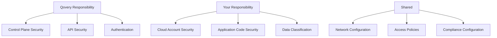

## Security-First Design

Qovery is built with security as a core principle, implementing industry best practices and compliance standards.

## Key Security Features

<CardGroup cols={2}>
  <Card title="Encryption" icon="lock">
    Data encrypted at rest and in transit
  </Card>
  <Card title="RBAC" icon="users">
    Role-based access control
  </Card>
  <Card title="Secrets Management" icon="key">
    Secure secret storage and injection
  </Card>
  <Card title="Network Security" icon="shield">
    Network policies and isolation
  </Card>
  <Card title="Audit Logs" icon="clipboard-list">
    Complete audit trail of all actions
  </Card>
  <Card title="Compliance" icon="certificate">
    SOC 2, GDPR, HIPAA ready
  </Card>
</CardGroup>

## Security Layers

### 1. Infrastructure Security

- **Your Cloud Account**: Resources run in your infrastructure
- **Network Isolation**: VPC and subnet isolation
- **Firewall Rules**: Configurable security groups
- **Private Networking**: Databases not exposed to internet

### 2. Application Security

- **Container Scanning**: Automatic vulnerability scanning
- **Image Signing**: Verify container image integrity
- **Runtime Security**: Detect anomalous behavior
- **Secrets Injection**: No secrets in code or logs

### 3. Access Control

- **SSO Integration**: SAML, OAuth 2.0
- **MFA**: Multi-factor authentication
- **API Tokens**: Scoped and time-limited
- **RBAC**: Fine-grained permissions

### 4. Data Security

- **Encryption at Rest**: All data encrypted
- **Encryption in Transit**: TLS 1.3
- **Secret Encryption**: AES-256 encryption
- **Backup Encryption**: Encrypted backups

## Shared Responsibility Model

## Security Best Practices

<AccordionGroup>
  <Accordion title="Enable MFA">
    Require multi-factor authentication for all users.
  </Accordion>

  <Accordion title="Use Least Privilege">
    Grant minimum necessary permissions to users and services.
  </Accordion>

  <Accordion title="Rotate Secrets">
    Regularly rotate API tokens, database passwords, and credentials.
  </Accordion>

  <Accordion title="Monitor Access Logs">
    Regularly review audit logs for suspicious activity.
  </Accordion>

  <Accordion title="Scan Dependencies">
    Keep dependencies up to date and scan for vulnerabilities.
  </Accordion>

  <Accordion title="Use Private Registries">
    Store container images in private registries.
  </Accordion>
</AccordionGroup>

## Compliance

Qovery helps you meet compliance requirements:

- **SOC 2 Type II**: Annual audit
- **GDPR**: Data protection compliance
- **HIPAA**: Healthcare data handling
- **ISO 27001**: Information security management

## Next Steps

<CardGroup cols={2}>
  <Card title="Authentication" icon="key" href="/security/authentication">
    Configure authentication
  </Card>
  <Card title="RBAC" icon="users" href="/security/rbac">
    Set up access control
  </Card>
  <Card title="Secrets" icon="lock" href="/security/secrets-management">
    Manage secrets securely
  </Card>
  <Card title="Network Security" icon="shield" href="/security/network-security">
    Secure your network
  </Card>
</CardGroup>
