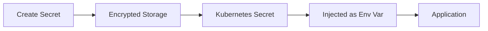

## Overview

Qovery provides secure secrets management for sensitive configuration data like API keys, passwords, and certificates.

## How Secrets Work



## Creating Secrets

### Via Console

1. Navigate to service → Environment Variables
2. Click "Add Secret"
3. Enter key and value
4. Secret is encrypted immediately

### Via Terraform

```hcl
secrets = [
  {
    key   = "DATABASE_PASSWORD"
    value = var.db_password  # Never hardcode!
  },
  {
    key   = "API_KEY"
    value = var.api_key
  }
]
```

### Via CLI

```bash
qovery application secret create \
  --application my-app \
  --key API_KEY \
  --value "secret-value"
```

## Secret Security

- **AES-256 Encryption**: Secrets encrypted at rest
- **TLS in Transit**: Encrypted during transmission
- **No Plaintext**: Never displayed after creation
- **Access Control**: RBAC enforced
- **Audit Logging**: All access logged

## Secret Rotation

Rotate secrets regularly:

```bash
# Update secret
qovery application secret update \
  --application my-app \
  --key API_KEY \
  --value "new-secret-value"

# Redeploy to apply
qovery application redeploy --application my-app
```

## External Secret Managers

Integrate with external secret stores:

### AWS Secrets Manager

```hcl
secrets = [
  {
    key    = "DATABASE_PASSWORD"
    source = "AWS_SECRETS_MANAGER"
    arn    = "arn:aws:secretsmanager:us-east-1:123456789:secret:db-password"
  }
]
```

### HashiCorp Vault

```hcl
secrets = [
  {
    key    = "API_KEY"
    source = "VAULT"
    path   = "secret/data/api-key"
  }
]
```

## Best Practices

- Never commit secrets to Git
- Use environment variables for secrets
- Rotate secrets every 90 days
- Limit secret access to necessary services
- Use secret scanning tools in CI/CD

