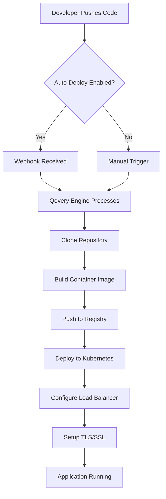

This guide covers how Qovery handles deployments, from code push to production. Understanding the deployment process will help you troubleshoot issues and optimize your workflow.

## Deployment Lifecycle

Qovery follows a complete deployment lifecycle from your Git repository to your Kubernetes cluster:



### Deployment Stages

Each deployment goes through several stages:

<Steps>
  <Step title="Queued">
    Deployment is queued and waiting to start. This happens when multiple deployments are triggered simultaneously.
  </Step>

  <Step title="Building">
    - Repository is cloned
    - Dockerfile is built (or Buildpack detects language)
    - Container image is created
    - Image is pushed to container registry
  </Step>

  <Step title="Deploying">
    - Kubernetes resources are created/updated
    - Deployment strategy is applied (rolling update, blue/green)
    - Health checks are performed
    - Load balancer is configured
  </Step>

  <Step title="Running">
    - Application is live and serving traffic
    - Health checks passing
    - Logs are streaming
    - Metrics are being collected
  </Step>
</Steps>

## Complete Deployment Flow

Here's the detailed flow from Git push to running application:

### 1. Trigger Deployment

Deployments can be triggered in three ways:

<Tabs>
  <Tab title="Auto-Deploy (GitOps)">
    **Automatic deployments on Git push**

    - Developer pushes code to Git repository
    - Git provider sends webhook to Qovery
    - Qovery receives commit information
    - Deployment is triggered automatically

    <Tip>
    Recommended for development and staging environments. Enable [auto-deploy](/using-qovery/deployment/auto-deploy) for faster feedback cycles.
    </Tip>
  </Tab>

  <Tab title="Manual (Console)">
    **Deploy from Qovery Console**

    - Navigate to your environment
    - Click on the service you want to deploy
    - Click **Deploy** button
    - Select commit/tag to deploy

    <Note>
    Recommended for production environments where you want explicit control over deployments.
    </Note>
  </Tab>

  <Tab title="CI/CD Integration">
    **Trigger from your CI/CD pipeline**

    - CI/CD runs tests and builds
    - On success, calls Qovery API or CLI
    - Qovery deploys the application

    ```bash
    # Example with Qovery CLI
    qovery application deploy \
      --application-name "my-app" \
      --commit-id "abc123"
    ```

    <Info>
    See [CI/CD Integration](/using-qovery/deployment/ci-cd) for detailed guides.
    </Info>
  </Tab>
</Tabs>

### 2. Processing by Qovery Engine

Once triggered, the Qovery Engine processes the deployment according to your [Deployment Pipeline](/using-qovery/deployment/deployment-pipeline):

1. **Validates Configuration**: Checks that all required settings are present
2. **Determines Order**: Based on deployment stages and dependencies
3. **Allocates Resources**: Ensures cluster has capacity
4. **Starts Build Process**: For services that require building

### 3. Build Phase

For applications built from source code:

<AccordionGroup>
  <Accordion title="From Git Repository">
    **What happens**:
    1. Clone repository from GitHub/GitLab/Bitbucket
    2. Checkout specified branch/commit/tag
    3. Detect Dockerfile or use Buildpacks
    4. Build container image
    5. Tag image with commit SHA
    6. Push to container registry (ECR, GCR, ACR, etc.)

    **Build Time**: Typically 1-5 minutes depending on:
    - Application size
    - Dependencies
    - Cache availability
    - Build resources allocated
  </Accordion>

  <Accordion title="From Container Registry">
    **What happens**:
    1. Pull specified image from registry
    2. Verify image exists and is accessible
    3. Tag for Qovery tracking
    4. Push to mirroring registry

    **Build Time**: Usually < 1 minute (no build required)
  </Accordion>
</AccordionGroup>

### 4. Deployment Phase

Once the image is ready, Qovery deploys to Kubernetes:

1. **Create/Update Resources**:
   - Deployments or StatefulSets
   - Services (for networking)
   - ConfigMaps and Secrets
   - Ingress rules (for HTTP/HTTPS)

2. **Apply Deployment Strategy**:
   - **Rolling Update** (default): Gradually replace old pods with new ones
   - **Recreate**: Stop all old pods, then start new ones

3. **Health Checks**:
   - Kubernetes liveness probes
   - Readiness probes
   - Application-specific health endpoints

4. **Traffic Routing**:
   - Update load balancer configuration
   - Configure DNS records
   - Enable TLS/SSL certificates

### 5. Load Balancer Configuration

Qovery automatically configures networking:

- **Load Balancer**: Created or updated (ALB, Cloud Load Balancer, etc.)
- **Ingress**: Nginx ingress controller routes traffic
- **DNS**: External DNS updates records automatically
- **TLS/SSL**: Cert-manager provisions Let's Encrypt certificates

### 6. Application Running

Once deployed, the application:

- Serves traffic on configured ports
- Reports health status
- Sends logs to centralized logging
- Exposes metrics for monitoring

## Deployment Status

Qovery provides two status indicators:

### Deployment Status

Shows the current state of the deployment process:

| Status | Description | Actions Available |
|--------|-------------|-------------------|
| **Building** | Container image is being built | View build logs |
| **Deploying** | Application is being deployed to Kubernetes | View deployment logs |
| **Running** | Deployment completed successfully | View application logs, metrics |
| **Stopped** | Service is intentionally stopped | Start service |
| **Failed** | Deployment encountered an error | View logs, redeploy, rollback |
| **Queued** | Waiting for resources or dependencies | Monitor status |

### Running Status

Shows the health of the running application:

- **Healthy** (Green): All pods running, health checks passing
- **Degraded** (Yellow): Some pods failing or health checks intermittent
- **Unhealthy** (Red): Service not responding or all pods crashed
- **Stopped** (Gray): Service intentionally stopped

## Monitoring Deployments

### Deployment Logs

Qovery provides detailed logs for each deployment phase:

<Tabs>
  <Tab title="Build Logs">
    Shows the container image build process:
    - Dockerfile execution
    - Dependency installation
    - Build output
    - Image push confirmation
  </Tab>

  <Tab title="Deployment Logs">
    Shows Kubernetes deployment process:
    - Resource creation
    - Pod scheduling
    - Container startup
    - Health check results
  </Tab>

  <Tab title="Application Logs">
    Shows your application's stdout/stderr:
    - Application startup
    - Request logs
    - Error messages
    - Custom log output
  </Tab>
</Tabs>

### Accessing Logs

<Steps>
  <Step title="Navigate to Service">
    Click on your application in the Qovery console
  </Step>

  <Step title="View Logs Tab">
    Click on the **Logs** tab
  </Step>

  <Step title="Select Log Type">
    Choose between:
    - **Live Logs**: Real-time streaming (last 1000 lines)
    - **Deployment Logs**: Historical deployment logs
    - **Build Logs**: Build process logs
  </Step>

  <Step title="Filter and Search">
    Use filters to find specific log entries:
    - Time range
    - Log level (INFO, WARN, ERROR)
    - Search text
  </Step>
</Steps>

## Deployment Actions

### Available Actions

<CardGroup cols={2}>
  <Card title="Deploy" icon="rocket">
    Start a new deployment with latest code or specific commit
  </Card>

  <Card title="Redeploy" icon="arrows-rotate">
    Redeploy the current version (useful after config changes)
  </Card>

  <Card title="Rollback" icon="clock-rotate-left">
    Revert to a previous working deployment
  </Card>

  <Card title="Stop" icon="stop">
    Stop the service (scales to 0 replicas)
  </Card>

  <Card title="Restart" icon="power-off">
    Restart all pods without redeploying
  </Card>

  <Card title="Cancel" icon="xmark">
    Cancel an in-progress deployment
  </Card>
</CardGroup>

### Rollback

If a deployment fails or causes issues, you can rollback to a previous version:

<Steps>
  <Step title="Open Deployment History">
    Navigate to your service and click on **Deployment History**
  </Step>

  <Step title="Select Previous Deployment">
    Choose a previous successful deployment
  </Step>

  <Step title="Click Rollback">
    Confirm rollback to the selected version
  </Step>

  <Step title="Monitor Rollback">
    Watch logs to ensure rollback completes successfully
  </Step>
</Steps>

<Warning>
Rollback deploys the previous container image but keeps current environment variables and configuration. If the issue is config-related, you may need to update configuration as well.
</Warning>

## Deployment Strategies

### Rolling Update (Default)

Gradually replaces old pods with new ones:

**Advantages**:
- Zero downtime
- Automatic rollback on failure
- Gradual traffic shift

**Configuration**:
```yaml
maxUnavailable: 0  # Keep all pods running during update
maxSurge: 1        # Add 1 extra pod during update
```

### Recreate

Stops all old pods before starting new ones:

**Use Cases**:
- Applications that can't run multiple versions
- Stateful applications requiring exclusive access
- Quick deployments for development environments

**Note**: Causes brief downtime during update

## Deployment Pipeline

Qovery uses deployment pipelines to control the order of service deployments:

### Default Pipeline

1. **Stage 0: Databases** - Deploy first (dependencies)
2. **Stage 1: Jobs** - Run after databases
3. **Stage 2: Containers** - Deploy container services
4. **Stage 3: Applications** - Deploy applications last

### Custom Pipeline

You can customize the pipeline to match your architecture:

<Accordion title="Example: Microservices Pipeline">
```
Stage 0: Databases (PostgreSQL, Redis)
Stage 1: Backend API
Stage 2: Authentication Service
Stage 3: Frontend Application
Stage 4: Background Workers
```
</Accordion>

Learn more about [Deployment Pipelines](/using-qovery/deployment/deployment-pipeline).

## Deployment Triggers

### Git-Based Triggers

- **Push to branch**: Automatic deployment when code is pushed
- **Pull request**: Create preview environment for testing
- **Tag**: Deploy specific release version
- **Manual**: Deploy from console or API

### Filtering Deployments

Use deployment restrictions to control when auto-deploy triggers:

- **EXCLUDE mode**: Ignore changes to specific files/folders
- **MATCH mode**: Only deploy when specific files/folders change

Example: Don't deploy on README changes:
```yaml
Mode: EXCLUDE
Value: README.md
```

## Best Practices

<CardGroup cols={2}>
  <Card title="Use Auto-Deploy Wisely" icon="robot">
    - Enable for dev/staging
    - Consider manual for production
    - Use deployment restrictions
  </Card>

  <Card title="Monitor Deployments" icon="chart-line">
    - Watch build logs for errors
    - Check deployment status
    - Monitor application health
  </Card>

  <Card title="Test Before Production" icon="flask">
    - Use preview environments
    - Deploy to staging first
    - Run automated tests
  </Card>

  <Card title="Have Rollback Ready" icon="life-ring">
    - Keep previous versions available
    - Test rollback procedure
    - Document recovery steps
  </Card>
</CardGroup>

## Common Deployment Issues

<AccordionGroup>
  <Accordion title="Build Failures">
    **Symptoms**: Build logs show errors, deployment stuck in "Building" state

    **Common Causes**:
    - Missing dependencies in package files
    - Dockerfile syntax errors
    - Build timeout (increase build timeout in advanced settings)
    - Insufficient build resources

    **Solutions**:
    - Check build logs for specific errors
    - Test Dockerfile locally
    - Increase build timeout if needed
    - Verify all dependencies are listed
  </Accordion>

  <Accordion title="Deployment Timeout">
    **Symptoms**: Deployment stuck in "Deploying" state, eventually fails

    **Common Causes**:
    - Application takes too long to start
    - Health checks failing
    - Insufficient cluster resources
    - Image pull errors

    **Solutions**:
    - Check deployment logs
    - Increase deployment timeout
    - Verify health check endpoints
    - Check Kubernetes events: `kubectl get events`
  </Accordion>

  <Accordion title="Application Crashes">
    **Symptoms**: Deployment succeeds but pods keep restarting

    **Common Causes**:
    - Application errors on startup
    - Missing environment variables
    - Insufficient memory/CPU
    - Port configuration mismatch

    **Solutions**:
    - Check application logs
    - Verify all required env vars are set
    - Increase resource limits
    - Ensure port matches application configuration
  </Accordion>

  <Accordion title="Cannot Access Application">
    **Symptoms**: Deployment successful but application not accessible

    **Common Causes**:
    - Port not exposed or configured incorrectly
    - Ingress/load balancer not configured
    - DNS not propagated
    - Firewall/security group blocking traffic

    **Solutions**:
    - Verify port configuration
    - Check ingress/load balancer status
    - Wait for DNS propagation (up to 5 minutes)
    - Check cloud provider security groups
  </Accordion>
</AccordionGroup>

## Next Steps

<CardGroup cols={2}>
  <Card title="Auto-Deploy" icon="arrows-rotate" href="/using-qovery/deployment/auto-deploy">
    Set up automatic deployments
  </Card>
  <Card title="Deployment Pipeline" icon="list-timeline" href="/using-qovery/deployment/deployment-pipeline">
    Customize deployment order
  </Card>
  <Card title="CI/CD Integration" icon="code-branch" href="/using-qovery/deployment/ci-cd">
    Integrate with your CI/CD
  </Card>
  <Card title="Logs & Monitoring" icon="chart-line" href="/using-qovery/observability/logs">
    Monitor your deployments
  </Card>
</CardGroup>
