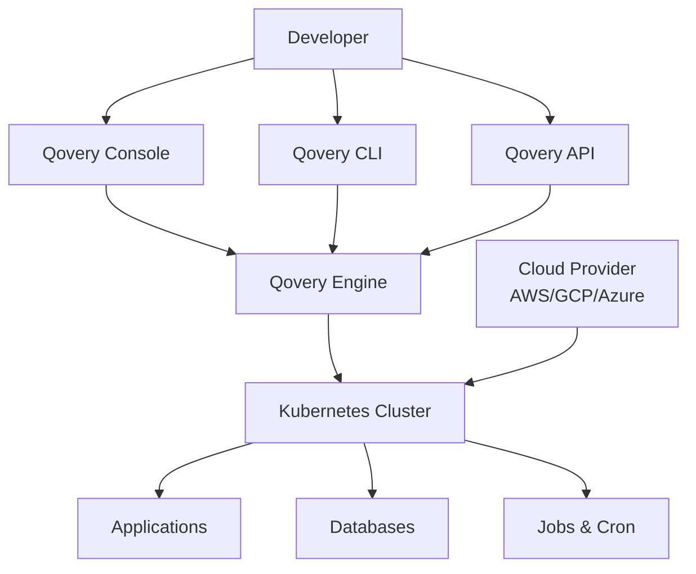

## Overview

Qovery is an Internal Developer Platform (IDP) that empowers developers to deploy and manage their applications on their own cloud infrastructure without requiring deep DevOps expertise. It provides a self-service platform that abstracts away the complexity of Kubernetes and cloud infrastructure management.

## Core Principles

<CardGroup cols={2}>
  <Card title="Developer-Centric" icon="user">
    Built for developers who want to focus on building features, not managing infrastructure
  </Card>
  <Card title="Cloud Native" icon="cloud">
    Leverages Kubernetes and cloud-native technologies for reliability and scalability
  </Card>
  <Card title="Your Infrastructure" icon="server">
    Deploy on your own AWS, GCP, or Azure accounts - you maintain full control
  </Card>
  <Card title="GitOps Driven" icon="code-branch">
    Git-based workflows with automatic deployments on every push
  </Card>
</CardGroup>

## Key Features

### Self-Service Platform

Qovery provides developers with a self-service platform where they can:

- Deploy applications, databases, and jobs without waiting for DevOps
- Manage multiple environments (dev, staging, production)
- Configure CI/CD pipelines automatically
- Monitor application health and logs in real-time

### Multi-Cloud Support

Deploy on your preferred cloud provider:

- **AWS** - Full support for EKS and AWS services
- **Google Cloud Platform** - GKE integration
- **Azure** - AKS support
- **On-Premise** - Kubernetes cluster support

### Infrastructure as Code

Manage your infrastructure with:

- **Terraform Provider** - Define infrastructure declaratively
- **CLI** - Command-line automation
- **API** - Programmatic access for custom integrations
- **Web Console** - Intuitive visual interface

### Built-in Best Practices

Qovery implements industry best practices out of the box:

- **High Availability** - Multi-zone deployments
- **Auto-Scaling** - Horizontal and vertical scaling
- **Security** - Network policies, secrets management, RBAC
- **Monitoring** - Integrated observability stack
- **Disaster Recovery** - Automated backups and restore

## How Qovery Helps

### For Developers

<AccordionGroup>
  <Accordion title="Deploy in Minutes">
    Connect your Git repository and deploy your application in minutes without configuring CI/CD pipelines, Dockerfiles, or Kubernetes manifests.
  </Accordion>

  <Accordion title="Multiple Environments">
    Easily create and manage development, staging, and production environments with consistent configurations.
  </Accordion>

  <Accordion title="Preview Environments">
    Automatically create temporary environments for every pull request to test changes before merging.
  </Accordion>

  <Accordion title="Database Management">
    Provision PostgreSQL, MySQL, MongoDB, Redis, and more with a few clicks. Automated backups included.
  </Accordion>
</AccordionGroup>

### For Engineering Teams

<AccordionGroup>
  <Accordion title="Standardization">
    Enforce organizational standards and best practices across all applications and teams.
  </Accordion>

  <Accordion title="Cost Optimization">
    Monitor and optimize cloud costs with built-in cost tracking and resource recommendations.
  </Accordion>

  <Accordion title="Governance & Compliance">
    Implement role-based access control, audit logs, and compliance policies.
  </Accordion>

  <Accordion title="Platform Engineering">
    Build your Internal Developer Platform on top of Qovery's extensible architecture.
  </Accordion>
</AccordionGroup>

## Architecture

Qovery consists of several components:

### Components

- **Qovery Console** - Web-based UI for managing infrastructure
- **Qovery Engine** - Core deployment engine (open source)
- **Qovery API** - REST API for programmatic access
- **Qovery CLI** - Command-line interface
- **Kubernetes** - Underlying orchestration platform

## Use Cases

### Startups

- **Fast Time to Market** - Deploy production infrastructure in hours, not weeks
- **Cost Efficiency** - Pay only for what you use on your own cloud account
- **Scalability** - Grow from MVP to production without infrastructure rewrites

### Scale-ups

- **Developer Productivity** - Reduce bottlenecks by enabling developer self-service
- **Multi-tenancy** - Manage infrastructure for multiple products and teams
- **Compliance** - Meet security and compliance requirements (SOC 2, GDPR, HIPAA)

### Enterprises

- **Platform Engineering** - Build an Internal Developer Platform
- **Multi-Cloud** - Deploy across multiple cloud providers
- **Governance** - Enterprise-grade security, RBAC, and audit logs

## Supported Technologies

### Languages & Frameworks

Qovery supports any language or framework that can be containerized:

- Node.js, Python, Java, Go, Ruby, PHP
- React, Vue, Angular, Next.js, Nuxt
- Django, Flask, FastAPI, Express, Spring Boot
- And many more...

### Databases

- **SQL**: PostgreSQL, MySQL, MariaDB
- **NoSQL**: MongoDB, Redis
- **Search**: Elasticsearch
- **Message Queues**: RabbitMQ

### Container Registries

- Docker Hub
- AWS ECR
- Google Container Registry (GCR)
- Azure Container Registry (ACR)
- GitHub Container Registry (GHCR)
- GitLab Container Registry
- Private registries

## Comparison

### Qovery vs Traditional DevOps

| Traditional DevOps | Qovery |
|-------------------|--------|
| Manual Kubernetes setup | One-click cluster creation |
| Write Dockerfiles & CI/CD | Automatic detection and deployment |
| Manual scaling configuration | Auto-scaling out of the box |
| DIY monitoring & logging | Built-in observability |
| Custom security policies | Security best practices included |

### Qovery vs Heroku/Platform.sh

| Managed PaaS | Qovery |
|--------------|--------|
| Runs on vendor infrastructure | Your own cloud account |
| Limited cloud provider choice | AWS, GCP, Azure, on-premise |
| Vendor lock-in | Full portability |
| Higher costs at scale | Cost-efficient |
| Black box infrastructure | Full visibility and control |

## Getting Started

Ready to get started with Qovery?

<CardGroup cols={2}>
  <Card title="Installation" icon="download" href="/installation">
    Install Qovery on your cloud infrastructure
  </Card>
  <Card title="How It Works" icon="gears" href="/how-it-works">
    Learn how Qovery works under the hood
  </Card>
  <Card title="Quickstart" icon="rocket" href="/quickstart">
    Deploy your first application
  </Card>
  <Card title="Configuration" icon="sliders" href="/configuration/overview">
    Explore configuration options
  </Card>
</CardGroup>
